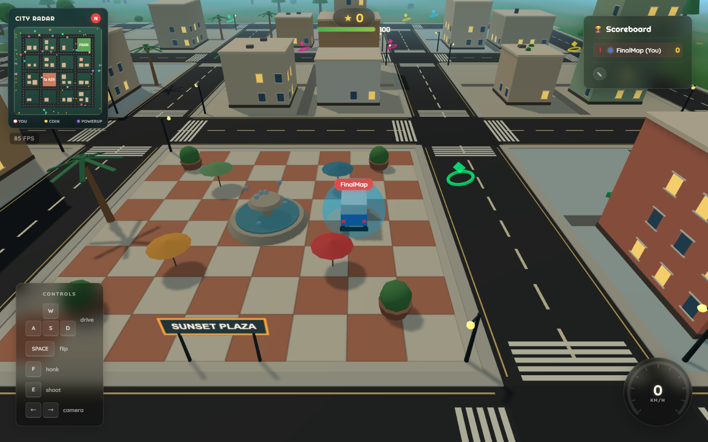

# Bulli Drive

A multiplayer 3D driving game featuring a chibi-style VW Bulli. Cruise a sun-soaked
city, collect coins and powerups, and shoot it out with other drivers.



## Features
- **Multiplayer:** The server simulates every car at 60 Hz; each client predicts its own car, so driving and bumping into each other feel immediate. Party (combat) and Free Roam rooms of up to 32 players.
- **Racing:** Race rooms with a lobby, a countdown with start lights and a launch boost, the Downtown Loop (3 laps) and the Hill Sprint (three ramps up to a lookout), real bumping with ghost rules against griefing, slipstream, server bots that fill the grid to six, results and a rematch vote. The time trial races your best run (or the track record) as a ghost car.
- **Combat:** Shoot projectiles at other players, score kills, climb the scoreboard.
- **Powerups & coins:** Turbo, Mega, Super Jump, Shield, Magnet and Ghost powerups plus collectible coins, shared across all players.
- **3D Graphics:** Built with Three.js.
- **Sunset city:** A deterministic, connected road grid with marked crossings, palm-lined streets, a tiled fountain plaza, landscaped park, and a heading-up radar that keeps your Bulli centered.

## Getting Started

### Prerequisites
- Node.js 22.12+ (required by Vite, Vitest and concurrently)

### Install, build and run
```bash
npm install
npm run build
npm start
```
The game is then available at `http://localhost:8000`.

### Development
```bash
npm run dev
```
Starts the game server (`tsx watch`, port 8000) and the Vite dev server with HMR
at `http://localhost:5173`, which proxies the game WebSocket (`/ws`) to the game server.

To try the touch controls on a real phone in the same network, run
`npm run dev:lan` instead: Vite then also listens on the LAN and prints the
`Network:` URL to open on the phone. (`npm run dev -- --host` does not work,
the flag ends up at `concurrently`, not at Vite.) The production build is
reachable from the LAN as well: `npm run build && npm start`, then
`http://<LAN-IP>:8000`.

### Scripts

| Script | What it does |
|---|---|
| `npm run dev` | Game server with `tsx watch` plus the Vite dev server (HMR) on port 5173 |
| `npm run dev:lan` | Same as `dev`, but Vite also listens on the LAN, for testing on real phones |
| `npm run build` | Client with Vite to `dist/client` (hashed assets, `build-version.txt`), server with `tsc` to `dist/server` and `dist/shared` |
| `npm start` | Runs the production build on port 8000 (`PORT` to override) |
| `npm run typecheck` | Type-checks client, server, tests, scripts, build config and the worldviewer |
| `npm test` | Vitest unit tests in `tests/` (golden tests for world generation, terrain, RNG and the v2 sim scenarios, the binary codec and protocol validation, the tick scheduler, rooms and Party rules, the prediction against the real rooms with simulated latency and loss, speedometer scale, model cache, budgets of the packed models and textures) |
| `npm run test:e2e` | Builds, then runs the Playwright tests of the critical user paths in `tests/e2e` against the production server (port 8799, `E2E_PORT` to override; the restart test starts its own server on `E2E_PORT + 1`), among them a race on the phone from the splash to the results |
| `npm run test:e2e:render` | Builds, then runs the render checks in the browser: the phone tier's draw call and triangle budget, a world without its textures that is shaded, not black, and the touch HUD of the Party and of a race in eight phone and tablet viewports without overlaps (`tests/e2e-render`, Playwright project `render`) |
| `npm run test:bots` | Bot integration tests in `tests/integration`: starts its own game server process (port 8560-8599, `BOTS_PORT` to override) and runs headless bots over real WebSockets: a head-on bump seen by both cars (also behind the netsim), reconnect within and after the grace time, the protocol version reject and `/healthz`, a room switch, a flood kick, and 16 bots for 30 s behind netsim 150/30/3 with the bandwidth (≤ 30 kB/s per client) and tick budgets (p95 < 4 ms); a Hill Sprint race of bots behind the netsim with a bump, a manipulating client and server bots, and a time trial whose ghost comes back after a reload |
| `npm run test:mutation` | Mutation tests (Stryker, `stryker.config.mjs`) of `src/shared` and `src/server/rooms` against the unit tests: incremental (`reports/stryker-incremental.json`), HTML report in `reports/mutation/`; `-- --mutate src/shared/sim/contact.ts` narrows a run, `npx tsx scripts/mutation-summary.ts --survivors` lists the survivors. Not part of CI: runs weekly and on demand in `.github/workflows/mutation.yml` |
| `npm run bots -- --url ws://127.0.0.1:8000/ws --count 32 --mix drive:24,ram:6,reconnect:1,hop:1 --netsim 150,30,3 --duration 120` | Load and robustness run against any server (see `tools/bots/cli.ts`): prints snapshot rate, downlink per bot, corrections, contacts and the server's tick times from `/healthz`; `--json` for the whole report. Modes: `drive`, `ram`, `idle`, `reconnect`, `hop`, `flood`, `race`, `timetrial` |
| `npm run perf:baseline` | Builds, then drives two headless Chromium clients for 20 s and prints FPS, draw calls and WebSocket bandwidth as JSON (see [docs/baseline.md](docs/baseline.md)); it also reports the sim time per frame, `-- --sandbox` measures the offline sandbox |
| `npm run screenshots` | Builds, then captures a fixed set of views with headless Chromium for visual before/after comparisons, the race included (lobby, grid, checkpoint, ramps, the finish from 600 m, results, the phone HUD) (`-- --out=<dir>`, `--gl=swiftshader`, `--compare=<a>,<b>`, `--only=<views>`; `stats.json` records how much of the frame the car takes and the draw calls and triangles of the track dressing; see `scripts/screenshots.ts`) |
| `npx tsx scripts/sim-golden-drift.ts` | Shows how far the v2 golden scenarios drift when `Math.sin` & co. round differently in the last bit, and that the golden tolerance still catches tiny tuning changes |
| `npm run ci` | typecheck, unit tests and build in one go |
| `npm run worldviewer` | Map viewer and spline editor for the curated map on port 5174 (`-- --port <n>` to change), a Vite app of its own outside the game bundle, see [Worldviewer](#worldviewer-map-viewer-and-spline-editor) |
| `npm run assets:models` | Builds the car models in Blender and packs them (meshopt + KTX2) into `public/models` (needs Blender 5.2 and `npm --prefix tools ci` once; see [tools/models/README.md](tools/models/README.md)) |
| `npm run assets:textures` | Downloads the CC0 textures and HDRIs (Poly Haven) and encodes them to KTX2 in `public/textures` ([tools/textures/README.md](tools/textures/README.md)) |

The tests follow the test pyramid (see `CLAUDE.md`): the logic is unit-tested
in `tests/shared`, `tests/server` and `tests/client` (the client's page glue
in Node or happy-dom), the server with real WebSockets in the bot tests, and
Playwright covers only the critical user paths: load, join and drive on the
desktop (with the asset pipeline and a lost WebGL context), two players who
see and ram each other, touch on a phone (splash, stick and buttons, room
chip, HUD layout in eight viewports, a lost connection), a new deploy (stale
page, old protocol, server restart) and missing assets. The suite runs in one
CI job in under ~5 minutes; the render checks of the phone tier run beside it.
They need Chromium once:
`npx playwright install chromium`.

GitHub Actions (`.github/workflows/ci.yml`) runs typecheck and unit tests, the
build, the Playwright tests, the bot integration tests and a Docker build with
a container smoke test (`/healthz`, the image's health check and a graceful
`docker stop`) on every pull request and push to `main`.

### Operations
The server runs 24/7. `GET /healthz` answers 200 while the 60 Hz tick runs
(503 when it stalls), the Docker image has a `HEALTHCHECK` on it, and on
`SIGTERM` the server tells every client to reconnect with a signed resume
ticket (colour and Party score survive a deploy) before it exits. Set
`SESSION_SECRET` in the hosting environment for that. A lost connection
keeps the player's session and car for 30 s. Details, environment variables
and the restart policy: [docs/ops.md](docs/ops.md).

### URL flags
The game drives with the fixed-step v2 physics (single-track model with
drift, boost and car contact, see
[docs/phase-1a-design.md](docs/phase-1a-design.md)) without any flag.

- `?sandbox=1` opens the offline test pad of the v2 physics instead of the
  city (always v2, no server connection needed). See below.
- `?tune=1` together with `?sandbox=1` adds the live tuning panel with
  telemetry. It is loaded on demand. Online the server drives every car with
  the default tuning, so the game only shows a hint there.
- `?debug=perf` shows a performance overlay (FPS, frame time, draw calls,
  triangles, geometries, textures, WebSocket bytes per second, JSON and
  binary apart, and the sim time per frame), online also the netcode (tick,
  lead, round trip, snapshots per second, corrections, the connection) and
  the server's tick times from `/healthz`. `?debug=net` shows the same
  overlay. Use it to measure on real devices.
- `?netsim=RTT,JITTER,LOSS[,tcp|drop]`, e.g. `?netsim=150,30,3`, puts a
  simulated bad network in front of this tab's connection (both
  directions; the server has the same as `NETSIM=rtt=150,jitter=30,loss=3`
  outside production). For playtesting the netcode.
- `?e2e=1` installs a state hook for the Playwright tests (read-only, apart
  from placing the car on a free stretch of road, which online only a server
  started with `E2E=1` accepts) and `window.__bulliNet` with the netcode
  numbers (lead, corrections, snaps, missed inputs).

Apart from these, the flags change nothing about the game.

### Sandbox and tuning (v2 physics)
Open `http://localhost:5173/?sandbox=1&tune=1` with `npm run dev` (or
`http://localhost:8000/?sandbox=1&tune=1` after `npm run build && npm start`;
`npx vite` alone is enough, the sandbox never connects to the server). The
pad is 400 × 400 m and has three kickers (10°, 15°, 20°), a jump with a
landing hill, a long wall to slide along, a post row, a cone slalom, two
painted curves (R 40 and R 80 m), a 90° city corner with 12 m roads and five
dummy cars, one of each body: three parked next to the start, two lapping
the curves. They are full sim cars, so ramming them pushes them away.

| Key | Sandbox |
|---|---|
| W/S, A/D (or arrows) | Throttle, brake/reverse, steer |
| Space / Shift / Q | Handbrake (drift) / boost / jump |
| R (hold) | Reset the car where it is |
| N | Put the dummies and cones back |
| C | Switch the car body |

The same buttons are in the SANDBOX box at the top left (for touch). With
`?tune=1` the panel on the right shows speed, slip (drift) angle, yaw rate,
wheel angle, boost and ground contact, plots speed and drift angle of the
last 5 s and has every tuning value of the spec: global values, the values
of one car class (`·K`, pick the class in "Werte der Klasse") and of the
assist profile (`·P`). "Export → Zwischenablage" copies the changed values
as JSON, "Import ← Zwischenablage" loads such a JSON back and "Reset auf
Defaults" undoes everything. In the sandbox the panel also toggles the
powerup effects (Turbo, Mega, Super-Jump, Ghost, Shield) and switches the
body. Changes live in the page only; to keep them, paste the exported JSON
into the defaults (`SIM_TUNING` in `src/shared/sim/constants.ts`, the classes
in `src/shared/sim/vehicleClasses.ts`).

### Worldviewer: map viewer and spline editor
`npm run worldviewer` opens `http://localhost:5174`: the curated map of phase
3 (Bulli Bay, [docs/phase-3-design.md](docs/phase-3-design.md)) in 3D, built
from the same files and shared modules the game will load. It is a Vite app of
its own (`tools/worldviewer`, config `tools/worldviewer/vite.config.ts`) and is
never part of the game build; `npx vite build --config tools/worldviewer/vite.config.ts`
writes a static copy to `output/worldviewer`.

It shows the baked heightfield (`public/maps/bulli-bay/terrain.bhf`, coloured by
surface, height or zone), the roads of `roads.json` as ribbons with their guard
rails, areas and nodes (yellow junctions, blue joints, red dead ends), the zones,
landmarks and spawns of `zones.json` and `pois.json`, and any track of
`tracks.json` with its centre line, gates (white: start/finish) and starting
grid. The status line shows position, height, surface, zone and road under the
pointer. Left drag pans, right drag turns, the wheel zooms.

Editing `roads.json`:

| Tool | Key | What it does |
|---|---|---|
| Select | V | Click a road or node to select it, drag nodes, support points and Bézier handles; the panel edits name, profile, width, surface, grade limit, one-way and the guard rail per side |
| Draw | N | Click to start a road and to add nodes; a click on a road joins it there (new junction), on a node connects to it; Esc ends the road. "New roads" picks the profile |
| Point | P | Adds a support point where you click on a road |
| Split | S | Splits a road with a new joint |
| | Del | Deletes the selection; deleting a joint joins its two roads again |
| | Ctrl/⌘ Z, Ctrl/⌘ Shift Z | Undo, redo (a drag is one step) |
| | F | Looks at the selection |

Every edit goes through `tools/worldviewer/logic/editOps.ts` (pure functions,
unit tests in `tests/tools/worldviewer`) and is kept only if the result passes
the schema and the checks of `src/shared/map/roadSchema.ts`; positions are
rounded to 0.1 m. Width and surface are stored as `overrides` of the profile and
only while they differ from it. The page keeps an unsaved draft in the browser
and offers it again after a reload.

- **Export:** "Download" or "Copy to clipboard" gives the new `roads.json`; save it
  as `src/shared/maps/bulli-bay/roads.json`. The export uses the layout of the
  committed file (one line per node, edge and area), so unchanged lines stay byte
  for byte the same and the diff shows only the edited objects. "Open…" loads a
  `roads.json` from disk.
- **Rebake:** "Rebake heightfield" bakes the edited roads in a web worker with the
  bake code of `tools/map` (under a second); for unchanged sources the result is
  the committed `terrain.bhf` byte for byte. "Download terrain.bhf" saves it, but
  the repository's `terrain.bhf` and `manifest.json` come from
  `npx tsx tools/map/bake.ts` after the export (the data tests check the hash).
- **Check:** "Validate map" runs `tools/map/validateMap.ts` (the checks of
  `npx tsx tools/map/validate.ts`) on the edited roads and the current
  heightfield; click a finding to look at it.
- **Tracks** are shown, not edited: splitting or joining an edge that a track names
  breaks its route in `tracks.json`, and the header lists every broken track.
  Fix `route`, `start` and `finish` there by hand.

## Architecture

```
index.html            Vite entry (HUD markup, loading and splash screens)
src/client/           Browser game (three.js)
  main.ts             Bootstrap, render loop, chase camera
  entities/Bulli.ts   Cars: model, powerup looks, shooting, nametags
  world/              City, terrain, coins, powerups, projectiles
  network/            WebSocket, handshake, room state and events
  net/                The own car's prediction (NetDriver) and the remote cars
  controls/           Keyboard and touch (joystick, action buttons)
  ui/                 HUD, speedometer, minimap, screens, WebGL context-loss notice
  effects/            Particles, sounds, adaptive render quality
  debug/              Perf overlay (?debug=perf), v2 tuning panel (?tune=1)
  vehicle/, input/,   v2 physics on the client: car model, local sim car,
  camera/, game/      input manager, chase camera, fixed-step loop, hooks
  sandbox/            Offline test pad of the v2 physics (?sandbox=1)
  assets/             Model cache: GLB (meshopt) + KTX2 loading, preload and
                      shader warmup during the splash screen, procedural fallback
src/server/           Express + ws game server: handshake, sessions, rooms that
                      simulate at 60 Hz (rooms/), Party rules, tick scheduler
src/shared/           Code for both sides: protocol schemas (valibot), constants,
                      seeded RNG, city/world generation, terrain height, the v2
                      driving sim (sim/) and its collision world and sandbox
                      layout (world/), the netcode (net/: binary codec, clock,
                      lead control, prediction with the contact set, render
                      offsets, interpolation) and the Party
                      rules in ticks (party/)
tests/                Vitest (shared/, server/, client/, tools/), bot integration
                      tests (integration/), Playwright (e2e/) and the render
                      checks (e2e-render/)
tools/bots/           Headless bot clients over real WebSockets (shared NetClient,
                      pure-pursuit driving on the road grid), npm run bots
scripts/              perf-baseline.ts, screenshots.ts
public/models/        Packed car GLBs (3 LODs each) + manifest.json
public/icons/         Rendered car-select icons (WebP)
public/textures/      KTX2 world textures, HDRIs + manifest.json
tools/                Offline asset pipeline (own package.json): Blender car builds,
                      gltfpack/KTX2 packing, texture download and encoding
docs/                 Refactor plan, performance baseline, phase 1a/1b specs, blind
                      test guide, operations (ops.md), asset provenance and
                      licences (assets.md), world look (world-look.md), cars (cars.md)
```

Server and clients build the same world from a fixed seed (the server sends
only the seed and a hash). The server is authoritative
([docs/phase-1b-design.md](docs/phase-1b-design.md)): clients send only their
inputs (binary, 60 Hz), every room steps all its cars with the shared v2 sim
and sends each player a binary snapshot 20 times a second. The client runs its
own car a few ticks ahead of the server, predicts it with the same sim and
replays from the server's state when a snapshot differs; remote cars are
shown slightly in the past, the ones close by are predicted along. Pickups,
hits, the Mega ram and respawns are decided by the server in its tick.
One world unit is one metre.

Code in `src/shared` runs in the browser and on the server, so it must not
import three, the DOM or Node modules (a test enforces this).

### Roadmap
Bulli Drive is being rebuilt into an open-world multiplayer racing game
(party mode with the current combat, car contact, a curated map, full mobile
support, 24/7 hosting). The plan, decisions and phases are in
[docs/refactor-plan.md](docs/refactor-plan.md); the performance baseline the
rebuild is measured against is in [docs/baseline.md](docs/baseline.md). The
realistic world look (HDRI sky, height fog, PBR materials, quality tiers, draw
call budgets; `?tier=high|low|software` forces a tier) is described in
[docs/world-look.md](docs/world-look.md), the cars (the Blender T1 in the
game, LODs, lamps, scale against the sim hull) in [docs/cars.md](docs/cars.md).

## Controls
- **WASD or arrows:** Drive, brake/reverse and steer
- **SPACE:** Handbrake / drift (drifting fills the boost meter)
- **SHIFT:** Boost
- **Q:** Jump / flip
- **R (hold):** Reset the car onto the nearest road
- **E:** Shoot projectile
- **F:** Honk

On touch screens auto-gas drives once you touch the stick, which steers and
brakes when pulled back; hold **DRIFT** for the handbrake and **BOOST** to
boost, **AUTO** switches auto-gas on and off, and the jump button jumps on a
tap and resets when held. Gamepads (standard mapping) work too: RT/LT gas and
brake, A drift, B boost, Y jump, Back reset, X shoot, LB honk.

The camera automatically swings into a chase view behind the car.

**Races:** pick RACE on the splash screen (or RACE / TIME TRIAL from the room
chip), choose the track, the bots and your car in the lobby and press READY.
Press the gas in the last third of a second before green (the green end of
the bar under the lights) and hold it: a perfect start. Pressed earlier and
held, the wheels spin for half a second. There is no jump in a race;
R (or holding the reset button) puts the car back on the racing line. On
touch screens the stick only steers in a race, **BRAKE** brakes, and
auto-gas starts with a tap on **TAP ON GREEN** (a tap in the window is a
perfect start) or by itself right after green.
