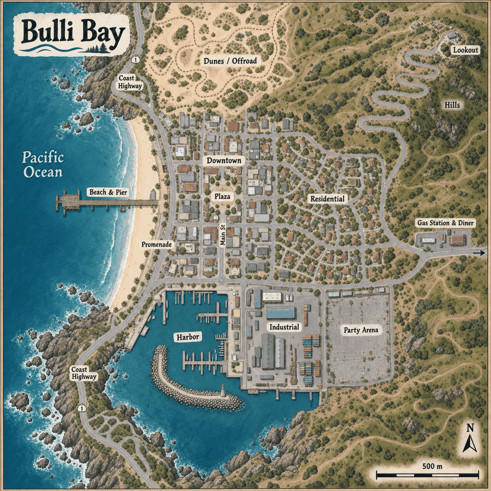
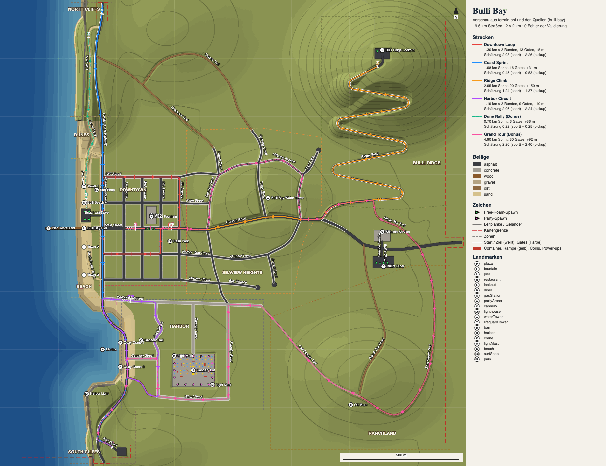

# Phase 3: Kuratierte Map „Bulli Bay“ – Konzept und technische Spezifikation

**Stand:** 2026-09-25 · **Branch:** `map/phase-3` (auf `main` 4edf2d5, nach dem Merge von Phase 2) · Bezug: [`refactor-plan.md`](refactor-plan.md) Abschnitt 0 (Entscheidung 3), 5 (Phase 3), 6 (Determinismus) · Grundlagen: [`phase-1a-design.md`](phase-1a-design.md) (Sim, Collider), [`phase-1b-design.md`](phase-1b-design.md) (`MapData`, `worldHash`), Phase 2 (`docs/phase-2-design.md` auf `game/phase-2-racing`: `TrackDef`, Gates, Ideallinie), [`world-look.md`](world-look.md) (Look, Tiers, Draw Calls), [`assets.md`](assets.md) (Pipeline, Budgets)

Dieses Dokument beschreibt die Karte, die Datenformate und die Budgets für Phase 3. Das Datenformat, die Interpolation des Heightfields und die Modulgrenzen sind verbindlich. Zahlen, die als *Startwert* markiert sind, werden beim Bau der Karte, im Tuning-Panel und bei Messungen nachjustiert. Abweichungen kommen wie in 1a/1b in einen eigenen Abschnitt am Ende und werden nicht still umgesetzt.

**Rahmen (aus den Nutzerentscheidungen, nicht verhandelbar):**

- Eine **kuratierte Map von 1,5–2 km** mit handgebauten Straßen-Splines als JSON. Es gibt kein Streaming: Die ganze Karte wird beim Start geladen, Chunks dienen nur dem Culling und dem Merging (Plan, Entscheidung 3).
- **Mobile ist gleichwertig:** Jedes Budget gilt für Tier low (iPhone 12/13) genauso wie für den Desktop.
- **Der Party-Modus bleibt** und bekommt eine eigene Zone (Plan 8.5).
- **Server-autoritativ:** Der Server simuliert mit derselben shared-Sim. Der Boden (Heightfield) muss auf Client und Server exakt gleich sein.
- **Neue Features gehen direkt live**, ohne Feature-Flag. Die Karte geht deshalb erst live, wenn sie als Ganzes spielbar ist (Abschnitt 14).
- `src/shared` bleibt frei von three, DOM und Node-Globals (`tests/shared/purity.test.ts`).

---

## 1. Kurzfassung

Bulli Bay ist eine fiktive kalifornische Küstenkleinstadt auf einem Quadrat von 2 × 2 km, davon rund 1,8 × 1,8 km befahrbar. Im Westen liegt der Pazifik mit Strand, Pier und Promenade. Dahinter liegen ein Downtown-Raster mit Main Street und Plaza, ein Wohnviertel am Hang, im Süden Hafen und Industrie mit der Party-Arena auf einem stillgelegten Cannery-Parkplatz. Im Nordosten führt die Ridge Road über zwei Kehren und den Kamm von Bulli Ridge zu einem Aussichtspunkt auf 130 m. Die Bucht liegt als Sichel zwischen zwei Landzungen; die Küstenstraße folgt im Norden und Süden der Klippenkante. An der Ausfallstraße nach Osten stehen Tankstelle und Diner. Offroad gibt es am Strand, in den Dünen und auf Feldwegen im Ranchland.

Technisch besteht die Karte aus drei Quellen: `roads.json` (Knoten, Kanten mit Catmull-Rom- oder Bézier-Kurven, Querschnittsprofile), `map.json` (Zonen, Plätze, Landmarken, Spawns, Party-Arena, Strecken-Routen) und einem Grundgelände. Ein Bake-Werkzeug (`tools/map/bake.ts`) erzeugt daraus deterministisch eine Binärdatei `terrain.bhf` mit Heightfield (2 m, Uint16, 1 cm Auflösung), Oberflächen-Raster und Zonen-Maske. Client und Server laden dieselben Bytes und interpolieren mit derselben Funktion aus `src/shared/map/heightfield.ts` bilinear. Neue Strecken entstehen mit `routeToTrack` aus einer Liste von Kanten.



*Konzeptskizze (KI-generiert mit Codex-imagegen, 960 px, auf 160 Farben reduziert). Sie zeigt Stimmung und grobe Anordnung, nicht die Maße. Maßgeblich sind die Koordinaten in Abschnitt 3. Abweichungen der Skizze: Die Main Street läuft dort von Norden nach Süden statt vom Pier nach Osten, die Dünen liegen nördlich von Downtown statt zwischen Strand und Nordklippen, die Party-Arena liegt östlich der Industrie statt hinter der Cannery, und der Maßstabsbalken passt nicht zu 2 km. Bild ist nur Dokumentation, kein Spiel-Asset.*

---

## 2. Entscheidungen dieser Phase (selbst getroffen)

| # | Frage | Entscheidung | Begründung |
|---|---|---|---|
| E1 | Größe der Karte | **2000 × 2000 m** Datenfläche (x, z ∈ [−1000, 1000]), davon ca. **1,8 × 1,8 km befahrbar**. Der Rand von 100 m ist Kulisse (Meer, steile Hänge). | Liegt im Rahmen von 1,5–2 km. Ein gerades Quadrat mit 8 × 8 Chunks zu 250 m. Der Rand verhindert, dass man die Welt „enden“ sieht. |
| E2 | Himmelsrichtung | **Norden = −z, Osten = +x.** In der Draufsicht von oben (rechtshändig, y oben) liegt dann Osten rechts, wenn Norden oben ist. Das Meer liegt im Westen (−x). | Mit dieser Zuordnung stimmen Karte und Fahrersicht überein (links vom Auto bei yaw = π, also Blick nach Norden, ist −x = Westen). Die Minimap muss dieselbe Ausrichtung zeigen; die Integration bekommt dafür einen Achsen-Test (Abschnitt 15). |
| E3 | Heightfield-Raster und Kodierung | **2 m**, 1001 × 1001 Stützpunkte, **Uint16 mit Offset −20 m und Skala 0,01 m** (Bereich −20 … 635,35 m). Kein Float16. | Float16 hat bei 128–256 m Höhe nur 12,5 cm Auflösung, und das Dekodieren braucht Bit-Arbeit. Uint16 mit 1 cm ist exakt, ganzzahlig und komprimiert gut (Messung in 6.2). 2 m genügen für Kehren mit 15 m Radius und für Böschungen. |
| E4 | Gleichheit Client/Server | **Dieselbe Datei, dieselbe Funktion.** Das Heightfield wird nicht zur Laufzeit berechnet, sondern gebacken und als Asset ausgeliefert. `heightAt` nutzt nur +, −, ×, ÷ und `Math.floor` auf Double. | IEEE-754 rundet diese Operationen exakt, und JavaScript kennt keine FMA-Kontraktion. Damit ist das Ergebnis in V8, JavaScriptCore und SpiderMonkey bitgleich (Plan 6: „vorberechnetes Heightfield“). Keine Sinus-Summen mehr im Sim-Boden. |
| E5 | Wer rechnet das Road-Corridor-Flatten? | **Nur das Bake-Werkzeug** (Node, `tools/map`). Die Laufzeit liest das Ergebnis. | Das Flatten ist teuer (Distanzfeld über 1 Mio. Punkte) und muss nicht auf dem Handy laufen. Es gibt nur eine Wahrheit: die Bytes der Datei. |
| E6 | Oberflächen in der Sim | **Oberflächen-Raster 2 m** (Uint8, nächste Zelle) in derselben Datei, abgefragt an der Vorder- und Hinterachse. | Die Sim hat `offroadGrip`/`offroadDrag` schon je Klasse („take effect in phase 3“). Ein Raster ist O(1) und auf beiden Seiten gleich; ein Abstandstest zu allen Splines wäre teurer und nicht exakt gleich. |
| E7 | Terrain-Rendering | **Ein Terrain-Mesh für die ganze Karte als CDLOD** (Quadtree, ein instanziertes Patch, Geomorphing). Der Vertex-Shader liest die vier Stützpunkte per `texelFetch` und interpoliert bilinear wie `heightAt` (kein Float-Filter nötig). Nah am Auto wird LOD0 feiner unterteilt (A32). | 1–2 Draw Calls für das ganze Gelände statt einem pro Chunk und LOD. Die Ecken liegen auf der Sim-Fläche; zwischen den Ecken weicht ein flaches Dreieck von der bilinearen Fläche ab, das begrenzt die Unterteilung (A32). |
| E8 | Neue Collider-Formen | **`segment`** (Kapsel entlang einer Strecke, für Leitplanken, Geländer, Zäune, Kartenrand) und **`obox`** (gedrehte Box, für Gebäude an schrägen Straßen, Container). | Kreisketten würden an Leitplanken holpern und die Anzahl der Collider aufblähen. Kreis gegen Kapsel und Kreis gegen gedrehte Box sind einfache, exakte Tests. Die bestehenden Karten nutzen die neuen Formen nicht, alle Goldens bleiben gleich. |
| E9 | Brücken und Ebenen übereinander | **Keine** in v1. Die einzige „Ebene über Wasser“ ist der Pier, und er liegt im Heightfield. | Ein Heightfield kann nur eine Höhe pro Punkt. Brücken bräuchten Deck-Flächen in der Sim, den Ramps ähnlich. Das kann später kommen (Abschnitt 17). |
| E10 | Party-Zone | **Arena „Cannery Lot“** am Hafen, 180 × 140 m, umzäunt. Der PartyRoom spawnt nur dort, seine Sim-Welt hat einen Zaun als Grenze. | Plan 8.5: eigene Zone statt der ganzen Karte, damit sich Free Roam und Party nicht stören. Kampf und Coins brauchen Dichte. |
| E11 | Phase-2-Strecken | **Portieren**, nicht die alte Stadt mitführen. `downtown-loop` und `hill-sprint` behalten ihre IDs, bekommen eine Route auf Bulli Bay und die `mapVersion` 4 (A38). | Der Plan erlaubt beides. Zwei Karten im Build verdoppeln Assets, Tests und Pflege. Bestenlisten gibt es erst in Phase 4, verloren gehen nur Ghosts aus dem Zeitfahren (per `trackVersion` ungültig). |
| E12 | Zufall der Bestückung | **Integer-Hash je (Kante, Los-Index) bzw. (Chunk, Zelle)**, kein fortlaufender RNG-Strom. | Ändert man eine Straße, ändern sich nur die Gebäude an dieser Straße, nicht die der ganzen Stadt. Keine `Math.sin`-Hashes (Plan 7, Risiko „Math.sin“). |
| E13 | Datei-Kompression | **Zeilen-Prädiktor im Format** (dekodiert in `src/shared`) plus **Brotli/Gzip über HTTP**. Dafür wird die Vorkomprimierung aus `server/staticAssets.ts`, die heute nur `*.hdr` kennt, mit M4 auf `*.bhf` verallgemeinert (A37). | Kein zusätzlicher Dekompressor im Client, keine Node-Abhängigkeit in `shared`. Der Server liest die Datei roh vom Datenträger. |
| E14 | Brücke Phase 2 → 3 | Neue Module liegen in **`src/shared/map/`** und **`tools/map/`**. `src/shared/world/*`, `src/client/world/*` und `src/server/*` bleiben bis zur Integration unverändert. | Phase 2 läuft parallel und ändert `shared/race`, `server/rooms` und das HUD. Getrennte Ordner vermeiden Konflikte; die Integration folgt nach dem Merge von Phase 2 (Abschnitt 14). |

---

## 3. Die Karte

### 3.1 Koordinaten, Maße, Höhen

- 1 u = 1 m. Datenfläche x, z ∈ [−1000, 1000]. **Norden = −z, Osten = +x** (E2). In diesem Dokument stehen Punkte als `(x | z)`.
- **Meeresspiegel y = 0.** Der Meeresboden fällt bis −12 m ab, der Strand liegt bei 0–3 m, Downtown bei 4–14 m (sanft nach Osten steigend), das Wohnviertel bei 10–50 m, der Aussichtspunkt bei 130 m (der Gipfel darüber 143 m), die Klippenstraße bei 30–45 m.
- Befahrbare Grenze: ein Polygon ca. 100 m innerhalb des Quadrats. Im Westen ist das Meer die Grenze (Wasser-Reset, Abschnitt 7).

### 3.2 Übersicht (nicht maßstäblich)

```
                       N (−z)
 z=−1000  ~~~~~~~~~~~~~~│PCH│ Nordklippen (35–45 m)            Wildnis, Chaparral
          ~~~~~~~~~~~~~ │   │                                        ▲ Lookout 130 m
          ~~~~~~~~~~~~~ │   │                                   ╭─╮╭─╯
          ~~~~~~~~~~~~~~ \  │                               ╭──╯ ╰╯  Ridge Road
 z=−400   ~~~~~~~~~~~ ░░Dünen░ ╲                          ╭─╯   (2 Kehren + Kamm)
          ~~~~~~~~~~ ░░░░░░░░   ╲         Wohnviertel      │     Hügel „Bulli Ridge“
          ~~~~~~~~~~ ▒Strand▒ ║ ┼──┼──┼──┼   „Seaview       │
          ~~~~~~~~~~ ▒▒▒▒▒▒▒▒ ║ ┼──┼PL┼──┼    Heights“      │
 z=0      ~~~~ Pier ═══════════╬═Main St═╬════════ Canyon Road ════ ⛽ Diner ═══════► Ost (+x)
          ~~~~~~~~~~ ▒▒▒▒▒▒▒▒ ║ ┼──┼──┼──┼   (Kurven,
          ~~~~~~~~~~ ▒▒▒▒▒▒▒▒ ║ ┼──┼──┼──┼    Sackgassen)        Ranchland, Feldwege
 z=+300   ~~~~~~~~~~~~~~~~~~~ ╚═══ Harbor Blvd ════╗              (Eichen, Gras gold)
          ~~~~ Wellenbrecher  ┃ Kais  Cannery ▣▣  ║ Container
          ~~~~~ ═════╗ Becken ┃ ▣▣ ┌─Party-Arena─┐ ║
          ~~~~~~~~~~ ║ ~~~~~~ ┃    │ Cannery Lot │ ║
 z=+700   ~~~~~~~~~~~~~~~~~~~ ╲    └─────────────┘
          ~~~~~~~~~~~~~~~~~~~~ ╲ Südklippen (30 m), PCH nach Süden
 z=+1000  ~~~~~~~~~~~~~~~~~~~~~~│PCH│
        x=−1000        −600          −200          +200          +600         +1000
```

### 3.3 Zonen

| Zone | Lage (x \| z) *Startwert* | Höhe | Charakter | Straßen | Befahrbar abseits der Straße |
|---|---|---|---|---|---|
| **Pazifik** | westlich der Wasserlinie, x < −650 … −620 | Boden bis −12 m | Meer mit Brandung, Horizont | – | nein (Wasser-Reset) |
| **Strand & Pier** | x −680 … −590, z −320 … +260; Pier bei z −20 von x −590 bis −805 | 0–3 m, Pier-Deck +5 m | breiter Sandstrand, Rettungsschwimmer-Türme, Pier aus Holz mit Geländer | Pier (Holz, 10 m, Schritttempo), Strandzufahrten | ja: Sand, nasser Sand an der Wasserlinie |
| **Promenade** | entlang x ≈ −560, z −330 … +280 | 3–5 m | Ocean Boulevard mit Palmen-Mittelstreifen, Fußgänger-Promenade zum Meer, Surf-Shop | PCH-Abschnitt, 2 + 2 Spuren | nein (Bordstein) |
| **Downtown** | x −540 … −200, z −260 … +200 | 4–14 m | Raster aus 4 Avenues (N–S bei x −470, −390, −310, −230) und 5 Streets (O–W bei z −240, −130, −20, +90, +200). **Main Street** = z −20 vom Pier nach Osten. **Plaza** nördlich der Main Street zwischen 2nd und 3rd Ave (Brunnen aus `fountain.ts`). **Palm Park** zwischen 3rd und 4th Ave südlich der Main Street. Zwei- bis viergeschossige Stuckhäuser, Läden, Markisen | Main St 1 + 1 mit Schrägparken, Avenues 1 + 1, Ampeln an der Main Street | nein |
| **Wohnviertel „Seaview Heights“** | x −200 … +380, z −480 … +260 | 10–50 m | geschwungene Straßen, Sackgassen, Einfamilienhäuser mit Garagen, Gärten, Zypressen | 1 + 1, schmal (7 m), keine Mittellinie | Vorgärten nein (Bordstein), Böschungen am Hang ja |
| **Hügel „Bulli Ridge“** | x +400 … +920, z −920 … −250 (Grat von Südwest nach Nordost mit Sattel bei (+480 \| −430) und Ostsporn, A35) | 30–143 m | goldenes Trockengras, Chaparral, Felsen, Eichen. **Aussichtspunkt** (+640 \| −760) mit Parkplatz, Münzfernrohr, Blick auf die Bucht | **Ridge Road** mit 6 Kehren (R 14–20 m), Steigung bis 12 % | ja: Gras, Erde; steile Hänge bremsen |
| **Nordklippen & Küstenstraße** | Landzunge „Point Bulli“ bis x −830, z −1000 … −600; Hangrücken hinab zur Bucht bis (−570 \| −350) | 42 m auf der Landzunge | Steilküste, Leitplanken, Aussichtsbucht als Haltebucht | **PCH** 1 + 1, 9 m, Leitplanke meerseitig | nein (Leitplanke / Felswand) |
| **Dünen** | zwischen Strand und PCH, x −700 … −590, z −600 … −345 | 3–15 m | Sanddünen mit Strandhafer, Holzzaun-Reste | Sandpisten, Strand-Slalom | ja: Sand |
| **Industrie & Hafen** | x −620 … +120, z +300 … +760; Hafenbecken x −660 … −480, z +340 … +640 | 2–6 m (Kais 2,5 m) | Cannery, Lagerhallen, Containerlager, Fischmarkt, Kräne, Wellenbrecher mit Leuchtturm | Harbor Blvd 1 + 1 (Beton), Kai-Straße, Gleisspur (Optik) | nein (Kaikante mit Poller-Kette) |
| **Party-Arena „Cannery Lot“** | x −260 … −80, z +520 … +660 | 3 m | stillgelegter Parkplatz der Cannery: rissiger Asphalt, verblasste Stellplätze, Container als Deckung, 2 Rampen, Laderampen, Maschendrahtzaun | Zufahrt vom Harbor Blvd | innerhalb des Zauns frei |
| **Ausfallstraße, Tankstelle & Diner** | Canyon Road von (−200 \| −20) nach (+1000 \| +40); Diner und Tankstelle bei (+560 \| +60) | 20–35 m | „Bulli's Diner“ und „Seaside Service“ (Ladenfronten aus `storefront_atlas`), Parkplatz, Neon | Canyon Road 1 + 1 mit Standstreifen, 11 m | Parkplatz ja |
| **Südklippen** | Landzunge bis x −770, z +700 … +1000 | 25–35 m | Steilküste wie im Norden | PCH entlang der Klippenkante, Stichstraße zur Aussichtsbucht | nein |
| **Ranchland** | x +150 … +920, z +250 … +920 | 20–70 m | Weiden, Eichen, Holzzäune, Scheune | **Fire Roads** (Erde, Schotter), Anschluss an Diner und Ridge Road | ja: Gras, Erde |

### 3.4 Straßennetz *(Startwerte)*

| Straße | Verlauf | Länge | Profil |
|---|---|---|---|
| Pacific Coast Highway (PCH, „SR 1“) | Nordrand (−560 \| −1000) → Klippen → Ocean Blvd → Harbor → Südklippen → (−500 \| +1000) | ca. 2,6 km | 1 + 1 (Klippen), 2 + 2 (Ocean Blvd), Leitplanken an Klippen |
| Main Street + Canyon Road | Pier (−590 \| −20) → Downtown → durch Seaview Heights → Diner → Ostrand | ca. 1,6 km | 1 + 1, in Downtown mit Schrägparken |
| Downtown-Raster | 4 Avenues à 460 m, 5 Streets à 340 m | ca. 3,5 km | 1 + 1, Bordstein, Gehweg 3 m |
| Seaview Heights | Schleifen und Sackgassen | ca. 4,5 km | 1 + 1 schmal, Bordstein |
| Ridge Road | Canyon Road (+380 \| −60) → Aussichtspunkt | ca. 1,4 km | 1 + 1, 12 m (Kehren 14 m), Leitplanken talseitig |
| Harbor Blvd, Kai- und Werksstraßen | Hafen und Industrie | ca. 2,5 km | Beton, 1 + 1, teils ohne Markierung |
| Fire Roads, Sandpisten | Ranchland, Dünen, Strand, Anschluss an die Klippen | ca. 5 km | Erde, Schotter, Sand, 5–7 m |
| **Summe** | | **ca. 22 km**, davon ca. 16 km befestigt | |

### 3.5 Spawns und Landmarken

- **Free-Roam-Spawns** (je 4 Plätze): Plaza, Diner-Parkplatz, Strandparkplatz am Pier, Aussichtspunkt. Der Server verteilt reihum und prüft den Mindestabstand wie heute.
- **Landmarken** (handplatziert in `map.json`, nicht prozedural): Pier mit Pier-Restaurant am Kopf, Plaza-Brunnen, Leuchtturm am Wellenbrecher, Wasserturm „Bulli Bay“ über dem Wohnviertel, Cannery-Halle mit Schornstein, Diner und Tankstelle, Aussichtspunkt mit Parkplatz, Rettungsschwimmer-Türme.
- **Minimap:** Namen der Zonen und Straßen kommen aus `map.json`/`roads.json`.

### 3.6 Stand der Daten (Schritt „curated-map-data“)

Die Karte liegt vollständig als Daten vor: `roads.json`, `map.json`, `zones.json`, `pois.json`, `tracks.json` (Aufteilung A13) und das daraus gebackene `terrain.bhf`. `npx tsx tools/map/validate.ts` meldet 0 Fehler, das Bake 0 Korridor-Konflikte und 0 unerfüllbare Höhen-Pins.



*Vorschau (`npx tsx tools/map/mapPreview.ts`, A15): Schummerung und Oberflächen aus dem gebackenen `terrain.bhf`, darüber Straßen nach Belag, Leitplanken, Zonen, Strecken mit Gates und Startaufstellung, Landmarken, Spawns und der Inhalt der Party-Arena. PNG auf 128 Farben reduziert (Pillow, Octree). Im Vergleich zur Konzeptskizze stimmen Anordnung und Charakter überein (Pier und Strand im Westen, Downtown-Raster dahinter, geschwungenes Wohnviertel östlich davon, Serpentinen zum Aussichtspunkt im Nordosten, Diner und Tankstelle an der Ausfallstraße, Hafen mit Industrie und Arena im Süden, Küstenstraße an beiden Klippen, Feldwege im Ranchland). Abweichungen zur Skizze: Das Hafenbecken ist eine offene Bucht ohne Wellenbrecher (so formt es `base.json`), die Arena liegt mitten im Industriegebiet, und das Offroad-Gebiet nördlich von Downtown aus der Skizze sind hier der Chaparral und der Coyote Trail, die Dünen bleiben der schmale Streifen aus 3.3.*

| Bereich | Länge | Inhalt |
|---|---|---|
| PCH, Ocean Blvd, Bluff Road | 2,2 km | Landzunge Point Bulli mit Haltebucht, Hangrücken zur Bucht, Promenade 2 + 2, Südklippen mit Stichstraße zur Aussichtsbucht (−690 \| +815) (A35) |
| Downtown | 3,8 km | 4 Avenues, 5 Streets, Main Street mit Pier, Portola Diagonal (4th Ave/Palm St → 2nd Ave/Cliff St) und Mission Diagonal (2nd Ave/Harbor View → 3rd Ave/Main), Zufahrt zum Strandparkplatz |
| Canyon Road mit Zufahrten | 1,32 km | Downtown → Seaview → Ridge-Abzweig → Diner/Tankstelle (Kreuzung mit beiden Parkplätzen) → Ostrand |
| Seaview Heights | 3,05 km | Seaview Drive, Hillcrest Avenue, Tower Road über die Kuppe, Orchard Lane, 3 Sackgassen mit Wendeplatz (Crest Lane entfällt, sie läge jetzt am Fuß des Grats), Stützmauern talseitig in Laurel und Cypress Court |
| Ridge Road | 1,42 km | Zufahrtsbogen R 90 m, Kehre 1 (R 16 m, 125°), Kehre 2 (R 24 m, 152°), Sattelkurve (R 40 m), Kamm mit Bögen R 120/150 m, Schlussbogen R 70 m in den Parkplatz (A35) |
| Hafen und Industrie | 2,33 km | Harbor Blvd, Dock Street mit Schikane, Cannery Street, Wharf Road (Erde), Foundry Road, Cannery Lane zur Arena |
| Feldwege und Pisten | 5,4 km | Ranch Fire Road, East Ranch Trail, Oak Canyon Trail (Schotter), Ridge Fire Trail, Chaparral und Coyote Trail (Seaview ↔ Nordklippen), Strand-Slalom (Beach Trail, drei Bahnen mit zwei Wenden), Dune Track zur PCH, South Beach Track |
| **Summe** | **19,4 km**, davon 14,0 km befestigt | 122 Kanten, 88 Knoten, 11 Areas, 15 Leitplanken-Abschnitte an Kanten und 5 Geländer an Areas (415 Kapsel-Collider) |

`terrain.bhf` hat über die Leitung 305 KB (Brotli 11) bzw. 361 KB (Gzip 9); das rauere Gelände (A36) kostet gegenüber dem ersten Bake 107 KB, das Budget von 600 KB hält. Die sechs JSON-Quellen zusammen 9 KB (Gzip 9).

---

## 4. Rennstrecken

Alle Strecken liegen auf den Splines und entstehen mit `routeToTrack` (Abschnitt 13). Längen und Zeiten sind *Startwerte* aus der Planung, die Bots messen sie nach.

| # | ID / Name | Art | Verlauf | Länge | Belag | Charakter | geschätzte Zeit |
|---|---|---|---|---|---|---|---|
| T1 | `downtown-loop` „Downtown Loop“ (**Port** aus Phase 2) | Rundkurs, 3 Runden, gegen den Uhrzeigersinn | Start/Ziel auf der Main Street zwischen 3rd und 4th Ave (Richtung Osten) → 4th Ave nach Norden → Cliff St (z −240) nach Westen → Ocean Blvd an der Promenade nach Süden → z +90 nach Osten → 3rd Ave nach Norden am Palm Park vorbei → Main Street | ca. 1,3 km | Asphalt | 6 Kurven zu 90° (5 links, 1 rechts), zwei lange Geraden (Cliff St, Promenade), Bordsteine, kein Selbstkreuzen | ca. 55 s pro Runde, 2:45 gesamt |
| T2 | `coast-sprint` „Coast Sprint“ | Sprint | PCH vom Nordrand über die Klippen, hinunter zum Ocean Blvd, am Hafen vorbei auf die Südklippen, Ziel an der Aussichtsbucht (−480 \| +940) | ca. 2,4 km | Asphalt | schnell (bis ca. 180 km/h), lange Bögen, Leitplanken, Gefälle von 40 m auf 4 m | ca. 65 s |
| T3 | `hill-sprint` „Ridge Climb“ (**Port** aus Phase 2 „Hill Sprint“) | Sprint | Plaza → Main Street → Canyon Road → Ridge Road mit 6 Kehren → Aussichtspunkt | ca. 2,6 km, +140 m | Asphalt, eine Schotter-Abkürzung | Hill-Climb; drei Rampen wie im Original (Stadtausfahrt, Schotter-Abkürzung, Kuppe vor dem Ziel) | ca. 1:45 |
| T4 | `harbor-circuit` „Harbor Circuit“ | Rundkurs, 3 Runden, im Uhrzeigersinn | Harbor Blvd → Kaistraße entlang des Beckens → Schikane durch das Containerlager → hinter der Cannery zurück | ca. 1,2 km | Beton, kurzes Erdstück | eng, technisch, Rempeln an der Schikane | ca. 55 s pro Runde, 2:45 gesamt |
| T5 | `dune-rally` „Dune Rally“ (Bonus) | Sprint | Strandparkplatz → Strand nach Norden → Dünen → Sandpiste hinauf auf die Nordklippen → Ziel an der PCH-Aussichtsbucht | ca. 1,6 km | Sand, Erde | Offroad, springende Dünenkämme, stark für den Typ 181 | ca. 75 s |
| T6 | `grand-tour` „Grand Tour“ (später) | Sprint | durch alle Zonen: Pier → Downtown → Seaview → Ridge → Ranch → Hafen → Südklippen | ca. 6 km | gemischt | lange Tour, Event-Marker in Phase 4 | ca. 3:30 |

Die Strecken kreuzen sich untereinander, aber keine Strecke kreuzt sich selbst (keine Frontalbegegnungen im Rennen). Wo eine Route eine Kreuzung durchfährt, sperrt `routeToTrack` die anderen Äste mit Barrieren-Reihen (wie die Hints in Phase 2).

**Stand in `tracks.json`** (gemessen mit `tools/map/validate.ts`; Zeiten sind die Schätzung aus `drivability.ts` mit 75 % des Griffs, schnellste bis langsamste Klasse, kein Sim-Lauf; Sprünge mit Lippe, Absprungtempo der langsamsten Klasse und Flugzeit; längste Gerade mit Krümmung unter 1/500 m, Kurven ab 14° je km):

| # | ID | Länge | Gates | Höhe | langsamste Kurve | Schätzung | Sprünge | längste Gerade | Kurven/km |
|---|---|---|---|---|---|---|---|---|---|
| T1 | `downtown-loop` | 1,16 km × 3 | 11 | ± 5 m | 52 km/h | 1:42–1:57 | 1 (Ocean Blvd, 1,6 m, 105 km/h, 0,64 s) | 298 m | 6,1 |
| T2 | `coast-sprint` | 2,00 km | 15 | +28 / −43 m | 50 km/h | 0:45–0:53 | 2 (Ocean Blvd, 1,8/1,9 m, 169 km/h, 0,8 s) | 406 m | 5,0 |
| T3 | `hill-sprint` „Ridge Climb“ | 2,22 km | 15 | +141 m | 56 km/h | 0:56–1:05 | 3 (Stadtausfahrt 1,2 m, Kehrenstück 2,3 m, Parkplatzeinfahrt 0,9 m) | 228 m | 3,6 |
| T4 | `harbor-circuit` | 1,17 km × 3 | 9 | ± 10 m | 42 km/h | 2:03–2:20 | 1 (Dock Street, 1,4 m) | 188 m | 11,1 |
| T5 | `dune-rally` (Bonus) | 1,76 km | 11 | +65 / −32 m | 35 km/h | 1:03–1:11 | 2 (Strand-Slalom, 1,8 m) | 202 m | 5,7 |
| T6 | `grand-tour` (Bonus) | 4,79 km | 26 | +120 / −99 m | 48 km/h | 2:09–2:28 | 1 (Main Street) | 386 m | 4,6 |

Vorher (vor dem Review): Coast Sprint mit 832 m Gerade am Stück, Ridge Climb mit sechs gleichen Kehren und zwei wirkungslosen Rampen, Dune Rally 0,70 km. Abweichungen der Routen von der Tabelle oben: A17, A35.

---

## 5. Straßen-Spline-Format (`roads.json`)

### 5.1 Dateien

```
src/shared/maps/bulli-bay/
  roads.json        # Straßennetz (Quelle, vom Spline-Editor geschrieben, per Hand editierbar)
  map.json          # Zonen, Plätze, Landmarken, Spawns, Party-Arena, Grenze, Strecken-Routen
                    # (aufgeteilt, A13: map.json = Kopf + Grenze, zones.json, pois.json, tracks.json)
  base.json         # Grundgelände: Formen (Küstenlinie, Hügel, Klippen) + Rausch-Parameter
tools/map/
  bake.ts           # roads + map + base → public/maps/bulli-bay/terrain.bhf (+ Vorschau-PNG)
public/maps/bulli-bay/
  terrain.bhf       # gebacken, im Repo (deterministisch, Content-Hash im Manifest)
  manifest.json     # { mapId, mapVersion, files: { terrain: { hash, bytes } }, roadsHash, mapHash }
```

JSON-Quellen liegen unter `src/shared/maps`, damit Server und Client sie über Imports erhalten (Vite bündelt sie für den Client, Node liest sie direkt). Das gebackene Heightfield liegt als Asset unter `public/`, weil es zu groß für das JS-Bundle ist; der Server liest dieselbe Datei beim Start von der Platte.

### 5.2 Schema

Alle Längen in m, Punkte als `[x, z]`. Die Datei wird beim Laden mit valibot geprüft (`src/shared/map/roadSchema.ts`), wie das Protokoll.

```ts
interface RoadNetworkFile {
    format: 'bulli-roads';
    version: 1;
    mapId: string;                          // 'bulli-bay'
    profiles: Record<string, RoadProfile>;  // Querschnitts-Vorlagen, z.B. 'downtown', 'pch-cliff'
    nodes: RoadNode[];
    edges: RoadEdge[];
    areas: RoadArea[];                      // Plätze, Parkplätze, Arena, Kai
}

interface RoadNode {
    id: string;
    x: number; z: number;
    y?: number;                 // feste Höhe (sonst aus dem Gelände, 6.4)
    kind: 'junction' | 'joint' | 'end';
    // joint: genau 2 Kanten, tangentenstetig durchlaufen (C1)
    // junction: ≥ 3 Kanten oder ausdrücklich Kreuzung
    junction?: {
        shape: 'auto' | 'roundabout';
        radius?: number;        // Trimm-Radius; auto = max. halbe Kantenbreite + 2 m
        control: 'signal' | 'stop' | 'yield' | 'none';
        crosswalks: boolean;
        cornerRadius?: number;  // Bordstein-Radius der Ecken, Standard 6 m
    };
}

type Curve =
    | { type: 'catmullRom'; points: [number, number][] }       // innere Stützpunkte zwischen from und to
    | { type: 'bezier'; segments: { c1: [number, number]; c2: [number, number]; to?: [number, number] }[] };
      // stückweise kubisch; der Endpunkt des letzten Segments ist der Knoten `to`

interface RoadEdge {
    id: string;                 // stabil, auch Hash-Schlüssel der Bestückung (E12)
    name?: string;              // 'Main Street'
    from: string; to: string;   // Knoten-IDs; Richtung = Stationierung s = 0 bei from
    curve: Curve;
    profile: string;            // Schlüssel in profiles
    overrides?: Partial<RoadProfile>;
    oneWay?: boolean;
    maxGrade?: number;          // Längsneigung, Standard 0.08 (Ridge Road 0.12)
    elevation?: { s: number; y: number }[];   // optionale Höhen-Pins
    rails?: RailRange[];        // Leitplanken und Geländer
    walls?: { side: 'left' | 'right'; from: number; to: number }[];   // Stützmauern (erzwingt senkrechte Böschung)
    tags?: string[];            // 'pch', 'track:coast-sprint', …
}

interface RoadProfile {
    width: number;              // befahrbare Fahrbahnbreite zwischen den Bordsteinen/Rändern
    lanes: [number, number];    // Spuren vorwärts / rückwärts (0 bei Einbahn)
    surface: 'asphalt' | 'concrete' | 'dirt' | 'gravel' | 'sand' | 'wood';
    markings: {
        center: 'none' | 'dashedWhite' | 'dashedYellow' | 'solidYellow' | 'doubleYellow';
        lanes: 'none' | 'dashed';
        edges: boolean;         // weiße Randlinie
        parking?: 'none' | 'parallel' | 'angled';
    };
    curb: { left: boolean; right: boolean; height: number };   // Standard 0,15 m
    sidewalk: { left: number; right: number };                 // Breite, 0 = keiner
    shoulder: number;           // Bankett (befahrbar, Oberfläche der Umgebung), Standard 1 m
    wear: number;               // 0..1, nur Optik (Flicken, Risse, Radspuren)
}

interface RailRange {
    side: 'left' | 'right';     // links/rechts in Kantenrichtung
    from: number; to: number;   // Stationierung s in m; to = -1 bis zum Kantenende
    kind: 'wbeam' | 'concrete' | 'wood' | 'fence';
    offset?: number;            // Abstand vom Fahrbahnrand, Standard 0,5 m
}

interface RoadArea {
    id: string;
    polygon: [number, number][];    // gegen den Uhrzeigersinn
    y?: number;                     // feste Höhe, sonst Mittelwert des Geländes
    surface: RoadProfile['surface'];
    curb: boolean;
    markings?: 'none' | 'parking' | 'plazaPavers';
    connects: string[];             // Knoten, an denen Straßen anschließen
    walls?: boolean;                // senkrechte Seiten statt Böschung (A1)
    rails?: { from: number; to: number; kind: RailRange['kind']; offset?: number }[];
                                    // Geländer auf den Polygonseiten von Ecke `from` bis `to` (A33)
    tags?: string[];                // 'noRail'
}
```

Beispiel (gekürzt):

```json
{
  "format": "bulli-roads", "version": 1, "mapId": "bulli-bay",
  "profiles": {
    "pch-cliff": { "width": 9, "lanes": [1, 1], "surface": "asphalt",
                   "markings": { "center": "doubleYellow", "lanes": "none", "edges": true },
                   "curb": { "left": false, "right": false, "height": 0 },
                   "sidewalk": { "left": 0, "right": 0 }, "shoulder": 1.5, "wear": 0.4 }
  },
  "nodes": [
    { "id": "pch-n0", "x": -560, "z": -1000, "kind": "end" },
    { "id": "pch-n1", "x": -585, "z": -700, "kind": "joint" },
    { "id": "ocean-main", "x": -560, "z": -20, "kind": "junction",
      "junction": { "shape": "auto", "control": "signal", "crosswalks": true } }
  ],
  "edges": [
    { "id": "pch-cliff-1", "name": "Pacific Coast Highway", "from": "pch-n0", "to": "pch-n1",
      "curve": { "type": "catmullRom", "points": [[-548, -900], [-575, -800]] },
      "profile": "pch-cliff", "maxGrade": 0.07,
      "rails": [{ "side": "right", "from": 0, "to": -1, "kind": "wbeam" }],
      "tags": ["pch", "track:coast-sprint"] }
  ],
  "areas": []
}
```

### 5.3 Auswertung (`src/shared/map/spline.ts`, `roadNetwork.ts`)

- **Catmull-Rom zentripetal** (α = 0,5) durch `from`, die Stützpunkte und `to`. Zentripetal vermeidet Schlaufen und Spitzen bei ungleichen Abständen.
- **Phantom-Punkte an den Enden:** An einem `joint` nimmt der Auswerter den ersten Stützpunkt der Nachbarkante als Phantom, damit der Übergang tangentenstetig (C1) ist. An `junction` und `end` wird gespiegelt (`2·p0 − p1`), die Straße läuft also gerade in die Kreuzung.
- **Bézier:** stückweise kubisch mit expliziten Anfassern. An einem `joint` prüft der Validator, dass die Anfasser beider Seiten kollinear sind (Toleranz 1°).
- **Bogenlänge:** Jede Kante wird zuerst mit 64 Parameterschritten je Segment abgetastet und über die kumulierte Sehnenlänge auf **genau 1 m** umparametrisiert (das letzte Stück ist kürzer). Ergebnis je Kante: `RoadSample[]` mit `{x, z, tx, tz, s, curvature}`. Dieselben Samples nutzen Bake, Ribbon-Mesh, Reset-Ziele und `routeToTrack`.
- **Räumlicher Index:** ein Gitter mit 16 m Zellen über alle Samples für „nächste Straße zu (x, z)“ (Reset, Minimap, Bots). Die Abfragen `nearestRoad` und `roadSurfaceIdAt` sind **nicht für den Sim-Tick** gedacht: Der Tick liest nur `surfaceAt`, `heightAt` und `waterDepth` aus dem Raster (O(1), ca. 5–8 ns). `nearestRoad` dient Resets, Minimap und Werkzeugen (A29).
- **Determinismus:** Die Samples speisen die Leitplanken-Collider, und die gehen in die Sim und in `worldHash`, den Client und Server strikt vergleichen (bei Abweichung lädt der Client neu). Deshalb nutzen alle Module auf diesem Weg (`spline`, `geometry`, `rails`, `roadNetwork`, `trackRoute`, `heightfield`, `corridor` und das Bake) nur +, −, ×, ÷ und `Math.sqrt`. Diese Operationen rundet ECMAScript exakt; `Math.hypot`, `atan2`, `sin`, `cos`, `pow` und `**` sind dagegen nur „implementation-approximated“ und können zwischen V8, JavaScriptCore und SpiderMonkey im letzten Bit abweichen. Ein Regeltest (`tests/shared/map/determinism.test.ts`) findet jede solche Funktion in diesen Dateien; bewusste Ausnahmen tragen den Kommentar `determinism:`. Zusätzlich werden die Enden der Collider auf ganze Millimeter und Gate- und Grid-Winkel (`atan2`) auf Mikroradiant gerundet (A28).

### 5.4 Kreuzungen und Plätze

- Jede Kante wird am `junction`-Knoten um den Trimm-Radius gekürzt. Die Kreuzungsfläche ist das Polygon aus den gekürzten Kantenenden, deren Ecken mit `cornerRadius` verrundet werden (Bordstein-Bögen). Sie wird als eigenes Mesh-Stück erzeugt.
- **Markierungen:** Haltelinien bei `stop`/`signal`, Zebrastreifen bei `crosswalks`, keine Mittellinie in der Kreuzungsfläche. Ampeln werden wie heute im Shader geschaltet (`world-look.md`, Straßenmöbel).
- **Kreisverkehr** (`roundabout`): Der Knoten wird zu einer geschlossenen Ringkante mit Radius `radius` (Standard 18 m, Fahrbahn 7 m) und einer Mittelinsel mit Bordstein (Collider `circle`, top 0,3 m, überfahrbar per Sprung). Die Äste schließen tangential an.
- **Areas** (Plaza, Parkplätze, Arena, Kai) sind Polygone mit fester Höhe. Straßen enden an ihren `connects`-Knoten.

### 5.5 Markierungen, Bordsteine, Leitplanken

- **Markierungen** entstehen im Straßen-Shader aus UV (u quer, v = s längs) und je Vertex kodiertem Markierungstyp. Es gibt keine eigenen Meshes und keine Decals. Die Stile folgen dem heutigen Look (gelbe Mittellinie, weiße Ränder, abgefahren).
- **Bordsteine** sind eine Extrusion entlang der Fahrbahnkante (0,15 m, Beton) im Hardscape-Mesh des Chunks, **nur Optik, ohne Collider** (A34). Die Sim lässt ein Auto am Boden nur über einen Collider, wenn es schon über dessen `top` ist; ein 15-cm-Segment wäre für jedes Auto am Boden eine Wand.
- **Leitplanken** (`rails`): Pfosten alle 2 m als InstancedMesh, Holm als Ribbon im Chunk. In der Sim ist jede Leitplanke eine Kette von `segment`-Collidern mit höchstens 8 m Länge (top 0,8 m, r 0,15 m).
- **Leitplanken-Pflicht:** Der Datentest (Abschnitt 15) findet Stellen, an denen das Gelände innerhalb von 4 m neben dem Fahrbahnrand mehr als 2 m abfällt, und verlangt dort eine `rails`- oder `walls`-Angabe (oder das Tag `noRail`).

---

## 6. Heightfield

### 6.1 Dateiformat `terrain.bhf` (Bulli Heightfield)

Little Endian, 64-Byte-Kopf, danach die Ebenen hintereinander.

| Offset | Typ | Feld | Wert |
|---|---|---|---|
| 0 | u8[4] | magic | `BDHF` |
| 4 | u16 | version | 1 |
| 6 | u16 | flags | bit 0 = Höhen mit Prädiktor kodiert |
| 8 | u16 | cols | 1001 |
| 10 | u16 | rows | 1001 |
| 12 | f32 | cellSize | 2.0 |
| 16 | f32 | originX | −1000 |
| 20 | f32 | originZ | −1000 |
| 24 | f32 | heightOffset | −20.0 |
| 28 | f32 | heightScale | 0.01 |
| 32 | f32 | waterLevel | 0.0 |
| 36 | u16 | surfaceCell | 2 (Raster wie die Höhen, `cols × rows`) |
| 38 | u16 | zoneCell | 8 (250 × 250 Zellen) |
| 40 | u32 | mapVersion | |
| 44 | u8[16] | sourceHash | FNV-1a-128 über `roads.json`, `map.json`, `base.json` (seit A13 auch `zones.json`) und die Bake-Version |
| 60 | u32 | reserved | 0 |
| 64 | u16[cols·rows] | heights | Zeile für Zeile (z außen, x innen), mit Prädiktor (6.2) |
| … | u8[cols·rows] | surface | Oberflächen-ID je Stützpunkt (Tabelle 8.1) |
| … | u8[250·250] | zones | Zonen-ID je 8-m-Zelle (Tabelle 11.1) |

Die f32-Felder sind nur beschreibend (0,01 ist in f32 nicht exakt darstellbar). `decodeHeightfield` prüft sie mit Toleranz gegen die Konstanten der Karte und rechnet danach nur mit den Double-Konstanten aus dem Code (`0.01`, `-20`, `2` als JS-Literale). So hängt das Ergebnis nicht an f32-Rundungen.

### 6.2 Kodierung und Download-Budget

- **Prädiktor:** `r = q[i,j] − q[i−1,j] − q[i,j−1] + q[i−1,j−1]` (Rand: nur links bzw. oben), Zickzack auf Uint16. Dekodiert in `src/shared/map/heightfield.ts` (rein, ohne Node oder DOM).
- **Transport:** Brotli (Fallback Gzip) über HTTP, vorberechnet beim Serverstart wie die HDRIs in `server/staticAssets.ts`, Content-Hash als `?v=`, Cache `immutable`. Die heutige Middleware kennt nur `*.hdr`; M4 verallgemeinert sie auf `*.bhf` und prüft das mit einem Test in `tests/server/staticAssets.test.ts` (A37).
- **Messung beim Entwurf** (synthetisches Gelände 1001², Hügel bis 290 m, 20 % Meer, Python-Probe): roh 2,0 MB; mit Prädiktor und Gzip 0,26–0,30 MB; mit xz 0,23 MB. Die echte Karte hat mehr Ebenen (Straßen, Meer, Plätze) und dürfte kleiner sein.
- **Messung am ersten Bake** (2026-09-24, `roads.json` erste Fassung mit 10,7 km, `tools/map/bake.ts`): `terrain.bhf` roh 3 068 567 Bytes (64 Kopf + 2 002 002 Höhen + 1 002 001 Oberflächen + 62 500 Zonen). Über die Leitung **Brotli (Qualität 11) 175 KB**, Gzip (Stufe 9) 217 KB, also weit unter dem Budget von 600 KB. Einzeln komprimiert: Höhen 169 KB, Oberflächen 5 KB, Zonen 0,1 KB. Die Größen stehen bei jedem Bake in `public/maps/bulli-bay/manifest.json`; der Datentest `tests/tools/map/bulliBay.test.ts` prüft das Budget mit Gzip (Standardstufe, 244 KB) als Obergrenze. Das Bake dauert auf einem M-Mac etwa 10 s.
- **Budget:** `terrain.bhf` **≤ 600 KB über die Leitung** (erwartet ca. 300 KB), davon Oberflächen- und Zonen-Ebene ≤ 80 KB. `roads.json` + `map.json` + `base.json` (seit A13 dazu `zones.json`, `pois.json`, `tracks.json`) zusammen ≤ 150 KB komprimiert. Neue Texturen der Karte (Fels-Klippe, Erde, nasser Sand, Leitplanke, Pier-Holz, Wasser-Normalen, Container) ≤ 2,5 MB KTX2. `public/models` + `public/textures` + `public/maps` bleiben unter den 30 MB aus `assets.md` (heute 9,6 MB).

### 6.3 Abfrage: bilineare Interpolation (verbindlich)

Eine einzige Funktion in `src/shared/map/heightfield.ts`. Sim (`SimWorld.terrainHeight`), Spawns, Reset, Bots, Client-Ribbons und Props nutzen sie alle.

```ts
// q: Uint16Array der dekodierten Höhen, cols = rows = 1001, CELL = 2, ORIGIN = -1000
export function heightAt(hf: Heightfield, x: number, z: number): number {
    let gx = (x - ORIGIN) / CELL;
    let gz = (z - ORIGIN) / CELL;
    if (gx < 0) gx = 0; else if (gx > COLS - 1) gx = COLS - 1;   // außerhalb: Randwert
    if (gz < 0) gz = 0; else if (gz > ROWS - 1) gz = ROWS - 1;
    let i = Math.floor(gx); if (i > COLS - 2) i = COLS - 2;
    let j = Math.floor(gz); if (j > ROWS - 2) j = ROWS - 2;
    const fx = gx - i, fz = gz - j;
    const k = j * COLS + i;
    const h00 = hf.q[k], h10 = hf.q[k + 1], h01 = hf.q[k + COLS], h11 = hf.q[k + COLS + 1];
    const top = h00 + (h10 - h00) * fx;
    const bottom = h01 + (h11 - h01) * fx;
    return HEIGHT_OFFSET + (top + (bottom - top) * fz) * HEIGHT_SCALE;
}
```

- Die Reihenfolge der Operationen ist Teil des Vertrags. Wer sie ändert, ändert die Sim (Golden-Lauf, `mapVersion`).
- **NaN und ±Infinity** als Eingabe liefern NaN bzw. den Randwert; die Sim klemmt Positionen ohnehin auf `bound`.
- **Gradient:** Die Sim behält die zentrale Differenz mit `GRADIENT_STEP` 0,5 m über `terrainHeight` (`vehicle.ts`). Sie glättet die Knicke an den Zellgrenzen der bilinearen Fläche, und am Sim-Code ändert sich nichts.
- **Kosten:** 2 Divisionen, 2 `floor`, 4 Array-Zugriffe, ca. 10 Flops. Das ist billiger als die heutige Sinus-Summe.
- **Speicher:** Die Höhen bleiben als `Uint16Array` (2,0 MB) im Speicher. Kein Float-Array auf dem Server.

### 6.4 Bake: Grundgelände, Road-Corridor-Flatten, Böschungen (`tools/map/bake.ts`)

Das Bake läuft in Node, ist deterministisch (gleiche Eingabe → gleiche Bytes, Test) und schreibt zusätzlich ein Vorschau-PNG (Höhen-Schummerung, Straßen, Zonen) für Reviews.

1. **Grundgelände** aus `base.json`: Küstenlinie als Polygon (Meeresboden-Profil −12 m draußen, Strandprofil 0–3 m über 60 m), Hügelmassen als Formen mit Zielhöhe und Abfall-Profil, Klippen als Linien mit Kantenhöhe und Steilhang, dazu fBm-Rauschen aus einem Integer-Hash (4 Oktaven, 60–480 m Wellenlänge, Amplitude je Zone). Kein `Math.sin`.
2. **Höhenprofil jeder Kante:** Das natürliche Gelände unter der Mittellinie wird über 60 m gleitend gemittelt. Höhen-Pins (`elevation`, Knoten-`y`) werden fest gesetzt. Danach begrenzen ein Vorwärts- und ein Rückwärtslauf die Längsneigung auf `maxGrade`, und Kuppen und Wannen werden mit einem Mindestradius von 150 m ausgerundet (kein Abheben auf normalen Straßen, außer auf gewollten Kuppen).
3. **Knoten:** Die Höhe eines Kreuzungsknotens ist der Mittelwert der Kantenprofile (oder `y`). Die Kanten laufen mit ihrer Längsneigung darauf zu. Kreuzungsflächen und Areas sind eben.
4. **Querprofil:** Die Fahrbahn ist quer eben (kein Dachprofil in v1, E-Frage in 17). Die ebene Zone reicht über die Fahrbahn hinaus bis **Bordstein + Gehweg + Bankett, mindestens aber 2 Rasterzellen (4 m) über den befahrbaren Rand**. So hat jede Zelle, die die Fahrbahn berührt, vier Ecken auf Straßenhöhe, und die bilineare Fläche ist dort exakt die Straße.
5. **Böschungen:** Außerhalb der ebenen Zone wird zum natürlichen Gelände übergeblendet, mit höchstens **1 : 1,5** (33,7°) in Einschnitt und Damm: `h = clamp(natürlich, straße − d/1,5, straße + d/1,5)` mit `d` = Abstand zur ebenen Zone. Der Übergang wird über 3 m weich gezeichnet. Wo `walls` gesetzt ist, entsteht statt der Böschung eine senkrechte Stützmauer (Optik + `segment`-Collider mit top ∞ auf der Bergseite bzw. Leitplanke auf der Talseite).
6. **Mehrere Korridore:** Für jeden Stützpunkt zählt der nächste Korridor (Distanzfeld). Liegen zwei Korridore näher als ihre Böschungen, entscheidet die tiefere Straße im Damm bzw. die höhere im Einschnitt nicht: Der Validator meldet es, und der Autor setzt Pins oder Mauern. Keine stillen Mischhöhen.
7. **Wasser:** Unter dem Meer bleibt das Grundgelände. Der Pier ist eine Area mit `y = 5` und Oberfläche `wood`. Er hebt das Heightfield als schmalen Streifen an; das Terrain-Mesh zeichnet dort ein Loch (Oberfläche `wood` → discard), und das Pier-Modell mit Pfählen ersetzt die Optik.
8. **Quantisieren:** `q = round((h + 20) / 0.01)`, geklemmt auf 0 … 65535.
9. **Oberflächen- und Zonen-Raster** rastern Straßen (Fahrbahn + 1 m), Areas, Strand, Dünen und Zonen-Polygone in fester Prioritätsreihenfolge (Tabelle 8.1).

---

## 7. Wasserlinie und Meer

- **Meeresspiegel y = 0.** Das Meer ist eine Ebene bis zum Horizont (ein Draw Call). Der Wasser-Shader nutzt die Wassertiefe aus einer Tiefen-Textur (8 m, aus dem Heightfield abgeleitet) für Farbe, Schaum an der Brandungslinie und Transparenz im Flachwasser.
- **Sim:** `waterDepth(x, z) = waterLevel − heightAt(x, z)`. Ab 0,6 m Tiefe am Fahrzeugmittelpunkt gilt das Auto als „im Wasser“: kein Antrieb, starke Dämpfung, kein Boost. Nach 1,0 s im Wasser setzt die Sim es zurück auf die nächste Straße (Free Roam) bzw. auf die Ideallinie (Rennen). Die Schwelle liegt so, dass man am flachen Strand durchs Wasser fahren kann.
- **Pier und Kaikanten:** Geländer und Poller-Ketten als `segment`-Collider, damit man nicht versehentlich ins Wasser fällt. Die Strandseite ist offen. Die Daten dafür stehen in `RoadArea.rails` (A33); die Leitplanken-Pflicht prüft auch die Seiten der Areas.

---

## 8. Oberflächen und Offroad in der Sim

### 8.1 Oberflächen-IDs *(Startwerte)*

| ID | Oberfläche | Griff-Faktor `g` | Rollwiderstand `d` (m/s²) | befestigt | Priorität beim Rastern |
|---|---|---|---|---|---|
| 0 | Asphalt | 1,00 | 0,0 | ja | 9 (höchste) |
| 1 | Beton (Kai, Plaza, Arena) | 0,97 | 0,0 | ja | 8 |
| 2 | Holz (Pier) | 0,90 | 0,1 | ja | 10 |
| 3 | Schotter | 0,80 | 0,4 | nein | 6 |
| 4 | Erde / Feldweg | 0,75 | 0,5 | nein | 5 |
| 5 | Gras | 0,70 | 0,8 | nein | 2 |
| 6 | Sand (trocken, Dünen) | 0,60 | 1,6 | nein | 3 |
| 7 | nasser Sand | 0,72 | 0,9 | nein | 4 |
| 8 | Fels | 0,85 | 0,3 | nein | 1 |
| 9 | Wasser (Meeresboden) | – | – | nein | 0 |

- **Anwendung:** Die Sim liest die Oberfläche an der Vorder- und Hinterachse (Kreismittelpunkte bei ±`colliderOffset`). Auf befestigten Flächen gilt `μ · g`. Auf unbefestigten gilt `μ · g · offroadGrip` und zusätzlich der Rollwiderstand `d · offroadDrag` der Klasse (heute 0,85–1,00 bzw. 0,2–1,0, der Typ 181 ist offroad am stärksten).
- `VehicleParams.offroadGrip/offroadDrag` existieren bereits. Die Sim bekommt `SimWorld.surfaceAt(x, z)`; Welten ohne Raster (Sandbox, heutige Stadt) liefern immer 0, die Goldens bleiben gleich.
- **Optik:** Das Terrain-Shading liest dasselbe Raster als R8-Textur und mischt Gras, trockenes Gras, Erde, Sand und Fels (plus Hangneigung für Fels). Staubpartikel hinter dem Auto hängen an der Oberfläche.

### 8.2 Neue Collider (E8)

```ts
| { kind: 'segment'; ax: number; az: number; bx: number; bz: number; r: number; base: number; top: number }
| { kind: 'obox'; x: number; z: number; hw: number; hd: number; yaw: number; base: number; top: number }
```

- **Kreis gegen Kapsel:** nächster Punkt auf dem Segment, dann wie Kreis gegen Kreis. **Kreis gegen gedrehte Box:** Kreismittelpunkt ins Box-System drehen, dann der bestehende Box-Test. `sin`/`cos` des Box-Winkels werden beim Aufbau einmal berechnet und gespeichert (der Server rechnet sie selbst; kleine ULP-Abweichungen zum Client korrigiert die Reconciliation).
- Das `SpatialGrid` wird auf die Kartenfläche parametrisiert (heute fest: Ursprung −512, 64 Zellen). Für Bulli Bay: Ursprung −1000, 16-m-Zellen, 125 × 125.
- Geschätzte Collider-Zahl: ca. 1 800 Gebäude (`obox`), 2 500 Bäume und Palmen (`circle`), 1 500 Leitplanken-, Geländer- und Zaun-Segmente (Bordsteine ohne Collider, A34; heute 415 Kapseln an Straßen und Areas), 400 Sonstige. Das ist mit dem CSR-Gitter unkritisch (Test: Kosten pro Tick mit 32 Autos, Abschnitt 15).

### 8.3 Kartengrenze und Out-of-Track-Reset

- **Grenze:** Das Polygon aus `map.json` wird als Kette von `segment`-Collidern (top ∞) gebaut, soweit dort kein Meer liegt. Am Meer greift der Wasser-Reset.
- **Reset-Ziel im Free Roam:** Die heutige `RoadGrid` wird durch eine Funktion ersetzt: nächstes Straßen-Sample (Index, 5.3), Fahrtrichtung der Straße, die dem Yaw des Autos am nächsten liegt, Spurmitte der passenden Richtung. Auf Areas die Mitte der Area. Die Sim-Schnittstelle bleibt `resetPose`, wie Phase 2 sie für das Rennen einführt.
- **Automatischer Reset:** im Wasser (7), unterhalb von y = −20 oder außerhalb der Grenze. Im Rennen zusätzlich die Regeln aus Phase 2 (verpasstes Gate, Falschfahrer).

---

## 9. Chunks (250 m)

- **Raster:** 8 × 8 Chunks über das Datenquadrat. `cx = floor((x + 1000) / 250)`, `cz` analog, `chunkId = cz · 8 + cx`. Objekte gehören zu dem Chunk, in dem ihr Mittelpunkt liegt; ihre Bounding-Box wird in die Chunk-AABB eingerechnet.
- **Kein Streaming:** Alle Chunks werden beim Start gebaut (im Splash, auf Mobile verteilt über mehrere Frames, Ziel ≤ 1,5 s auf dem Referenz-Handy). Chunks steuern nur Culling und Merging.
- **Inhalt je Chunk** (je ein gemergtes Mesh):

| Mesh | Material | Inhalt |
|---|---|---|
| `road` | Straßen-Shader (Asphalt, Beton, Erde, Sand, Holz per Vertex-Attribut; Markierungen im Shader) | Fahrbahnen, Kreuzungsflächen, Areas |
| `hardscape` | Beton-PBR | Bordsteine, Gehwege, Stützmauern, Kaikanten |
| `facade` | Fassaden-Atlas (heute `city.ts`) | Gebäudewände |
| `roof` | Ziegel/Kies per Attribut | Dächer, Gesimse |
| `trim` | Markisen, Ladenfronten | Details |
| `rail` | verzinkter Stahl / Holz | Leitplanken-Holme, Geländer, Zäune |

- **Global instanziert** (ein InstancedMesh je Art, Sichtbarkeit je Chunk über einen Instanz-Bereich, der bei Chunk-Wechsel neu gepackt wird, höchstens alle 250 ms): Palmen (Stamm, Wedel, Impostor), Baum-Karten, Büsche, Felsen, Straßenmöbel (5 Arten), Leitplanken-Pfosten, Container, Poller.
- **Terrain:** ein CDLOD-Mesh für die ganze Karte (E7). Blätter des Quadtrees 62,5 m, Patch 32 × 32 Quads, LOD0 = 0,5 m bis 40 m um das eigene Auto, 1 m bis 80 m, 2 m bis ca. 150 m (Tier low: 100 m), dann 4, 8, 16 m mit Geomorphing (A32). Höhen aus einer R16UI-Textur der quantisierten Werte (1001², 2 MB), gelesen per `texelFetch` und im Shader mit derselben Formel wie `heightAt` interpoliert; so braucht es kein `OES_texture_float_linear`, das iOS-WebGL2 meist nicht hat. Oberflächen aus R8 (1 MB). Dazu ein Horizont-Ring aus Kulissen-Hügeln (wie heute, ein Call).
- **Culling:** Frustum gegen die Chunk-AABB, Distanz-Culling nach Sichtweite des Tiers (Nebel verdeckt die Kante). Schatten nur für Chunks innerhalb der Schatten-Reichweite (±60 m bzw. ±45 m).

---

## 10. Budgets je Tier

Gemessen wie in `world-look.md` mit Schatten-Pass (`frameStats.ts`), an festen Kamerapunkten (`npm run screenshots`: Main Street, Plaza, Promenade, Ridge-Kehre, Aussichtspunkt, Hafen, Arena mit 8 Autos).

| | high (Desktop) | low (Handy) | software (SwiftShader, E2E) |
|---|---|---|---|
| **Draw Calls inkl. Schatten** | **≤ 300** (Plan-Exit), Ziel ≤ 220 | **≤ 150** | ≤ 110 |
| Dreiecke | ≤ 1,2 Mio. | ≤ 500 k | ≤ 300 k |
| Sichtweite (Nebel-Ende) | 600 m | 350 m | 220 m |
| sichtbare Chunks (typisch) | 12–16 | 6–9 | 4–6 |
| Terrain LOD0 | 2 m bis 150 m | 2 m bis 100 m | 4 m bis 80 m |
| Gebäude-Details | Gesimse, Markisen, Ladenfronten | ohne Gesimse | Kisten mit Atlas |
| Palmen-Impostor ab | 170 m | 110 m | 80 m |
| GPU-Speicher (Geometrie + Texturen) | ≤ 350 MB | **≤ 180 MB** | ≤ 150 MB |
| JS-Heap nach 20 min | ≤ 250 MB, stabil | **≤ 150 MB, stabil (iOS ohne Tab-Reload)** | – |
| Ziel-FPS | 60 (Referenz-Desktop) | ≥ 30 (Referenz-Handy) | Fahrstrecke im E2E wie heute |

**Aufteilung der Draw Calls, Tier high** *(Schätzung beim Entwurf)*: Chunks 14 × ca. 5 = 70, Terrain 2, Meer 1, Himmel 1, Horizont 1, instanzierte Arten ca. 18, 8 Autos ca. 40 (LOD), Gates/HUD/Effekte ca. 15 → ca. 150 im Haupt-Pass; Schatten-Pass (nur nahe Chunks, Autos, Palmen, Möbel) ca. 50 → **ca. 200**. Tier low: 8 Chunks × 4 = 32, Instanzen 14, Autos 30, Rest 15, Schatten 30 → **ca. 125**.

**Speicher auf dem Server** je Karte: Heightfield 2,0 MB, Oberflächen 1,0 MB, Zonen 62 KB, Straßen-Samples (22 km × 1 m × ca. 48 B) ca. 1,1 MB, Collider ca. 0,8 MB, Gitter ca. 0,3 MB → **≤ 6 MB**, einmal pro Prozess (MapData wird von allen Rooms geteilt).

**Ladezeit:** Karte bis spielbar ≤ 4 s auf dem Desktop, ≤ 8 s auf dem Handy im WLAN (Download ≤ 3,5 MB neu für Karte und Kartentexturen).

---

## 11. Zonen-Masken und prozedurale Bestückung

### 11.1 Zonen-IDs und Regeln *(Startwerte)*

| ID | Zone | Gebäude | Vegetation | Props |
|---|---|---|---|---|
| 0 | Wildnis | – | Chaparral, Felsen, Eichen (Poisson 18 m) | – |
| 1 | Downtown | geschlossene Zeile, Lose 12–24 m breit, 0 m Rücksprung, 2–4 Geschosse, Läden im EG | Palmen an der Main Street alle 18 m | Laternen, Ampeln, Bänke, Hydranten, Mülleimer |
| 2 | Wohnen | Einzelhäuser, Lose 18–26 m, Rücksprung 6 m, 1–2 Geschosse, Garagen | Zypressen, Büsche, Rasen | Briefkästen, Zäune (nur Optik) |
| 3 | Industrie/Hafen | Hallen 40–80 m, Rücksprung 10 m | kaum | Container, Paletten, Kräne (Landmarke), Poller |
| 4 | Strand | Rettungstürme (Landmarke) | – | Volleyballnetze, Sonnenschirme (Optik) |
| 5 | Dünen | – | Strandhafer, Zaun-Reste | – |
| 6 | Hügel | – | Trockengras, Eichen, Felsen | Weidezäune |
| 7 | Klippen | – | Felsen, Sukkulenten | – |
| 8 | Party-Arena | – | – | Container, Rampen (aus `map.json`, handplatziert) |
| 9 | Park/Plaza | – | Palmen, Beete | Bänke, Schirme, Brunnen |
| 10 | Ranch | Scheune (Landmarke) | Eichen, Gras | Holzzäune |

### 11.2 Verfahren

- **Gebäude** entstehen entlang der Straßenkanten (Frontage): Für jede Kante in der Reihenfolge ihrer IDs werden Lose links und rechts abgelegt, Ausrichtung nach der Tangente (daher `obox`). Ein Los fällt weg, wenn es einen Korridor (Fahrbahn + Gehweg + 1 m) oder ein bereits gesetztes Los schneidet, außerhalb seiner Zone liegt oder das Gelände unter der Grundfläche mehr als 2,5 m Höhenunterschied hat. Varianten (Geschosse, Farbe, Dach, Laden) kommen aus `hash(edgeId, seite, losIndex)` (E12).
- **Bäume, Felsen, Büsche:** Poisson-Scheiben je Chunk aus `hash(chunkId, zelle)`, mit Abstand zu Korridoren (Fahrbahn/2 + Bankett + 2 m) und zu Gebäuden.
- **Wer rechnet was:** Alles mit Collider (Gebäude, Bäume, Palmen, Felsen über 0,5 m, Container, Leitplanken) entsteht in `src/shared` und läuft auf Server und Client gleich; es geht in `worldHash` ein. Reine Optik (Gras, Büsche, Blumen, Zäune ohne Collider, Strandschirme) entsteht nur im Client.
- **Handplatzierte Overrides** in `map.json`: Landmarken, gesperrte Lose (`noBuild`-Polygone), fest gesetzte Gebäude (z.B. Diner, Cannery, Pier-Restaurant).

---

## 12. Party-Arena „Cannery Lot“

- 180 × 140 m bei (−170 | +590), Beton/rissiger Asphalt, Maschendrahtzaun ringsum (`segment`, top ∞), ein Tor zum Harbor Blvd, das im PartyRoom geschlossen ist (Collider nur in der Party-Welt).
- **Inhalt:** 12 Container als Deckung (`obox`), 2 Rampen (bestehendes `RampDef`), eine Laderampe als Plateau (Area mit `y = 4,2`, Kanten als Collider), zwei Lichtmasten als Landmarke.
- **Items:** 30 Coin- und 25 Powerup-Punkte als feste Liste in `map.json` (heute zufällig über die Stadt, `worldGen.ts`). Spawns: 16 Plätze am Rand mit Blick zur Mitte.
- **PartyRoom-Welt:** `createPartyWorld(map)` = Karten-Collider + Tor + Arena-Grenze, `bound` = Arena. Der Rest der Karte ist sichtbar, aber nicht erreichbar.

---

## 13. `routeToTrack` und Migration der Phase-2-Strecken

### 13.1 Routen in `map.json` (liegen in `tracks.json`, A13)

```json
{
  "id": "coast-sprint", "name": "Coast Sprint", "kind": "sprint", "laps": 1, "trackVersion": 1,
  "route": ["pch-cliff-1", "pch-cliff-2", "pch-cliff-3", "ocean-1", "ocean-2", "harbor-pch-1", "-bluff-2"],
  "start": { "edge": "pch-cliff-1", "s": 40 },
  "finish": { "edge": "bluff-2", "s": 30 },
  "gateSpacing": 220,
  "ramps": [],
  "hints": { "autoBarriers": true, "chevronCurvature": 0.025 }
}
```

`-` vor einer Kanten-ID heißt: gegen die Kantenrichtung. Ein Rundkurs endet an dem Knoten, an dem er beginnt.

### 13.2 Algorithmus (`src/shared/map/routeToTrack.ts`)

1. **Prüfen:** Aufeinanderfolgende Kanten teilen einen Knoten; ein Rundkurs ist geschlossen; keine Kante kommt zweimal vor; Einbahnstraßen nur in Fahrtrichtung. Fehler mit Kanten-ID, keine stille Reparatur.
2. **Mittellinie:** Samples der Kanten (5.3) aneinanderhängen. Durch jede Kreuzung eine Hermite-Kurve zwischen den gekürzten Enden (Tangenten der Kanten), damit die Linie C1 bleibt. Auf 2 m neu abtasten (passt zur Projektion mit Fenster ±40 Punkte aus Phase 2).
3. **Gates:** Start/Ziel bei `start` (Rundkurs) bzw. Start und Ziel getrennt. Dazwischen ein Gate nach jeder Kreuzung, an der die Route abbiegen könnte, und sonst spätestens alle `gateSpacing` m. Kein Gate innerhalb von 25 m nach einer Kreuzung oder mitten in einer Kehre (Krümmung > 1/30 m). Breite = Fahrbahnbreite + 2 m, `yaw` aus der Tangente.
4. **Startaufstellung:** 8 Plätze hinter dem Start, zwei Reihen auf den Spurmitten (±Breite/4), 8 m Abstand, versetzt wie in Phase 2, Blick entlang der Tangente. Jeder Platz muss auf der Fahrbahn liegen (Test).
5. **Hints:** An jeder durchfahrenen Kreuzung sperrt eine Barrieren-Reihe jeden nicht befahrenen Ast am gekürzten Ende. Pfeiltafeln außen an Kurven mit Krümmung über `chevronCurvature`. Rampen aus der Route kommen als `RampDef` in die Renn-Welt.
6. **Ergebnis:** ein `TrackDef` im Format von Phase 2 (`centerline`, `gates`, `grid`, `hints`, `minimap` = Bounding-Box + 40 m, `mapVersion` der Karte). Weil die Mittellinie schon verrundet ist (Kreuzungsübergänge mit R ≈ Trimm + halbe Breite), setzt `routeToTrack` `lineOptions = { radius: 0, apexShift: 0 }`; die Rundung von Phase 2 wirkt auf einer dichten Linie ohnehin nicht (A30).

Phase 2 ist gemergt: `src/shared/map/routeToTrack.ts` importiert `TrackDef` direkt aus `src/shared/race/types.ts` (keine Kopie `trackTypes.ts`). Das Ergebnis ist ein `MapTrackDef` = `TrackDef` mit `id: string` (die neuen IDs kommen mit M5 in `TRACK_IDS`), den Rampen der Route (`RampDef`) und `bonus` (A30).

### 13.3 Migration (E11)

| Phase-2-Strecke | Neu auf Bulli Bay | Was gleich bleibt | Was sich ändert |
|---|---|---|---|
| `downtown-loop` | T1 „Downtown Loop“ im Downtown-Raster | ID, Rundkurs, 3 Runden, gegen den Uhrzeigersinn, nur 90°-Kurven im Stadtraster, Barrieren an Seitenstraßen | 6 statt 8 Kurven, ca. 1,3 km statt 832 m, lange Gerade an der Promenade, `mapVersion`, `trackVersion` + 1 |
| `hill-sprint` | T3 „Ridge Climb“ | ID, Sprint von der Stadt zum Aussichtspunkt, drei Rampen | Serpentinen statt Hügelpiste, ca. 2,6 km, +140 m, Name, `mapVersion`, `trackVersion` + 1 |

- Die handgesetzten Gates der Phase 2 fallen weg; `routeToTrack` erzeugt sie. `tracks/downtownLoop.ts` und `tracks/hillSprint.ts` werden durch die Routen in `map.json` ersetzt, `tracks/index.ts` baut die `TrackDef`s beim Laden der Karte.
- **Bots:** Die Pure-Pursuit-Bots aus Phase 2 fahren auf der Ideallinie und brauchen nichts Neues. Der Bot-Integrationstest fährt jede Strecke einmal (Abschnitt 15).
- **Ghosts:** Ghosts des Zeitfahrens sind an `trackVersion` gebunden und werden mit dem Port ungültig. Persistente Bestenlisten gibt es erst in Phase 4, also geht nichts Dauerhaftes verloren.
- **Alte Stadt:** `cityGen.ts`, `city.ts`, `streetLayout.ts`, die Sinus-Terrain-Funktion und `RoadGrid` werden mit dem Umschalten auf Bulli Bay gelöscht (Löschen ist Teil des Exit-Kriteriums, Plan 5). Brauchbare Bausteine (Gebäude-Kit, Fassaden-Atlas, Möbel, Palmen, Brunnen) wandern in den Chunk-Builder.

---

## 14. Module und Umsetzungsreihenfolge

### 14.1 Neue Module (dieser Branch, ohne Integration)

```
src/shared/map/
  types.ts            # RoadNetworkFile, RoadProfile, RoadSample, Heightfield, Surface-/Zonen-IDs
  roadSchema.ts       # valibot-Schema für roads.json und map.json
  spline.ts           # Catmull-Rom zentripetal, Bézier, Bogenlänge, Resampling 1 m
  roadNetwork.ts      # Kanten auswerten, Phantom-Punkte, Kreuzungs-Trimmung, Sample-Index, nächste Straße
  heightfield.ts      # Format lesen/schreiben (Prädiktor), heightAt, surfaceAt, zoneAt, waterDepth
  corridor.ts         # Höhenprofil je Kante, Flatten, Böschung (vom Bake genutzt, rein und testbar)
  routeToTrack.ts     # Route → TrackDef (Typen aus shared/race/types.ts, A30)
  mapFiles.ts         # valibot-Schemas für map.json, zones.json, pois.json, tracks.json (A13)
  lighting.ts         # Sonne der Karte: Kompass-Azimut → Richtung, Umrechnung für look.ts (A38)
  trackRoute.ts       # Route prüfen, Mittellinie, Gates, Startaufstellung (13.2, Schritte 1–4; A14)
  drivability.ts      # Kurven- und Streckentempo aus den Klassenwerten der v2-Sim (A19)
tools/map/validate.ts, validateMap.ts, mapBundle.ts   # Validierung der Karte (A14)
tools/map/mapPreview.ts                              # Draufsicht-PNG für Reviews (A15)
tools/map/bakeSources.ts                             # Hash + Bake aus den Quell-Bytes, ohne Dateizugriff (A21)
tools/worldviewer/                                   # Karten-Viewer und Spline-Editor, eigene Vite-App (A21, A22)
  logic/                                             # reine Editor-Logik: editOps, format, history, changes, viewGeometry, bakeRequest
  src/                                               # three.js-Szene, Panel, Bake-Worker
tools/models/buildings/                              # Gebäude-Kit: Blender-Skripte, Atlas, Budgets, Packen (A23–A27)
  pieces/                                            # downtown, spanish, beach, industrial, pier, roadside, rocks, beachprops, arena
public/models/kit/                                   # 9 GLBs (3 LODs je Teil) + gemeinsamer KTX2-Atlas + manifest.json
src/shared/maps/bulli-bay/{roads,map,base}.json
tools/map/bake.ts, tools/map/preview.ts
tests/shared/map/*.test.ts
```

### 14.2 Reihenfolge

| Schritt | Inhalt | Merge-Punkt |
|---|---|---|
| M1 | Formate, `heightAt`, Splines, Flatten, Bake, `routeToTrack`, Vorschau-PNG, erste Fassung von `roads.json` (Downtown, Promenade, PCH) | Branch, kein Spiel-Einfluss |
| — | **Merge von Phase 2** abwarten | |
| M2 | Three-Upgrade (eigener PR mit Screenshot-Vergleich, Plan 5) | live |
| M3 | Sim-Integration: `SimWorld` aus dem Heightfield, `surfaceAt`, Wasser, `segment`/`obox`, Gitter-Parameter, Reset auf Straßen. Sandbox und alte Stadt laufen unverändert (Goldens gleich) | live (ohne sichtbare Änderung) |
| M4 | Client: CDLOD-Terrain, Straßen-Ribbons, Chunk-Builder, Gebäude, Props, Meer. Entwickelt mit `?map=bulli-bay` **nur im Dev-Build** (`import.meta.env.DEV`) | Branch |
| M5 | Strecken (Port + neue), Party-Arena, Spawns, Minimap; Default auf Bulli Bay umschalten, alte Stadt löschen | **live = Phase-3-Release** |
| M6 | Restliche Zonen verfeinern (Ranch, Dünen, Grand Tour), Budgets auf echten Geräten | live, je `mapVersion` + 1 |

Jeder Merge-Punkt ist ein vollständig spielbares Spiel (Rahmen). Weil neue Features ohne Flag live gehen, geht die Karte erst mit M5 live und dann mit allen Pflicht-Zonen und beiden portierten Strecken.

---

## 15. Tests (Testpyramide)

**Unit (Vitest, `tests/shared/map`)**, Erwartungswerte von Hand oder aus Geometrie, nie aus dem getesteten Code:

- `heightAt`: 2 × 2-Raster mit Handwerten (Ecken exakt, Mitte = Mittelwert, Kantenmitte, Klemmung außerhalb, letzte Zeile/Spalte). Prädiktor: Hin- und Rückweg an einer kleinen Handmatrix, Zickzack an ±1, ±32767.
- Dateikopf: falsche Magic, falsche Version, abgeschnittene Datei → Fehler.
- Splines: Catmull-Rom durch kollineare Punkte ist die Gerade (Länge von Hand); Viertelkreis aus 4 Stützpunkten hat die Bogenlänge π·R/2 ± 0,5 %; C1 an einem `joint` (Tangentenwinkel links/rechts < 0,1°); Resampling liefert Abstände von genau 1 m ± 1 mm.
- Flatten: gerade Straße über einem 20 %-Hang → Fahrbahn eben, Böschung nie steiler als 1 : 1,5 (Messung an allen Stützpunkten), Längsneigung ≤ `maxGrade`; jede Zelle unter der Fahrbahn hat vier Ecken auf Straßenhöhe.
- `routeToTrack` auf einem handgebauten Mini-Netz (Quadrat mit einer Querstraße): Gate-Anzahl, Reihenfolge, Richtung, Barrieren genau an den nicht befahrenen Ästen, Grid-Plätze auf der Fahrbahn, Fehler bei Lücke in der Route.
- Bake-Determinismus: zweimal backen → identische Bytes (Regressions-Lock auf den Hash erst, wenn die Karte steht, mit Begründung im Commit).

**Datentests auf der echten Karte** (Unit-Ebene, lesen die JSONs und `terrain.bhf`): jede Kante verbunden, keine unbeabsichtigten Überschneidungen von Korridoren, Leitplanken-Pflicht (5.5), Längsneigung je Kante, alle Strecken ohne Selbstkreuzung und mit Freiraum ≥ 1 m zu Collidern, alle Spawns auf befahrbarem Boden über dem Wasser, `terrain.bhf` passt zum `sourceHash` der Quellen (sonst: „bake vergessen“), Dateigrößen im Budget (6.2).

**Stand (Schritt „curated-map-data“):** `tests/shared/map/trackRoute.test.ts` (Quadrat mit Querstraße: Fehler, Mittellinie, Gates, Äste, Startaufstellung), `drivability.test.ts` (Kurventempo, Antrieb, Geschwindigkeitsprofil von Hand), `mapFiles.test.ts` (Schemas), `tests/tools/map/validateMap.test.ts` (jede Prüfung an Mini-Netzen über künstlichen Heightfields) und `bulliBay.test.ts` (Validierung der echten Karte ohne Fehler, Strecken wie in Abschnitt 4: Längen ± 10 %, Umlaufsinn, Anstieg, Start und Ziel; Gates und Startplätze auf der Fahrbahn).

**Stand (Schritt „worldviewer“):** `tests/tools/worldviewer/` prüft die reine Editor-Logik: jede Operation von `editOps.ts` an einem handgebauten Netz (Knotenarten nach dem Bearbeiten, Teilen und Verschmelzen samt Leitplanken-, Mauer- und Pin-Stationen, Umkehren inklusive Bézier, Overrides nur bei Abweichung vom Profil, Schlüssel-Reihenfolge), den Export (`format.ts`: die committete `roads.json` byte-gleich, eine Teilung ändert genau drei Zeilen), Undo/Redo, die Änderungsübersicht, die Szenengeometrie (Gitter, Bänder, Gates, Strahl gegen das Gelände, Picking) und das Bake im Browser (`bakeRequest.ts`: die committeten Quelltexte ergeben die committete `terrain.bhf` byte-gleich). Keine E2E-Tests (Werkzeug, kein Nutzerweg des Spiels).

**Stand (Schritt „building-kit“):** `tests/tools/models/buildingKit.test.ts` dekodiert die committeten Kit-GLBs (meshopt) und prüft Dateien und Hashes gegen das Manifest, Byte- und Dreiecks-Budgets samt Szenario Main Street, ein Primitive je LOD und nicht steigende Dreieckszahlen, jedes Teil aus `kit.json` mit LODs, Kategorie, Parametern und LOD-Distanzen, Footprint und Höhe der Extras gegen die Vertex-Grenzen jedes LODs, die Straßenfront gegen die Parameter (Joche × 4 m bzw. 6 m, Breite), die UVs jedes Dreiecks innerhalb einer Atlas-Region, Wicklung gegen Normalen, nach außen gedrehte Flächen auf den Footprint-Seiten, Vertex-Farben nie schwarz, das Atlas-Layout (innerhalb, überlappungsfrei, Texeldichte) und die KTX2-Köpfe.

**Integration:** Server lädt Bulli Bay, Bot-Rennen je Strecke mit Kontakt; ein Tick mit 32 Autos bleibt unter 2 ms (p99) trotz größerer Collider-Zahl.

**E2E (wenige):** Karte laden und fahren (Desktop und Touch), Draw Calls und Dreiecke im Tier low an drei festen Punkten im Budget, Minimap-Achsen (Punkt links vom Auto erscheint links).

**Mutationsprobe:** für jeden neuen Test einmal (Vorzeichen im Prädiktor, `fx`/`fz` vertauscht, Böschung 1 : 1 statt 1 : 1,5, Gate-Richtung umgedreht) und im Commit nennen (CLAUDE.md).

---

## 16. Risiken

| Risiko | Gegenmaßnahme |
|---|---|
| Der Bau der Karte frisst die Zeit | Bake-Vorschau-PNG und Datentests statt Handkontrolle, prozedurale Bestückung, zuerst Downtown + Promenade + PCH, Spline-Editor im worldviewer |
| Straße und Gelände passen optisch nicht (Gelände sticht durch die Fahrbahn) | ebene Zone ≥ 2 Zellen über den Rand, LOD0 = Raster nah an der Kamera, Ribbon aus `heightAt` + 3 cm und Polygon-Offset |
| iOS-Speicher bei ganzer Karte | Budgets Tier low (Abschnitt 10), gemergte Chunks statt Einzel-Meshes, Soak-Test 20 min auf dem Gerät |
| Leitplanken fühlen sich hart oder klebrig an | Kapsel-Collider mit dem bestehenden Wand-Gleiten, Tunneling-Test mit 85 m/s schräg gegen eine Leitplanke |
| Serpentinen zu eng für die Renn-Kamera | Kehren-Radius ≥ 14 m, Kamera-Test an der Kehre (Screenshot) |
| Brücken fehlen später doch | Deck-Flächen als Erweiterung der Rampen-Logik (17) |

---

## 17. Offene Punkte (entschieden, sobald sie drankommen)

- **Brücken/Unterführungen:** nicht in v1 (E9). Falls nötig: Deck-Flächen wie Rampen mit Ober- und Unterseite.
- **Querneigung/Dachprofil:** v1 ohne (Fahrbahn quer eben). Überhöhte Kurven erst, wenn das Fahrgefühl im Playtest danach verlangt.
- **Tag/Nacht:** nicht Teil von Phase 3. Laternen und Neon sind schon emissiv.
- **Verkehr (KI-Autos):** nicht geplant; Bots gibt es nur im Rennen.

## 18. Abweichungen

Stand nach den Schritten „Straßennetz und Heightfield“ (A1–A12), „curated-map-data“ (A13–A20), „worldviewer“ (A21–A22) und „building-kit“ (A23–A27), alle M1, Module ohne Integration:

| # | Abschnitt | Abweichung bzw. Ergänzung | Grund |
|---|---|---|---|
| A1 | 5.2 | `RoadArea` hat das zusätzliche Feld `walls?: boolean`: senkrechte Seiten statt Böschung und keine ebene Randzone. Der Pier nutzt es. | Ohne das Feld würde der Pier (y = 5 über −8 m Meeresboden) einen Damm mit 1 : 1,5 ins Meer schütten. |
| A2 | 5.2, 13.1 | *Erledigt mit A13.* `map.json` enthielt in M1 nur `mapVersion` und die Zonen-Polygone. | Das Bake brauchte nur die Zonen. |
| A3 | 3.4 | *Stand jetzt: 19,6 km, siehe 3.6 und A17.* Die erste Fassung von `roads.json` hatte 66 Kanten, 51 Knoten und 5 Areas mit **10,7 km**: PCH mit Nord- und Südklippen, Ocean Blvd, Downtown-Raster (4 Avenues, 5 Streets), Main Street mit Pier, Canyon Road, Ridge Road mit 6 Kehren zum Aussichtspunkt, Harbor Blvd mit Zufahrt zur Arena, ein Feldweg und eine Dünenpiste. Es fehlen noch die Straßen von Seaview Heights, weitere Fire Roads und Sandpisten sowie Kai- und Werksstraßen (zusammen die übrigen ca. 11 km). | M1 verlangt eine erste Fassung; der Rest folgt beim Bau der Zonen (M5/M6). |
| A4 | 5.3 | Die Bogenlängen-Tabelle nimmt je Segment mindestens 64 Schritte, bei langen Segmenten einen Schritt je 0,25 m Kontrollpolygon. | Mit festen 64 Schritten verfehlten schon ein 21-m-Segment mit ungleichem Parameterlauf und ein Bézier-Viertelkreis mit R = 100 m die geforderten 1 m ± 1 mm (geprüft mit `tests/shared/map/spline.test.ts`). |
| A5 | 6.4 Schritt 2–3 | Längsprofil je **Kette** von Kanten über `joint`-Knoten (nicht je Kante), damit ein Gelenk auch in der Höhe keinen Knick hat. Die Neigung wird symmetrisch begrenzt (Mittel aus größtem begrenzten Profil darunter und kleinstem darüber), dann zwischen die Hülle der Pins geklemmt. Die Ausrundung mit R ≥ 150 m arbeitet auf den Neigungen (Nachbarneigungen unterscheiden sich um höchstens Δs²/R) mit einer Bisektion, die die Höhen der Pins exakt trifft. Wo Pins und Neigungsgrenze unvereinbar sind, meldet das Bake den Fehlbetrag (`infeasibleChains`), wo nur der Radius nicht passt, bleibt der Knick (`unrounded`). | Ein reiner Vorwärts- und Rückwärtslauf verschiebt das Profil einseitig und rundet nicht aus. |
| A6 | 6.4 Schritt 3 | An einer Kreuzung läuft jede Straße über max(Trimm-Radius, breiteste ebene Zone der anschließenden Straßen) eben auf Knotenhöhe; an einem Knoten, an den eine Area anschließt, eben bis hinter die Area samt Randzone. Die Knotenhöhe ist die Höhe der Area, sonst `y`, sonst der Mittelwert der geglätteten Enden. | Sonst schneiden sich die ebenen Zonen quer laufender Straßen mit verschiedenen Höhen (Konflikte in 6.4 Schritt 6). |
| A7 | 6.4 Schritt 6 | Unterschiede bis 5 cm zwischen zwei Korridoren gelten nicht als Konflikt (`CONFLICT_TOLERANCE`); der Punkt bekommt die Mitte. | Rundungsrauschen an Kreuzungen. Die heutige Karte hat 0 Konflikte (größte Lücke 2 cm). |
| A8 | 6.4 Schritt 9, 8.1 | Oberfläche des Naturbodens: Wasser unter −5 cm, nasser Sand im Strandstreifen bis 0,5 m über dem Wasser, Regionen aus `base.json` (Dünen), Fels ab 45° Hangneigung, Sand am Strand bis 1,5 m über der Strandkante, sonst Gras. Straßen stempeln Fahrbahn + 1 m, Areas ihr Polygon, jeweils nach Priorität. | Konkretisiert 6.4 Schritt 9; Werte sind Startwerte. |
| A9 | 5.5, 8.2 | `SegmentCollider` in `src/shared/map/rails.ts` hat kein `base`, wie die bestehende `ColliderInput`; `createSimWorld` ergänzt `base` bei der Integration (M3). Gekrümmte Leitplanken werden kürzer als 8 m geteilt, damit die Kapsel höchstens 5 cm von der sichtbaren Leitplanke abweicht. Stützmauern formen bisher nur das Gelände (senkrechte Stufe); ihre Collider kommen mit M3. | Keine Änderung an `src/shared/sim` vor der Integration (E14). |
| A10 | 5.1 | `manifest.json` enthält zusätzlich Gitter, Gzip- und Brotli-Größen (gesamt und je Ebene) und Kennzahlen des Bakes (Kanten, km, Höhen, Konflikte, steilste gebackene Neigung). Der Datei-Hash ist SHA-256 (16 Hex-Zeichen). Die Vorschau liegt in `output/maps/<map>/preview.png` (nicht im Repo). `bake.ts --check` prüft ohne zu schreiben, ob `terrain.bhf` aktuell ist; `--strict` scheitert zusätzlich an Konflikten und unerreichbaren Pins. | Review und CI ohne Handkontrolle (Risiko „Bau der Karte frisst die Zeit“). |
| A11 | 6.4 | An den engsten Kehren der Ridge Road misst das gebackene Heightfield zwischen zwei Samples bis zu 0,5 % mehr Längsneigung als das Profil (`ridge-7`: 12,5 % bei `maxGrade` 0,12). | Die bilineare Fläche zwischen den Rasterpunkten folgt der gekrümmten Straße nicht exakt. Der Datentest erlaubt 1 % (Quantisierung + dies). |
| A12 | 15 | *Erledigt:* Die Leitplanken-Pflicht (5.5) ist jetzt Teil der Validierung (`checkRails`, A16). | – |
| A13 | 5.1, 13.1 | `map.json` ist aufgeteilt: `map.json` (Kopf: `mapVersion`, Name, Grenzpolygon), `zones.json` (Zonen-Polygone mit Namen und optionalem Beschriftungspunkt `label` für die Minimap), `pois.json` (Landmarken, Spawns je Modus, Inhalt der Party-Arena) und `tracks.json` (Strecken-Routen). Schemas in `src/shared/map/mapFiles.ts`. Der `sourceHash` des Heightfields deckt `roads.json`, `map.json`, `zones.json` und `base.json` ab; POIs und Strecken formen das Gelände nicht und ändern ihn nicht. `mapVersion` ist 2. | Kleinere Dateien, die beim Bauen der Karte getrennt geändert werden, und ein Bake, das nicht bei jeder verschobenen Münze neu läuft. |
| A14 | 15 | Die Datentests laufen über ein eigenes Validierungsmodul `tools/map/validateMap.ts` (rein, ohne Dateizugriff) mit CLI `npx tsx tools/map/validate.ts [--warnings]`. Es prüft: Netz zusammenhängend (Areas angeschlossen oder an einer Straße bzw. ihrem Gehweg; ein Fußgänger-Platz mit `plazaPavers` ist ausgenommen), keine Berührung oder Kreuzung zweier Fahrbahnen ohne Kreuzungsknoten (1 m Abstand) und keine Selbstüberlappung, `maxGrade` je Belag (befestigt 12 %, Erde/Schotter 18 %, Sand 20 %, Holz 8 %) und gebackene Längsneigung, Kurvenradius ≥ halbe Breite + 2 m und Kurventempo ≥ `designSpeed` des Profils für die schwächste Klasse, Leitplanken-Pflicht, Kartengrenze, Spawns (4 Gruppen × 4, auf Straße oder Area, trocken, ≥ 6 m Abstand), Party-Arena (16 Spawns mit Blick zur Mitte, 12 Container, 2 Rampen, 30 Coins, 25 Power-ups frei von Containern und Rampen, Tor am Zaun), Landmarken auf ihrer Area, Zonen; je Strecke `resolveRoute` (13.2, Schritte 1–4 in `src/shared/map/trackRoute.ts`), keine Annäherung an sich selbst, `minCornerSpeed`, Rampen außerhalb von Kreuzungen, Gates und Startplätze auf der Fahrbahn, Anstieg und Zeitschätzung. `routeToTrack` (Schritte 5–6: Barrieren, Pfeiltafeln, `TrackDef`) folgt mit `trackTypes.ts`. | Die Aufgabe dieses Schritts verlangt ein Validierungs-Skript; die Routenlogik ist dieselbe, die `routeToTrack` nutzen wird. |
| A15 | 6.4 | Die Review-Vorschau der Karte ist ein eigenes Werkzeug `tools/map/mapPreview.ts` (Playwright-Chromium zeichnet über das Relief aus `preview.ts`) und schreibt `docs/img/phase-3-map-preview.png`. Die Relief-Vorschau des Bakes bleibt unter `output/`. | Straßen, Beschriftungen und Strecken lesbar zu zeichnen braucht ein Canvas mit Text; keine neue Abhängigkeit, Playwright ist schon da. |
| A16 | 5.5 | Die Leitplanken-Pflicht misst den Abfall von der Kante der **ebenen Zone** aus (Fahrbahnrand + Gehweg/Bankett, mindestens 4 m) über 4 m, nicht vom Fahrbahnrand. Unbefestigte Pisten (Erde, Schotter, Sand) tragen das Tag `noRail`. | Das Bake hält 4 m neben der Fahrbahn eben, vom Fahrbahnrand gemessen wäre die Regel nie verletzt. So löst jeder Damm über ca. 2 m, jede Klippe und jede Kaikante die Pflicht aus. Offroad-Pisten sind zum Abkommen da. |
| A17 | 4 | Strecken: Ridge Climb ohne Schotter-Abkürzung (jede Abkürzung zwischen zwei Serpentinen-Ästen hätte über 40 % Steigung; die drei Rampen stehen an Stadtausfahrt, erster Geraden und Kuppe vor dem Ziel) und 2,95 statt 2,6 km. Coast Sprint 1,98 statt 2,4 km, Ziel auf der Bluff Road. Dune Rally 0,70 statt 1,6 km (Strand, Dünen und Klippenpiste liegen dicht beieinander). Grand Tour 4,9 statt 6 km und nur am Fuß der Ridge Road (Ridge Fire Trail vom Abzweig an der ersten Geraden zur Canyon Road), weil ein Abstieg vom Gipfel nach Osten über 30 % Hang führen würde. Das Straßennetz hat 19,6 statt ca. 22 km (Seaview 3,1 statt 4,5 km). | Die Längen in Abschnitt 4 und 3.4 sind Startwerte; alle Strecken erfüllen die Validierung. Bonus-Strecken sind nur Daten. |
| A18 | 3.3 | Die Kehren der Ridge Road sind Kreisbögen mit R = 22 m um feste Mittelpunkte, verbunden durch die gemeinsamen inneren Tangenten; der kleinste Radius der Spline liegt dann bei 14,7–17 m. | Catmull-Rom durch drei Punkte ergab Kehren mit R ≈ 7,5 m, unter den geforderten 14 m (Risiko „Serpentinen zu eng für die Renn-Kamera“). Beim Übergang Gerade → Bogen verengt die Spline den Radius, daher der größere Sollradius. |
| A19 | 4, 15 | „Kurvenradien bei Streckentempo fahrbar“ wird mit einem quasi-statischen Punktmassen-Modell geprüft (`src/shared/map/drivability.ts`): Querbeschleunigung der schwächeren Achse `grip · (1 + aeroGrip · (v/vtop)²) · g`, Belag nach 8.1, offroad mit `offroadGrip`, davon 75 % (`CORNER_GRIP_MARGIN`). `RoadProfile` hat dazu das optionale Feld `designSpeed` (km/h, Standard 30), jede Strecke `minCornerSpeed`. Die Zeitschätzung integriert Antrieb (`accel·(1 − (v/vtop)^2,5)`), Rollwiderstand, Steigung und `brakeDecel`. | Die v2-Sim selbst ist kein Kartenwerkzeug; die Werte der Klassen kommen direkt aus `vehicleClasses.ts`, das Modell ist eine Abschätzung für den Kartenbau, kein Ersatz für Bot-Läufe (Integration M5). |
| A20 | 5.4, 12 | Nicht umgesetzt in diesem Schritt: Kreisverkehre (das Format kennt `roundabout`, die Karte nutzt keinen), die Laderampe als Plateau in der Arena und die Wellenbrecher-Mole. Der Plaza-Platz ist ein Fußgänger-Platz im Block (`plazaPavers`, nicht angeschlossen); die Free-Roam-Spawns „Plaza“ stehen auf der Main Street vor dem Platz. | Das Bake formt Kreisverkehre und Plateaus in Areas noch nicht (Ringkante, Kanten-Collider kommen mit M3/M4); ein Platz, den vier Straßen mit verschiedenen Höhen umgeben, kann nicht eben an alle Gehwege anschließen. |
| A21 | 5.1, 6.4, 16 | Der Spline-Editor ist eine eigene Vite-App `tools/worldviewer` (`npm run worldviewer`, nicht im Spiel-Bundle, Aufbau im README). Er rechnet das Heightfield im Browser in einem Web Worker neu, mit demselben Code wie die CLI: Hash und Bake aus den Quell-Bytes liegen dafür in `tools/map/bakeSources.ts` (ohne Node-Importe, `bake.ts` exportiert sie weiter). Ein Browser-Bake der unveränderten Quellen ergibt die committete `terrain.bhf` byte-gleich (Unit-Test und in Chromium geprüft); das Bake braucht dabei unter 1 s, die 10 s der CLI sind Brotli und Vorschau-PNG. Der Export schreibt `roads.json` im Layout der Datei (eine Zeile je Knoten, Kante, Area). Dafür ist `roads.json` einmal in dieses Layout gebracht (vier Zeilen: `378.0` → `378`, gleiche Werte); `terrain.bhf` ist neu gebacken und unterscheidet sich nur im `sourceHash` des Dateikopfs. | Die Aufgabe verlangt die Neuberechnung „im Browser über dieselben shared-Module“; ohne das eine Layout würde jeder Export Zeilen ändern, die niemand bearbeitet hat. |
| A22 | 5.2, 13.1 | Umfang des Editors: Knoten setzen, verschieben und löschen (ein gelöschtes Gelenk verbindet seine zwei Kanten wieder), Stützpunkte einfügen, verschieben und löschen, Kanten teilen, zeichnen und umkehren, je Kante Name, Profil, Breite und Belag (als `overrides`, nur bei Abweichung vom Profil), `maxGrade`, Einbahn und Leitplanke je Seite; feste Knotenhöhe und Kreuzungs-Regelung je Knoten. Neue IDs heißen `node-N`, `road-N` und `<kante>-b`, Koordinaten werden auf 0,1 m gerundet. Nicht im Editor: Bézier-Kanten nur Griffe verschieben (nicht teilen oder verbinden), Areas, Zonen, POIs, Profile, Mauern und Höhen-Pins (werden beim Teilen, Verbinden und Umkehren korrekt mitgeführt). `tracks.json` wird nur angezeigt: Teilt oder verbindet man eine Kante, die eine Strecke nennt, meldet der Editor die Strecke als kaputt; `route`, `start` und `finish` werden von Hand nachgezogen. | Der Schritt verlangt einen einfachen Spline-Editor für `roads.json`; die Kartenpflege der anderen Dateien bleibt bei den JSONs und `npx tsx tools/map/validate.ts`. |
| A23 | 9, 11.2 | Gebäude und Props kommen aus einem prozeduralen **Blender-Kit** (`tools/models/buildings`, README dort) als meshopt-GLBs mit drei LODs, eine Datei je Gruppe (`public/models/kit`). Jedes Teil ist parametrisch (Joche bzw. Breite, Geschosse, Tiefe, Seed); exportiert wird ein Katalog von Varianten aus `kit.json` (6 Downtown-, 5 Spanish-Revival-, 4 Strand-, 3 Hallen-Varianten, Pier, Leitplanke, Felsen, Strand- und Arena-Props, zusammen 40 Teile). Der Chunk-Builder wählt je Los die passende Variante und dreht sie nach der Straßentangente, statt Module zur Laufzeit zusammenzusetzen. Die Extras jedes Teils tragen Footprint (`obox`), Höhe, Überstand, Fundamenttiefe und LOD-Distanzen. | Glaubwürdige Details (Ladenfronten, Gesimse, Markisen, Vordächer) lassen sich im Blender-Skript sauber modellieren und prüfen; zur Laufzeit bleiben nur Platzieren und Zusammenführen. Weitere Varianten sind ein Eintrag in `kit.json`. |
| A24 | 9 | Statt der Chunk-Meshes `facade`, `roof`, `trim`, `rail` mit eigenen Materialien nutzt das Kit **ein Material mit einem gemeinsamen Atlas** (`kit_atlas`: Albedo 2048 ETC1S, Normal 1024 UASTC, ARM 1024, Emissive 512; 1,04 MB). Varianten-Farben stecken in `COLOR_0`. Kachelnde Materialien werden an ihren Texturperioden geschnitten, damit Teile ohne Texture-Transform und ohne Wrap-Sampler zusammengeführt werden können. | Ein Draw Call für alle Kit-Teile eines Chunks statt vier bis fünf; das senkt die Schätzung in Abschnitt 10 (Chunks 14 × ca. 5) deutlich. |
| A25 | 10, 11.1 | Budgets des Kits in `tools/models/buildings/budgets.json`: Gebäude 4 000 / 2 500 / 600 Dreiecke (LOD-Wechsel 60 / 180 m), Landmarken 3 000 / 1 500 / 400 (80 / 250 m), Props 1 600 / 800 / 300 (35 / 110 m), Szenario Main Street (8/16/24 Gebäude je LOD) ≤ 90 000 Dreiecke. Heute größtes Teil: Eckgebäude 3 116 / 2 162 / 532. Downtown-Katalog mit 2–3 Geschossen (11.1: 2–4), Hallen 24–48 m breit (11.1: 40–80 m); die Generatoren nehmen beliebige Werte, der Katalog wird bei der Integration ergänzt. | Die Tier-Budgets gelten für das ganze Bild; die Szenario-Grenze hält Platz für Gelände, Straßen, Autos und Vegetation. |
| A26 | 5.5, 8.2 | Leitplanke als 3,81-m-Segment (ein Pfosten, W-Profil, Holz-Distanzstück, Reflektor) plus abgesenkte Endstücke `start`/`finish`; Kurven entstehen durch Aneinanderreihen kurzer Segmente entlang der Spline (wie die Kapsel-Collider in A9, die kürzer als 8 m geteilt sind). | Ein gebogenes Mesh je Kurve wäre ein eigener Generator im Client; Segmente passen zu Kollision und Instancing. |
| A27 | 9 | Der Kit-Ordner `public/models/kit` (2,5 MB) liegt schon im Build (`dist/client/models/kit`), wird aber erst mit M4 geladen; der Atlas liegt dort statt in `public/textures`, weil `worldTextures.test.ts` in `public/textures` nur heute angeforderte Texturen erlaubt. | Das Kit liegt dort, wo das Spiel es laden wird; der Download entsteht erst mit der Integration. |
| A28 | 5.3, E4 | Auch die Kurven, Leitplanken und Routen rechnen nur mit exakt gerundeten Operationen (`Math.sqrt` statt `Math.hypot`), Collider-Enden werden auf 1 mm, Gate- und Grid-Winkel aus `atan2` auf 1 µrad gerundet. Ein Regeltest verbietet genäherte `Math`-Funktionen in allen Modulen auf dem Weg zu Sim, Hash und Bake. | Befund aus dem Review: `hypot` und `atan2` können in WebKit im letzten Bit abweichen; über die Collider hätte das den strikt verglichenen `worldHash` verändert und iOS-Clients in eine Reload-Schleife geschickt. |
| A29 | 5.3, 8.3 | `nearestRoad` und `roadSurfaceAt` legen je Aufruf keine Objekte mehr an (Scratch-Zustand, optionales `out`), besuchen jedes Segment nur einmal (in der Zelle seines ersten Samples, Suchradius + 1 m) und prüfen Areas erst gegen ihre Hüllbox. Neu ist `roadSurfaceIdAt` (Zahl statt Objekt). Gemessen auf Bulli Bay (M-Mac, Node): `nearestRoad(50 m)` 4,9 → 1,3 µs, `roadSurfaceAt` 1,3 → 0,5 µs. Beide sind als „nicht im Tick“ dokumentiert. `perf:sim` bekommt die Collider von Bulli Bay mit M3. | Befund aus dem Review: Im 60-Hz-Tick hätten die Abfragen 10–15 % des 2-ms-Budgets gekostet und Müll erzeugt. |
| A30 | 4, 13.2 | **Kreuzungsübergänge und `routeToTrack`.** Der Übergang einer Route durch eine Kreuzung beginnt eine halbe Straßenbreite vor dem Trimm-Radius und ist eine kubische Kurve mit den Anfassern der Kreisnäherung (aus Kreuz- und Skalarprodukt, ohne Trigonometrie). Eine 90°-Ecke hat damit R ≈ Trimm + halbe Breite (12er-Straße: 14 m) statt 5–8 m, die Krümmung bleibt auf ±1 % konstant. `lineOptions` ist `{ radius: 0, apexShift: 0 }`: Die Rundung von Phase 2 (`roundCorners`) wirkt nur an den Ecken eines groben Polygons und höchstens eine halbe Beinlänge weit, auf der 2-m-Mittellinie also gar nicht. Gates sind mindestens 14 m breit (Phase 2: 16 m). `routeToTrack` erzeugt Barrieren am getrimmten Ende jedes nicht befahrenen Astes (Breite = Fahrbahn + Gehwege + Bankette), Pfeiltafeln (in Kreuzungen geradeaus hinter der Barriere, sonst außen am Scheitel) und Pfeile 30 m davor. Winkel innerhalb von 1° einer Achse werden exakt auf ein Vielfaches von π/2 gesetzt (Rampen innerhalb von 3°), weil die Phase-2-Sim Barrieren und Rampenwände nur achsparallel baut. Schräge Barrieren bleiben schräg und brauchen `obox` (M3); der Validator zählt sie. Ein Datentest fährt jede Strecke als `TrackDef` mit `buildRacingLine`, `createCourse` und `passGate` aus Phase 2 durch alle Gates ins Ziel. | Befund aus dem Review: Mit R 5–8 m in Kreuzungen und 4 m Abstand in der Startaufstellung passen 8er-Felder nicht; die Phase-2-Strecken nutzten 19 bzw. 40 m. |
| A31 | 4, 5.2, 13.1, 15 | **Sprünge.** Die v2-Sim hebt auf Gelände nicht ab: Seit 1a begrenzt `finishTick` die Vertikalgeschwindigkeit beim Übergang Gelände auf Gelände auf die des Bodens voraus plus `TERRAIN_LAUNCH_MARGIN` (2 m/s), damit Knicke im Heightfield nicht katapultieren. Gemessen mit der echten Sim: Kuppen mit R 0,01–150 m und Knicke bis +50 %/−50 % bei 90–198 km/h ergeben 0 Ticks in der Luft, eine 5-m-Stufe 0,68 s, eine Rampe fliegt. Kuppen mit kleinem Radius (Vorschlag aus dem Review) brächten also nichts; Sprünge sind Rampen (`RampDef`) oder Stufen. Der Validator prüft je Rampe die **wirksame Lippe** (Rampenhöhe über dem Boden vor der Vorderkante, Mitte und Ecken, weil die Sim die Basis unter die Mitte der Hinterkante legt) mit mindestens 0,8 m, die **Achslage** (JSON-Winkel innerhalb 1°, Streckenrampen innerhalb 3° rasten ein; schräge Rampen brauchen `obox`-Wände, M3) und bei Strecken eine **Landung** auf gerader Strecke (R ≥ 60 m über Flugweite + 10 m, Flug aus Absprungtempo der langsamsten Klasse und `G_AIR`). `tracks.json` hat `minJumps` je Strecke und `look` je Rampe, `pois.json` hat `jumps` für Free Roam und Party (8 Rampen: Strand, Dünen, Hafen, Ranch, Chaparral, Diner). | Befunde 1 und 2 aus dem Review: Die Rampen der Ridge Climb standen am Hang (Lippe 0 bzw. 0,4 m) und schräg, im Free Roam gab es keine. |
| A32 | E7, 9, 15 | **Terrain-Mesh gegen Sim-Boden.** Zwei Dreiecke durch die Ecken einer Zelle verfehlen die bilineare Fläche um bis zu \|d\|/4 mit d = h00 + h11 − h10 − h01, und zwar mit jeder Diagonale gleich stark (in der Zellmitte); die Wahl der Diagonale je Zelle hilft daher nicht. Ein Netz mit Ecken alle 2/k m auf der bilinearen Fläche verfehlt sie um \|d\|/(4k²) (`meshDeviation` in `heightfield.ts`). Gemessen auf Bulli Bay: befahrbares Gelände bis 69 cm bei 2 m, 4,3 cm bei 0,5 m, Straßen bis 2,5 cm bei 2 m. Deshalb: LOD0 bei 0,5 m bis 40 m ums eigene Auto, 1 m bis 80 m, dann 2 m; Höhen per `texelFetch` aus R16UI und im Shader bilinear wie `heightAt` (auch ohne Float-Filter auf iOS). Autos und Räder zeichnet der Client auf der Sim-Höhe. Ein Datentest verlangt ≤ 5 cm bei 0,5 m in allen Zellen ohne Wasser und Fels und ≤ 3 cm bei 2 m auf Straßen. Die Interpolation der Sim bleibt bilinear (Plan, Abschnitt 5: „Mesh, Client und Server interpolieren identisch bilinear“). | Befund 6 aus dem Review. |
| A33 | 5.2, 5.5, 7 | `RoadArea.rails` (Seiten von Ecke `from` bis `to`, Standard 0,3 m innen) und `RoadArea.tags` (`noRail`). `rails.ts` baut daraus Kapseln ≤ 8 m (nach den Kanten-Leitplanken, millimetergerundet). Die Leitplanken-Pflicht gilt auch für die Seiten der Areas (Abfall > 2 m in 4 m hinter der ebenen Randzone bzw. direkt an Wänden, außer wo eine Straße weitergeht). Pier (Holz, drei Seiten), Aussichtsparkplatz am Gipfel, Haltebucht Nord, Aussichtsbucht Süd und Strandparkplatz haben Geländer. | Befund 7 aus dem Review: Der Pier hatte 13 m Abfall und ein Geländer nur in der Optik. |
| A34 | 5.5, 8.2 | Bordsteine sind nur Optik, ohne Collider. | Die Sim lässt ein Auto am Boden nicht auf einen Collider steigen (`collision.ts`: durch nur, wenn schon über `top`); 15-cm-Segmente wären Wände, dazu ca. 6 000 Collider. Gehwege liegen in der ebenen Zone auf Straßenhöhe. Eine Stufenlogik in der Sim wäre eine eigene Entscheidung (später, falls Playtests es verlangen). |
| A35 | 3, 4 | **Umbau der Karte nach dem Review.** Küste als Sichel zwischen zwei Landzungen (Point Bulli im Norden bis x −830, Südklippen bis x −770); die PCH folgt oben der Klippenkante mit Bögen R 160–300 m und einer S-Kurve und steigt über einen Hangrücken mit 10 % zur Bucht ab, im Süden entlang der Klippe zur neuen Aussichtsbucht. Ocean Blvd beginnt und endet mit einem Knick, die längste Gerade des Coast Sprint ist 406 m statt 832 m. Ridge Road neu (1,42 km statt 2,2 km): Zufahrtsbogen, zwei verschiedene Kehren (R 16/125°, R 24/152°, auf 14 m verbreitert), Sattelkurve R 40 m, Kamm mit Bögen, Parkplatz auf 130 m. Downtown: Portola und Mission Diagonal, der Downtown Loop fährt über beide (Ecken 34–90°, Start auf Ocean Blvd). Dune Rally 1,76 km: Strand-Slalom mit zwei Wenden, Dünen, PCH, Chaparral und Coyote Trail. Breiten: Ridge 12 m, PCH 11 m, Downtown 12 m, Hafen 12 m, Canyon 12 m, Sandpisten 9 m (Startaufstellung ≥ 6 m Abstand). Spitze Kreuzungen (Diagonalen, Ridge-Abzweig) mit Trimm-Radius 18–28 m. Crest Lane und Dune Track 1 entfallen, Nordbucht als Haltebucht ohne Stich, Stützmauern talseitig in Laurel und Cypress Court. Der Validator prüft je Rennstrecke längste Gerade (≤ 450 m) und Kurven je km (≥ 3). | Befunde 3 und 4 aus dem Review (wenig Flow, schmale Straßen). |
| A36 | 6.4 Schritt 1 | `base.json` kennt **Grate** (Linie mit Höhe je Stützpunkt, als Spline geglättet, Glockenprofil), **Canyons** (dasselbe als Einschnitt), **gemischtes Rauschen** (Anteil Grat-Rauschen, Domain Warp, Amplitude je Region mit weichem Übergang). Bulli Ridge ist ein Grat mit Sattel und Ostsporn statt eines Kegels, dazu Coyote Ridge, Ranch Knoll, ein Hangrücken für die PCH und ein Ausläufer unter der Zufahrt der Ridge Road; Rinnen am Grat, im Chaparral und der Oak Canyon. Rauschen 2,5 m (Stadt, Strand), 8–12 m (Hügel, Wildnis, Ranch). Ein Zellindex je Linie hält das Bake bei 1,5 s. | Befund 12 aus dem Review (elliptische Glocken, 3 m Rauschen). |
| A37 | E13, 6.2 | **Auslieferung und Historie.** Die Vorkomprimierung der Middleware für `*.bhf` kommt mit M4 (dieser Branch ändert `src/server` nicht). `terrain.bhf` bleibt eingecheckt: Ein Bake kostet in Git 350 KB (zlib-komprimiert gemessen), nicht 3 MB, und die PRs werden gesquasht, sodass Zwischenstände des Branches nicht auf `main` landen. Ein Bake beim Build wäre möglich (bytegleich, `bakeRequest.test`), hängt aber das Deployment an das Bake-Werkzeug; das lohnt erst, wenn die Karte oft zwischen Releases geändert wird. | Befund 10 aus dem Review (Datengröße korrigiert). |
| A38 | 3, E11 | `mapVersion` von Bulli Bay ist 4, über der alten Stadt (2) und den Phase-2-Rennen (3); ein Datentest prüft das. `map.json` trägt `lighting` mit der Sonne als **Kompass-Azimut** 285° (West-Nordwest, über dem Pazifik) und 17° Höhe; `lighting.ts` rechnet das in die Konvention von `look.ts` um (Azimut von +z nach +x: 180° − Kompass = 255°) und in einen Richtungsvektor. Der Client dreht das Himmels-HDRI mit M4 passend (`make_env.py` misst dessen Sonnen-Azimut). | Befunde 9 und 13 aus dem Review. Die dort genannten 270–290° wären in der Konvention von `look.ts` West bis Westsüdwest; gemeint ist der Kompass-Wert. |
| A39 | 13.3, 15, A19 | **Bot-Fahrten vor M3.** `tools/map/driveTrack.ts` fährt die Bots aus Phase 2 mit der echten v2-Sim auf dem gebackenen Heightfield (Boden `heightAt`, die Rampen der Strecke mit ihren Randwänden, Reset auf die Ideallinie; noch ohne Leitplanken-Kollider und ohne Griff je Oberfläche, beides M3). Ein Test fährt jede Strecke: Ein Medium-Bot kommt ohne Reset ins Ziel, jede Rampe wirft ihn in jeder Runde mindestens 0,3 s in die Luft (sonst hebt er nirgends ab), und die Zeit der schnellsten und der langsamsten Klasse liegt innerhalb von 15 % der Schätzung aus `drivability.ts`. Gemessen über alle fünf Klassen und sechs Strecken: Faktor 0,92–1,08 (befestigt 1,03–1,08, weil der Bot 92 % seines Profils fährt; Dune Rally 0,92–0,97, weil die Sim Sand noch wie Asphalt fährt). Eine Fahrt dauert 10–30 ms. | Befund 15 aus dem Review: Die Schätzung war nicht gegen die Sim kalibriert. Der Test auf der Integrationsebene mit Server folgt mit M3/M5. |
