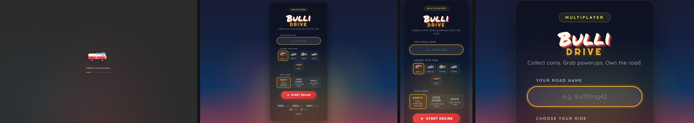
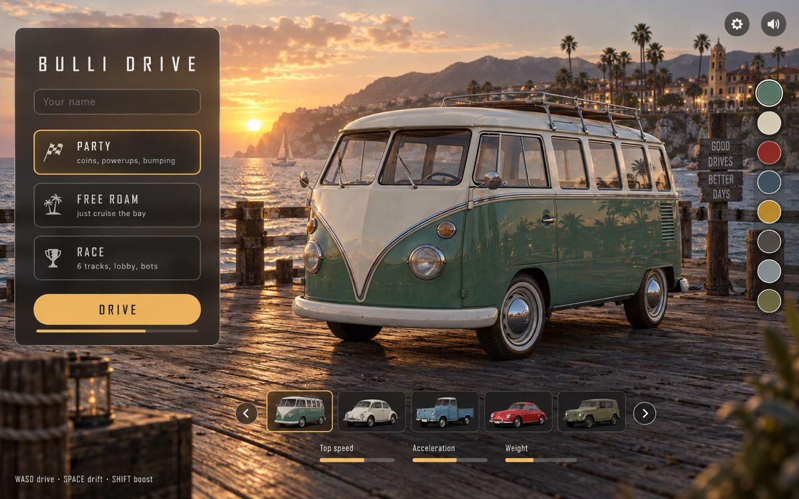
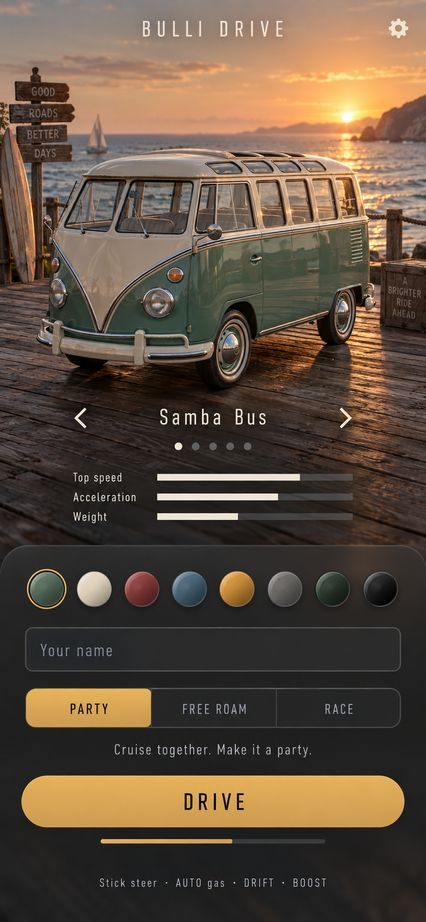
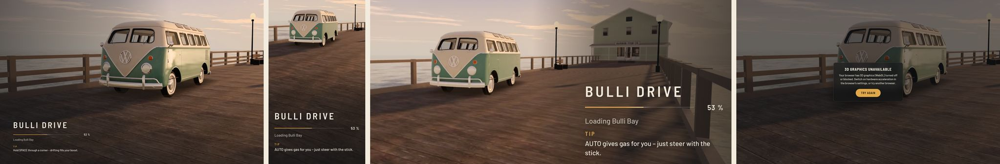
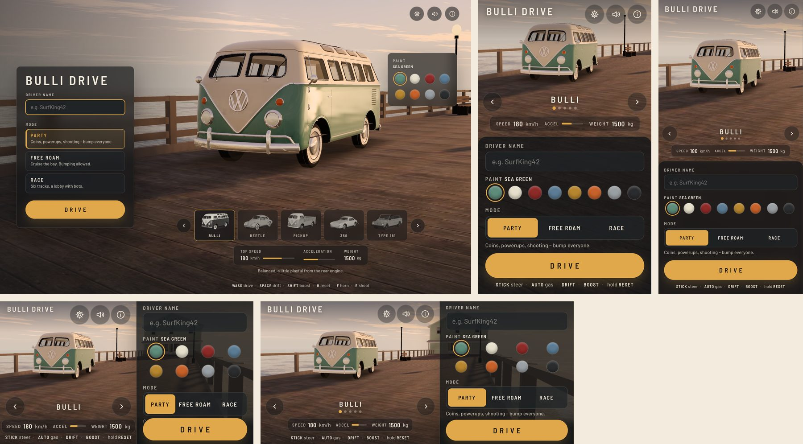

# UI: Ladebildschirm und Hauptmenü

**Stand:** 2026-09-26 · Branch `ui/menu-refactor` (auf `main` = Phase 3 live) · U1 (Ladebildschirm) und U2–U4 (Hauptmenü, Lack, Showroom und Übergang) umgesetzt, dazu die Nachbesserungen aus dem Review (Abschnitt 14) mit Teilen von U5 (Gewichte kalibriert). Offen aus U5: axe-Check und Stryker-Gesamtlauf. Was anders kam als geplant, steht in den Abschnitten 3.4, 4.5 und 14 und in den Entscheidungen D12–D39. Auf `main` mit #19 (ohne Sprung) rebased.
Auftrag: „also refactor the loading screen and main menu“. Der Ladebildschirm und das Hauptmenü sollen zum realistischen, ruhig-naturgetreuen Look von Bulli Bay passen ([`world-look.md`](world-look.md)) und sich auf Desktop und Handy gleich gut bedienen lassen.

Die Entscheidungen in diesem Dokument hat der Workflow ohne Rückfragen getroffen. Jede steht mit ihrer Begründung in Abschnitt 12 („Entscheidungen“).

## 1. Ausgangslage



Die Vorher-Aufnahmen liegen vollständig unter `/private/tmp/claude-501/gfx/ui/before/` (Desktop 1440×900, iPhone 13 hoch, iPhone SE quer, Pixel 7; jeweils Loader und Menü). Den Loader haben wir mit zurückgehaltenem WebSocket aufgenommen, sonst ist er lokal nach 1,4 s weg.

| Befund | Wo |
|---|---|
| Der Loader ist ein Cartoon-Bus aus SVG-Rechtecken mit Scherzsätzen („Polishing headlights…“, „Adding racing stripes…“). Er hat mit dem Spiel optisch nichts zu tun. | `index.html` #loading-screen |
| Der Fortschrittsbalken ist eine Endlos-Animation (`loader-slide`) und zeigt keinen echten Stand. | `style.css` `.loader-bar-fill` |
| Beim Übergang blendet der Loader über dem Menü aus. Beide Bildschirme sind verschieden aufgebaut, dadurch springt das Layout (Bus mitten über den Autokarten). | `websocket.ts` `removeLoader` |
| Das Menü ist eine einzelne Spalte auf einem Farbverlauf. Das Spiel wird dahinter bereits gezeichnet (Vorschau-Spawn), ist aber vollständig verdeckt. Dieses Bild kostet also Rechenzeit, ohne dass jemand es sieht. | `.splash-bg`, `main.ts` |
| Typografie: Righteous, Quicksand und Permanent Marker kommen von Google Fonts. Ohne dieses Netz (z. B. im E2E-Lauf und in den Screenshot-Skripten) fällt die Schrift auf `cursive` zurück. | `index.html` `<link>` |
| Auf dem iPhone SE quer liegen Autowahl, Modus und START unterhalb der sichtbaren Fläche, man muss scrollen. Auf dem iPhone 13 hoch sitzt START ganz unten am Rand. | Screenshots |
| Die Autowahl zeigt 52×32-px-Renderings, der fünfte Wagen rutscht in eine zweite Zeile. Werte der Autos fehlen ganz. | `.car-selector-row` |
| Die Spielerfarbe würfelt der Server als beliebige 24-Bit-Farbe (`handshake.ts`), der Client entsättigt sie nachträglich (`carPaintColor`). Wählen kann man sie nicht. | Server, `carMaterials.ts` |
| Hilfetexte nennen Q/„Jump“, das wird parallel entfernt (Branch `sim/airborne-no-jump`). | Menü, About-Modal |

Die Ladezeiten haben wir lokal auf einem M5 Pro gemessen (Resource Timing, Desktop-Tier). Der Code umfasst 1,8 MB in 9 Chunks, die Welttexturen 3,5 MB in 28 Dateien, das HDRI 1,8 MB, das Gebäude-Kit 1,9 MB in 17 Dateien, die Automodelle 0,9 MB in 16 Dateien und die Karte 0,36 MB. Zusammen sind das rund 10 MB. Im Lite-Tier sind es rund 5 MB, dort fehlen das HDRI und die meisten PBR-Texturen.

## 2. Leitidee und visuelle Sprache

**„Showroom am Pier“.** Das Menü ist kein Formular vor einem Farbverlauf. Das echte Spiel rendert dahinter das gewählte Auto, das in der Abendsonne am Kopf des Piers von Bulli Bay steht. Die Bedienelemente liegen als ruhiges Glas-Overlay darüber. Auch der Ladebildschirm zeigt dieses Bild, allerdings vorgerendert. Beim Übergang vom Loader ins Menü wird das Standbild dadurch nur lebendig, das Layout springt nicht.

Mockups als Stilreferenz (Codex-imagegen, Originale unter `/private/tmp/claude-501/gfx/ui/mockup-*.png`):

| Desktop | Handy hoch |
|---|---|
|  |  |

Aus den Mockups übernehmen wir die Glasflächen, die schmale Versal-Schrift mit weiter Laufweite, den gedämpften Bernstein als einzigen Akzent, die Autoreihe unten mit Werten, die runden Lack-Chips, das Bottom-Sheet auf dem Handy und den Start-Button im Daumenbereich.

Bewusst abweichend von den Mockups:

- Die KI-Bilder sind satter und dramatischer als unser Spiel. Das echte Bild ist das hellere, dunstige Grading aus `world-look.md`, wir übertreiben nichts.
- Requisiten wie Wegweiser, Kisten und die Stadt auf der Klippe gibt es auf der Karte nicht. Der Showroom zeigt nur Bulli Bay.
- Das Namensfeld bekommt eine sichtbare Beschriftung (a11y), ein Platzhalter allein reicht nicht.
- Die Lack-Chips sitzen auf dem Desktop im Panel beim Auto und schweben nicht frei am Rand.
- Die Werte-Balken tragen Zahlen, reine Balken sind nicht lesbar.

### Tokens

| Token | Wert | Verwendung |
|---|---|---|
| `--ui-ink` | `#121416` | Glasbasis: `rgba(18,20,22,.64)`, `backdrop-filter: blur(18px)`, ohne Filter-Unterstützung `.86` |
| `--ui-ink-2` | `#1E2226` | Felder, Karten |
| `--ui-line` | `rgba(243,235,221,.14)` | 1-px-Kanten |
| `--ui-paper` | `#F3EBDD` | Text (Kontrast auf `--ui-ink` ≈ 15:1) |
| `--ui-paper-2` | `rgba(243,235,221,.72)` | Nebentext (≥ 7:1 auf der Glasbasis) |
| `--ui-amber` | `#E0A84A` | einziger Akzent: Auswahl, Fortschritt, Start |
| `--ui-on-amber` | `#1B1712` | Text auf dem Start-Button (≈ 9:1) |
| `--ui-danger` | `#E06A5A` | Fehler, Verbindungsprobleme |
| Radius | 12 px Panels, 10 px Karten, Pille für den Start-Button | |
| Bewegung | 180–240 ms `cubic-bezier(.2,.7,.2,1)` | Mit `prefers-reduced-motion` nur Überblendungen, keine Kamerafahrt |

Damit der Text auch vor dem hellen Sonnenuntergang lesbar bleibt, liegt auf dem Desktop links ein Scrim (Verlauf von 55 % Ink auf 0) und auf dem Handy unten ein Sheet mit 80 % Ink. Die Kontraste prüfen wir am hellsten Bildbereich der Key-Art.

**Schrift:** Barlow und Barlow Semi Condensed (SIL OFL). Wir liefern sie selbst aus unter `public/fonts/` als Latin-Subset in WOFF2, zusammen etwa 60 KB. Zwei Schnitte werden vorgeladen (`<link rel=preload>`), dazu kommt `font-display: swap`. So hängt nichts mehr an Google Fonts. Der Schriftzug „BULLI DRIVE“ ist ein inline-SVG aus Pfaden, damit er beim ersten Paint steht und keine Schrift nachgeladen werden muss. Die Pfade erzeugt `tools/ui/wordmark.mjs` einmalig aus dem Font (opentype.js in `tools/`). Das echte VW-Logo bleibt am Auto (Nutzerentscheidung), in den Schriftzug kommt es nicht.

Die HUD-Typografie (Righteous/Quicksand) ist nicht Teil dieses Auftrags. Wir gleichen sie später an, siehe Abschnitt 13.

## 3. Ladebildschirm

### 3.1 Aufbau

```
┌──────────────────────────────────────────────────────────────┐
│ [Key-Art: Pier im Abendlicht, Bulli im Anschnitt, vollflächig]│
│                                                              │
│  BULLI DRIVE                         (Wortmarke, SVG)        │
│                                                              │
│                                                              │
│  ▔▔▔▔▔▔▔▔▔▔▔▔▔▔▔▔▔▔▔▔▔▔▔░░░░░░░░░░░░  64 %                   │
│  Loading the bay · textures 18/28                            │
│  Tip: Hold SPACE through a corner – drifting fills boost.    │
└──────────────────────────────────────────────────────────────┘
```

- **Hintergrund:** Die Key-Art füllt die Fläche (`object-fit: cover`). Es gibt eine Variante je Menü-Layout (Desktop, Handy hoch, Handy quer) und jede davon auch in Lite (D29, Abschnitt 3.3). Welche Dateien die `<picture>`-Quellen bekommen, entscheidet ein kleines Inline-Skript direkt nach dem Bild.
- **Sofort sichtbar:** Das kritische CSS steht inline in `<head>` (etwa 4 KB). Ein Blur-Platzhalter der Key-Art ist als Base64-WebP mit ≤ 1,5 KB inline eingebettet. Die Key-Art lädt mit `fetchpriority=high`, sobald das Inline-Skript ihre Quelle setzt. Der erste Paint zeigt Platzhalter, Wortmarke und Balken ohne ein Byte Game-Code.
- **Fortschrittsbalken:** 2 px hoch, Bernstein auf 14 % Paper, mit Prozentzahl in Tabellenziffern. Er zeigt den echten Stand aus 3.2, bleibt monoton und wird weich interpoliert: mindestens 30 %/s, bei großem Rückstand das 1,5-Fache des Rückstands je Sekunde. Ein schwacher Lichtschimmer läuft über die leere Spur, solange geladen wird (auch bei 0 % im Code-Schritt). Ist die Phase „Loader“ fertig, läuft der Balken in 0,26 s auf 100 %, erst dann blendet der Loader aus (D31). Der Balken hat `role="progressbar"` mit `aria-valuenow`.
- **Statuszeile:** Sie nennt den laufenden Schritt mit Zählern, z. B. „Loading the bay · textures 18/28“ oder „Preparing the view“. Die Zähler zählen eine Datei, sobald ihre Bytes da sind, nicht erst nach Dekodieren oder Upload (D38). Ein genannter Schritt bleibt mindestens 1,5 s stehen, solange er läuft. Läuft gerade keiner, steht dort der nächste. Die Zeile liegt in `aria-live="polite"`, wird aber höchstens alle 2 s angesagt.
- **Warten auf den Server:** Ist der Server nicht erreichbar, sagt die Statuszeile „Waiting for the server · retrying“ (bzw. „The server is full · retrying“) in `--ui-danger` mit Spinner. Nach 10 s bietet der Loader in seinem Panel „Reload“ an. Das Verbindungsbanner bleibt dem Loader fern (D32).
- **Tipps:** Ein Tipp alle 7 s mit Überblendung. Die Liste richtet sich nach der Eingabe: Tastatur, Touch (`pointer: coarse`) oder Gamepad (sobald eines verbunden ist). Keine Scherzsätze, nichts zu Sprung oder Q. Beispiele: „Hold SPACE through a corner – drifting fills your boost.“, „SHIFT burns boost.“, „Hold R to reset onto the road.“, „F honks.“, „Party: E shoots.“; Touch: „AUTO gives gas for you – steer with the stick.“, „Hold the reset button to get back on the road.“; Gamepad: „RT gas, LT brake, A drift, B boost.“
- **Fehlerfälle:** Die Anzeige aus `contextLoss.ts` (WebGL verweigert) steht als Glaskarte allein über der abgedunkelten Key-Art, das Loader-Panel ist dann ausgeblendet. Ihr Text unterscheidet einen ersten Fehlschlag („WebGL turned off or blocked … hardware acceleration“) von einem nach Grafikproblemen auf diesem Gerät („after the graphics crashed“). Kein Schritt darf den Balken endlos stehen lassen, jeder hat ein Timeout (3.2).

### 3.2 Echter Fortschritt

Neues reines Modul `src/client/ui/loadProgress.ts`, ohne DOM und ohne three.js:

```ts
interface LoadTask { id: TaskId; weight: number; label: string; fraction: number; state: 'pending'|'running'|'done'|'skipped'|'timedOut'; count?: [done: number, total: number] }
createLoadProgress(tasks, clock) → { start(id), report(id, fraction, count?), done(id), skip(id), overall(): number /* 0..1, monoton */, status(): string, whenPhase(phase): Promise<void> }
```

Die Gesamtzahl ist Σ(w·f)/Σw über alle nicht übersprungenen Schritte. Übersprungene Schritte, etwa das HDRI im Lite-Tier, fallen aus dem Nenner. Der Balken springt dabei nicht zurück, weil `overall()` monoton bleibt. Die Statuszeile nennt den laufenden Schritt mit dem größten offenen Gewicht und hält ihn mindestens 1,5 s (`STATUS_HOLD_MS`).

| Schritt (`TaskId`) | Quelle des Fortschritts | Gewicht Desktop | Gewicht Handy/Lite | Phase |
|---|---|---|---|---|
| `code`: Spiel-Code (Chunks `index`, `three`) | Inline-Bootstrap: `load`-Events der `modulepreload`-Links, gewichtet mit den Chunk-Größen, die ein kleines Vite-Plugin beim Build als `data-size` einträgt | 20 | 25 | Loader |
| `connect`: Verbindung, `welcome`, `roomState` | `websocket.ts` | 5 | 5 | Loader |
| `map`: Karte laden und Gelände bauen | Fetch `map.json` und `createMapScene` (CPU, zwei Teilschritte je 50 %) | 15 | 20 | Loader |
| `textures`: Welttexturen | Bytes je Datei laut Manifest (`FetchTally`, 80 %) und fertige Uploads (20 %), Zähler: Dateien geladen/angefragt | 25 | 15 | Loader |
| `kit`: Gebäude-Kit (GLB + KTX2) | Bytes der GLBs und Atlas-Dateien laut Manifest (`FetchTally`, 90 %, das Parsen ist der Rest), Zähler je Datei | 15 | 15 | Loader |
| `car`: Modell des gewählten Autos | `ModelCache`, neu je Autotyp abfragbar | 5 | 5 | Loader |
| `hdri`: Umgebung | `lighting.ts` (nur im Desktop-Tier, sonst `skip`) | 7 | – | Loader |
| `warmup`: Shader-Warmup, Status „Preparing the view“ | `renderer.compileAsync(scene, showroomCamera)` für das erste Showroom-Bild | 8 | 10 | Loader |
| `cars`: die übrigen vier Autos | `ModelCache` | 5 | 5 | Menü (Start-Button) |
| `audio`: Motor-Samples dekodieren | `initSounds` (braucht eine Nutzergeste, startet erst beim Klick) | – | – | Start |

Die Gewichte sind erwartete Anteile an der Wanduhr, keine Bytes. Die Tabelle zeigt die Startwerte. **Kalibriert (U5)** mit `?debug=load` bei gedrosseltem Netz (CDP): Desktop mit 25 Mbit/s und 40 ms, Pixel 7 mit 4G (6,4 Mbit/s, 150 ms). Desktop: Code nach 0,9 s, Karte und Verbindung bis 2,3 s, Texturen bis 4,3 s, Warmup unter 0,1 s. Handy: Code nach 2,2 s, Karte und Verbindung bis 5,2 s, das eigene Auto bis 7,7 s, Texturen und Kit bis 10,5 s. Daraus folgen die Gewichte in `loadProgress.ts`: Desktop Code 20, Verbindung 5, Karte 15, Texturen 30, Kit 12, Auto 4, HDRI 6, Warmup 3, übrige Autos 5. Handy und Lite: Code 25, Verbindung 4, Karte 12, Texturen 26, Kit 15, Auto 5, Warmup 8 (Handy-GPUs kompilieren langsamer als die Emulation zeigt), übrige Autos 5. Der Balken läuft damit auf 4G gleichmäßig von 0 auf 89 %, ohne Stufe, und dann in 0,26 s auf 100 %.

**Phasen:** Der Loader bleibt stehen, bis alle Schritte der Phase „Loader“ fertig sind (dann läuft der Balken auf 100 % und der Loader blendet aus, `finishLoader`). Erst dann ist das erste Showroom-Bild vollständig texturiert und kompiliert. Ein Schritt, der sein Timeout überschreitet, geht auf `timedOut`. Das Timeout ist `ASSET_WAIT_MS` = 20 s für den ganzen Loader wie heute, dazu kommen je Schritt Obergrenzen. Der Loader geht dann trotzdem, und der Rest läuft sichtbar auf dem Start-Button weiter. `assetGate.ts` geht in diesem Modell auf: Der Start wartet auf die Phase „Menü“, die heutige Wartelogik mit Timeout bleibt.

Heute verschwindet der Loader, sobald die Welt gebaut ist. Texturen und Modelle laden danach unsichtbar hinter dem Menü weiter. Künftig ist der Loader etwas länger zu sehen. Die reine Ladezeit bis zum Losfahren bleibt gleich, weil das Asset-Gate heute schon am START wartet. Dafür sieht man im Menü nie eine untexturierte Welt. Was sich ändert (D4): Name, Auto und Modus wählt man erst nach dem Laden, nicht mehr währenddessen. Wer schnell ist, fährt also etwas später los.

**Bootstrap vor dem Game-Code:** Ein Inline-Skript von etwa 1 KB legt `window.__bulliLoad` als Warteschlange an und zählt die `code`-Fortschritte. `loadProgress.ts` übernimmt die Warteschlange, sobald `main.ts` läuft. Das Skript steht neben dem vorhandenen Stale-Client-Guard und ändert dessen Verhalten nicht.

### 3.3 Key-Art

**Entscheidung:** Die Key-Art ist ein echtes In-Engine-Render und kein KI-Bild. Sie zeigt dieselbe Einstellung wie das erste Showroom-Bild: Pier-Kopf, Bulli in Sea Green (der Lack eines ersten Besuchs, D28), Kamera auf der Orbit-Startpose, Sonnenuntergang aus `map.json`. Das hat drei Gründe:

1. Der Wechsel vom Loader zum Menü ist dann eine Überblendung zwischen zwei fast gleichen Bildern (400 ms), kein Schnitt.
2. Karte, Licht und Grading stimmen automatisch mit dem Spiel überein.
3. Sie lässt sich reproduzierbar neu erzeugen, wenn sich Karte oder Modelle ändern.

Wir erzeugen sie mit `tools/ui/keyart.ts`. Das Skript nutzt die Infrastruktur von `scripts/screenshots.ts` (Produktionsbuild, GPU, `?e2e=1`) und nimmt das echte Menü mit reduzierter Bewegung auf, das Menü selbst ausgeblendet (D20). Seit D29 gibt es eine Aufnahme je Menü-Layout, jeweils im Render-Tier der Geräte mit diesem Layout:

| Datei | Layout | Aufnahme | Größe |
|---|---|---|---|
| `keyart-1920.webp` | Desktop | 1920×1080 CSS-px bei DPR 2, Desktop-Tier (HDRI), auf 1920×1080 verkleinert | 94 KB (≤ 250) |
| `keyart-portrait.webp` | Handy hoch | 390×750 bei DPR 2 (zwischen iPhone in Safari 390×664 und Pixel 7 412×839), Handy-Tier | 37 KB (≤ 120) |
| `keyart-phone-landscape.webp` | Handy quer (`max-height: 520px`) | 844×390 bei DPR 2 (iPhone 13 quer), Handy-Tier | 39 KB (≤ 120) |
| `keyart-lite-*.webp` | dieselben drei in Lite (`?lite=1`) | wie oben | 57 / 30 / 25 KB |

Dazu kommt der Blur-Platzhalter (≤ 1,5 KB, aus der Desktop-Aufnahme). Ein Unit-Test prüft Größen und Maße (Abschnitt 10). Welche Variante eine Seite zeigt, entscheidet das Inline-Skript nach dem `<picture>`: Die Quellen tragen die Media-Queries der Menü-Layouts, und bei Lite nimmt es die `lite-`-Dateien. Seine Lite-Entscheidung spiegelt `render/safeMode.ts` (Link > Einstellung > Trouble-Timer), ein Unit-Test vergleicht beide über eine Tabelle. Im Hochformat sitzt das Bild mit `object-position: 50% 30%`, damit das Auto auf einem iPhone in Safari (390×664) dort steht, wo das Menü es hinstellt.

Fallback nur, wenn das Render nicht trägt (etwa zu leerer Vordergrund): eine Codex-imagegen-Key-Art im Stil der Mockups, ausdrücklich „calm, naturalistic, not oversaturated“, mit dem Prompt unter `tools/ui/keyart-prompt.md`. Dann ist allerdings der Übergang zum Menü ein Schnitt mit Überblendung, und das Bild passt nur ungefähr zur Karte.

### 3.4 Umsetzung (U1)



Aufnahmen vorher und nachher: `/private/tmp/claude-501/gfx/ui/before/` und `/private/tmp/claude-501/gfx/ui/after/` (Loader und Menü auf Desktop 1440×900, iPhone 13, iPhone SE quer, Pixel 7; dazu `after/nogl/` mit verweigertem WebGL und `after/lite/` mit `?lite=1`).

| Teil | Datei |
|---|---|
| Fortschrittsmodell (rein, Uhr injiziert) | `src/client/ui/loadProgress.ts` |
| Bindung an das DOM, Übernahme vom Bootstrap, Tipps, `removeLoader`, `stopLoadingScreen`, `?debug=load` | `src/client/ui/loadingScreen.ts` |
| Quellen der Schritte (Kit, Autos, HDRI, Texturen, Warmup) | `src/client/assets/loadSteps.ts`; Verbindung und Karte melden aus `network/websocket.ts` |
| Tipps je Eingabeart | `src/client/ui/loaderTips.ts` |
| Showroom-Startpose (Key-Art und künftiges erstes Menübild) | `src/client/camera/showroom.ts` |
| Chunk-Größen als `data-size`, nicht blockierendes Stylesheet | `vite.config.ts` (`loaderAssetsPlugin`) |
| Key-Art-Render | `tools/ui/keyart.ts` → `public/ui/keyart-{1920,portrait,phone-landscape}.webp` und die Lite-Varianten (Abschnitt 3.3), Platzhalter inline (0,2 KB) |
| Wortmarke | `tools/ui/wordmark.mjs` schreibt das SVG zwischen `<!-- wordmark -->`-Markern in `index.html` |
| Schriften | `public/fonts/` mit `LICENSES.md` |

**Ablauf:** Das Inline-Skript im `<head>` zählt die Code-Dateien per `load`-Event und bewegt den Balken bis 20 % (kleinster Anteil des Code-Schritts). `main.ts` startet nach dem Renderer `startLoadingScreen(tier)`, der die Anzeige übernimmt (nie rückwärts), und `trackLoadSteps`. Die Verbindung und die Karte melden aus `websocket.ts`; sobald die Welt steht (`mapWorldBuilt`), zählen die Texturen, und nach Texturen, Kit und eigenem Auto kompiliert `renderer.compileAsync(scene, camera)` die Shader. Ab diesem Moment wartet der Loader höchstens `ASSET_WAIT_MS` (20 s) auf den Rest (`expire('loader')`), jeder Schritt hat zusätzlich seine Obergrenze. Wenn die Phase „Loader“ erledigt ist, blendet `removeLoader` in 400 ms über das Menü aus, das auf derselben Key-Art liegt. Der START-Button zeigt weiter den Stand, jetzt als `percent('menu')` desselben Modells.

**Gemessen (M5 Pro, lokal, `?debug=load`):** Code und Karte in ~0,35 s, Verbindung bis ~0,5 s, Kit, Autos und Texturen bis ~0,7 s, Loader weg nach 1,3–1,7 s. Lokal ist alles so schnell, dass die Gewichte daraus nicht kalibrierbar sind. Sie bleiben die Startwerte aus 3.2, die Kalibrierung mit gedrosseltem Netz gehört zu U5.

**E2E:** Alle 8 Specs grün, 1:46 min inklusive Build (Port 9220). Die längere Loader-Phase hat die Suite nicht verlängert, weil das Asset-Gate am START vorher genauso lange wartete.

## 4. Hauptmenü

### 4.1 Showroom

- **Ort:** Die Karte bekommt einen neuen POI `showroom` in `pois.json` mit Stellplatz, Hero-Gierwinkel und Kameradaten, am Kopf des Piers (−700…−760, −20). Die Sonne steht West-Nordwest über dem Pazifik und fällt als Streiflicht von hinten seitlich ein, dahinter liegen Meer und Pier-Restaurant. Die Scout-Aufnahmen `pier.png` und `lookout.png` (unter `/private/tmp/claude-501/gfx/ui/scout/`) zeigen, dass der Aussichtspunkt zu leer wirkt. Der Pier trägt als Motiv.
- **Das Auto:** Es ist das eigene Auto (`state.bulli`) vor `ready`. Es fährt nicht und wird nicht simuliert, es steht nur lokal auf dem Showroom-Platz. Andere Spieler sehen es nicht, weil der Server es erst beim Spawn setzt. Wechselt man das Auto, wird der Wagen in 250 ms getauscht: Er senkt sich 0,3 m ab, kurzes Ausblenden, der neue kommt. Im Karussell wird das nächste Modell schon vorgewärmt.
- **Kamera:** Neue Klasse `ShowroomCamera`. Die Posen berechnet eine reine Funktion `showroomPose(t, params)`, damit sie testbar ist. Die Kamera schwingt pendelnd ±35° um den Hero-Winkel (Dreiviertel von vorn), bei 6,5 m Abstand, 1,35 m Höhe und 35° FOV, mit einer Periode von 40 s. Sie macht bewusst keine volle Umrundung, damit das Gegenlicht und der Pier im Bild bleiben. `camera.setViewOffset` verschiebt das Auto aus der UI: auf dem Desktop in die rechten 60 %, auf dem Handy hoch in die oberen 55 %.
- **Kosten:** Auf Handys zeichnet der Showroom mit höchstens 30 fps, auf dem Desktop voll. Draw Calls und Dreiecke bleiben im Budget des Tiers (Desktop ≤ 300 Calls/1,2 Mio. Dreiecke, Handy ≤ 150/500 k), gemessen mit der neuen Screenshot-Ansicht `showroom`. Das Rendern hinter einem verdeckenden Menü entfällt, weil das Menü nicht mehr verdeckt.
- **Andere Spieler** fahren sichtbar vorbei, wenn sie in der Nähe sind (Remote-Autos wie im Spiel). Das belebt die Szene. Die Nametags der anderen blenden wir im Menü aus.

### 4.2 Layouts

**Desktop (≥ 1024 px breit, Querformat):**

```
┌──────────────────────────────────────────────────────────────────────┐
│┌──────────────┐                                       [⚙] [♪] [?]    │
││ BULLI DRIVE  │                                                      │
││ Driver name  │                ╭──────────╮                          │
││ [Logge     ] │               (  3D-Auto   )        Lack  ● ● ● ●    │
││              │                ╰──────────╯              ● ● ● ●    │
││ ▣ PARTY      │                                                      │
││ ▢ FREE ROAM  │   ‹ [Bulli][Beetle][Pickup][356][181] ›              │
││ ▢ RACE       │     Top speed 180 km/h ▬▬▬▬▬▬▭  Accel ▬▬▬▭  1500 kg  │
││ [  DRIVE   ] │                                                      │
│└──────────────┘  WASD drive · SPACE drift · SHIFT boost · R reset    │
└──────────────────────────────────────────────────────────────────────┘
```

Das linke Panel ist 360 px breit und vertikal zentriert. Autoreihe und Werte liegen unten mittig im Bereich des Autos. Die Lack-Chips stehen in einer kleinen Glaskarte rechts neben dem Auto, zwei Reihen à vier.

**Handy hoch** (iPhone 13, Pixel 7, ab 360×640): Oben liegen Wortmarke und ⚙, darunter die Showroom-Fläche (etwa 50–55 %) mit Autoname, Pfeilen ‹ ›, Punkten und den drei Werten (seit dem Review in einer Zeile, damit das Auto die Höhe bekommt). Unten folgt ein Glas-Sheet mit acht Lack-Chips (44 px), dem Namensfeld mit Label, den Modi als Segmentsteuerung mit einer Zeile Beschreibung und einem vollbreiten DRIVE-Button (56 px) im Daumenbereich über `env(safe-area-inset-bottom)`. Im Karussell wischt man auf der Showroom-Fläche. Unter 700 px Höhe (iPhone SE hoch) werden die Werte zu einer Zeile, und die Lack-Chips wandern in eine horizontal scrollende Reihe. DRIVE bleibt ohne Scrollen sichtbar.

**Handy quer** (iPhone SE quer 667×375 und kleiner): Das Auto steht links vollflächig, rechts liegt ein Panel von 320 px, das intern scrollt. DRIVE klebt am unteren Rand des Panels (`position: sticky`), Name, Lack und Modus stehen darüber. Das behebt den heutigen Befund, dass START unter der sichtbaren Fläche liegt. Die Autopfeile sitzen links und rechts am Auto. Die Safe Areas der Notch-Seiten werden eingehalten. Seit dem Review: Die Lack-Chips stehen quer in zwei Reihen à vier, damit jedes Ziel 44×44 px hat. Unter der Segmentsteuerung steht eine Zeile zum gewählten Modus wie im Hochformat. Auf dem iPhone 13 quer (750×342) passt alles ohne Scrollen, auf dem kleinsten Gerät (568×320) liegt nur diese Zeile unter DRIVE. Unter 640 px Breite ist die Wortmarke kleiner, damit sie nicht an die Werkzeuge stößt.

### 4.3 Elemente

| Element | Verhalten |
|---|---|
| **Name** | Sichtbares Label „Driver name“. Der gespeicherte Name wird vorbelegt (`bulli-player-name`), maximal 20 Zeichen. Enter startet. |
| **Autowahl** | Karussell mit fünf Karten. Die Renderings sind neu, im Dreiviertel-Profil mit 320×180 bei 2×, als WebP je ≤ 20 KB, gerendert aus den Blender-Skripten (`tools/ui/menu-renders.mjs`). Sie tragen den Werkslack, das Menü zeigt sie deshalb entsättigt im Papierton (D30). Sie laden erst, wenn das Menü erscheint, und blenden dann ein. Die heutigen 52×32-Icons bleiben für die Race-Lobby. Der Wechsel tauscht das 3D-Auto (4.1). Namen in der UI: Bulli, Beetle, Pickup, 356, Type 181. Die IDs (`bulli`, `beetle`, `pickup`, `sport`, `jeep`) bleiben. |
| **Werte** | Topspeed in km/h (`topSpeed`·3,6: Bulli 180, Beetle 173, Pickup 169, 356 198, 181 176), Beschleunigung als Balken (`accel`, 8,0–11,0 m/s²) und Masse in kg (900–2000). Die Balken zeigen `0,35 + 0,65·(v − min)/(max − min)` über die fünf Klassen, damit kein Auto leer aussieht. Alles kommt aus `VEHICLE_CLASSES` und wird nirgends kopiert. Dazu kommt eine Zeile Charakter („Balanced, a little playful“, aus den Kommentaren der Klassen übernommen). |
| **Lack** | Acht Chips, Radiogruppe (Abschnitt 5). Vorausgewählt ist der zuletzt gewählte Lack, beim ersten Besuch Sea Green, der Lack der Key-Art (D28). |
| **Modus** | Drei Karten mit Radiogruppe: **Party**: „Coins, powerups, shooting – bump everyone.“ **Free Roam**: „Cruise the bay. Bumping allowed.“ **Race**: „6 tracks, lobby with bots. Time trial from the room menu.“ Bei gewähltem Race erscheint der Hinweis „You start in the race lobby – pick track and bots there.“ Die Wahl merkt sich wie heute `bulli-room-kind`, das Zeitfahren zählt als Race. |
| **DRIVE** | Großer Pillen-Button. Solange die Menü-Phase noch lädt (übrige Autos, Zeitüberschreitungen aus dem Loader), füllt sich der Button von links, und das Label lautet „LOADING 64 %“. In den ersten 0,5 s, während der Loader ausblendet, zeigt er schlicht „DRIVE“ (D31). Ein Klick darauf ist trotzdem erlaubt: Er merkt den Start vor (Label „STARTING…“) und fährt los, sobald alles da ist oder das Timeout abläuft. Ab dem Klick ist die Wahl fest: Das Panel ist `inert` und abgeblendet, Karussell, Lack, Modus, Wischen und Gamepad ändern nichts mehr (D35). Ein zweiter Klick bricht nichts ab. |
| **Steuerungshinweis** | Eine Zeile je Eingabeart, ohne Q: Tastatur „WASD drive · SPACE drift · SHIFT boost · R reset · F horn“ (in der Party zusätzlich „E shoot“), Touch „Stick steer · AUTO gas · DRIFT · BOOST · hold reset“, Gamepad „RT gas · LT brake · A drift · B boost · View reset“. |
| **⚙ Einstellungen** | Dialog (`<dialog>`, Fokusfalle, Esc schließt). **Graphics**: Auto / Lite / High (Abschnitt 7). **Sound**: On/Off, als Master-Gain in `sounds.ts`, gespeichert unter `bulli-sound`. **Controls**: Registerkarten Keyboard / Touch / Gamepad mit voller Belegung; vorausgewählt ist die erkannte Eingabeart. |
| **♪** | Schnellschalter für Ton an/aus, gleicher Zustand wie in den Einstellungen. |
| **? About** | Kompakt in drei Zeilen: was das Spiel ist, Credits (Modelle: eigene Blender-Skripte; Texturen/HDRI: Poly Haven CC0 u. a. laut `LICENSES.md`; Schrift: Barlow, OFL), Build-Version. Die Party-Powerups stehen als Liste darunter, ohne „Jump“. |

### 4.4 Bedienung und a11y

- **Tastatur:** Die Tab-Reihenfolge ist Name → Autowahl → Lack → Modus → DRIVE → ⚙/♪/? in allen drei Layouts (D22, im Review bestätigt: D37). In Karussell und Radiogruppen wechseln die Pfeiltasten die Wahl (Roving Tabindex wie heute bei `.mode-option`). Enter im Namensfeld startet. Q/E als Kürzel für die Autowahl gibt es nicht, weil sie mit dem Spiel kollidieren würden.
- **Gamepad** (Standard-Mapping aus `input/gamepad.ts`, abgefragt nur solange das Menü offen ist): Steuerkreuz oder linker Stick hoch/runter wandert zwischen den Zeilen (Name überspringt es), links/rechts ändert die Wahl der Zeile, LB/RB wechselt das Auto überall, A aktiviert bzw. startet, Menu öffnet die Einstellungen, B schließt Dialoge. Der Fokusring ist dabei der sichtbare Cursor. Die Aktionen des Spiels auf denselben Tasten (LB hupt, X schießt) sind im Menü gesperrt, wie die Tastatur (`state.inMenu` in `v2Driver.ts` und `Bulli.handleActions`).
- **Touch:** Ziele sind mindestens 44×44 px, DRIVE hat 56 px. Wischen im Showroom wechselt das Auto. Kein Hover-only.
- **Screenreader:** Das Karussell trägt `role="group"` und `aria-roledescription="carousel"`, die gewählte Karte `aria-current`. Beim Wechsel wird „Beetle – 173 km/h, 900 kg“ angesagt. Die Lack-Chips haben Namen („Sea Green“). Das Canvas ist `aria-hidden`.
- **Fokus:** Ein 2-px-Ring in `--ui-paper` mit 2 px Abstand, immer über `:focus-visible`. Beim Öffnen des Menüs bekommt auf Geräten mit Tastatur das Namensfeld den Fokus, auf Touch-Geräten nichts, damit nicht sofort die Bildschirmtastatur aufgeht.
- **Kontraste:** Text mindestens 4,5:1 und große Schrift mindestens 3:1, jeweils auf dem hellsten Hintergrund. Einmalig lokal mit axe-core geprüft, nicht in CI.
- **Bewegung:** Mit `prefers-reduced-motion` steht die Showroom-Kamera still, und die Übergänge sind Überblendungen.

### 4.5 Umsetzung (U2–U4)



Aufnahmen: `/private/tmp/claude-501/gfx/ui/menu/` (Chromium und WebKit, je Desktop 1440×900, iPhone 13, iPhone SE quer, Pixel 7; dazu Einstellungen, About, Race-Auswahl, Lite, der Übergang als Bildfolge `*-drive-*.png` und das Raum-Menü im Spiel `room*.png`).

| Teil | Datei |
|---|---|
| Zustand, Speicherung, Navigation, Gamepad-Abbildung (rein) | `src/client/ui/menu/menuState.ts` |
| Werte der Autos aus `VEHICLE_CLASSES` | `src/client/ui/menu/carStats.ts` |
| Controller: DOM, Karussell, Wischen, Tasten, Gamepad, DRIVE, Rahmen für den Showroom | `src/client/ui/menu/menu.ts` |
| Einstellungen und About (`<dialog>`), auch aus dem Raum-Menü im Spiel | `src/client/ui/menu/settingsDialog.ts` |
| Lack zwischen Verbindung und Chips | `src/client/ui/menu/paintSync.ts` |
| Stile (Desktop, Handy hoch, Handy quer), importiert von `style.css` | `src/client/ui/menu.css` |
| Showroom-Posen, Einpassen, Kran-Übergang (rein) | `src/client/camera/showroom.ts` |
| Showroom und Übergang an Kamera, Auto und Renderer | `src/client/camera/ShowroomCamera.ts`, verdrahtet in `main.ts` |
| Grafik-Einstellung (Vorrang URL > Einstellung > Trouble > Auto) | `src/client/render/safeMode.ts`, `effects/renderQuality.ts` |
| Ton an/aus als Master-Gain | `src/client/effects/sounds.ts` |
| Menü-Renderings der Autos (Blender, 640×360, je ≤ 20 KB) | `tools/ui/menu-renders.mjs` → `public/icons/car-*-menu.webp` |
| Key-Art = erstes Menübild (echtes Menü, reduzierte Bewegung, UI ausgeblendet) | `tools/ui/keyart.ts` |
| Ansichten `menu`, `menu-phone`, `menu-landscape`, `showroom` mit Draw-Call-Budget | `scripts/screenshots.ts` |

**Ablauf:** `initMenu` baut Karten und Lack-Chips aus den Daten (`MENU_CARS`, `PAINTS`) und stellt die Wahl des letzten Besuchs her. Der Loader gibt das Menü mit dem Ereignis `menushow` frei. Solange das Menü offen ist, stellt `ShowroomCamera` das eigene Auto (vor dem Spawn nicht in der Simulation) an den Pier-Kopf und führt die Spielkamera. Die Verfolgerkamera läuft derweil auf einer eigenen Kamera mit, damit ihre Dämpfung nicht von der Showroom-Pose ausgeht. DRIVE wartet auf die Assets (Beschriftung `LOADING n %`, danach `STARTING…`), schickt Name, Auto, Lack und Modus und dann `ready`. Danach übernimmt der Kran und gibt am Ende die Kamera an die Verfolgerkamera ab. Das HUD blendet in den letzten 0,3 s ein (`body.in-menu`).

**Einpassen statt fester Posen:** Das Auto steht in der freien Fläche neben bzw. über den Bedienelementen (`menuCarFrame`: Bühne ohne Karussell, Wortmarke und Werkzeuge). `fitDistance` rechnet daraus den Kameraabstand. Die Höhe des Autos (0,54 des Bildes bei 8 m und 35°, an der Key-Art gemessen) soll im Querformat 70 % der freien Höhe füllen und höchstens 72 % der freien Breite, mit 1,5 als Breiten-/Höhenverhältnis in der Dreiviertelansicht. Im Hochformat ist die freie Fläche niedrig, dort füllt das Auto 92 % der Höhe und höchstens 62 % der Breite (`fill`, `maxWidth` je Framing). Gemessen: iPhone 13 in Safari (390×664) 45 % der Bildbreite statt vorher 28 %, Pixel 7 49 %. Der Abstand bleibt zwischen 7 und 15 m. Weil der Pier nur 10 m breit ist, dreht `heroAngleFor` weitere Einstellungen mehr nach vorn, damit die Kamera über den ganzen Schwenk mindestens 1,2 m innerhalb des Geländers bleibt (Unit-Test über alle Abstände und den ganzen Schwenk).

**Gemessen (M5 Pro, GPU, `/?e2e=1`, Menü offen, 2 s):**

| Gerät | Draw Calls | Dreiecke | fps im Menü |
|---|---|---|---|
| Desktop 1440×900 (Desktop-Tier) | 61 | 408 k | 60 |
| iPhone 13 / Pixel 7 (Handy-Tier) | 55 | 198 k | 30 (Deckel) |
| iPhone SE quer | 54 | 198 k | 30 |
| Lite (`?lite=1`) | 32 | 92 k | 0 im Leerlauf (Standbild) |

Alles liegt weit im Budget des Tiers (Desktop ≤ 300/1,2 Mio., Handy ≤ 150/500 k). Den Ladevorgang bremst der Showroom nicht: Unter dem deckenden Loader wird nichts gezeichnet. Der Loader verschwindet lokal nach 1,3–1,9 s wie in U1. Der Shader-Warmup kompiliert die erste Showroom-Ansicht, vorher werden Gelände, Kit-Zellen, Palmen und Auto-LODs für genau diese Kamera gesetzt.

**Übergang:** Kran 0,7 s nach oben bis 45 m, Blick 10° über die Bildunterkante in den Himmel, Schnitt beim Spawn, 1,1 s Anflug (Bildfolge `chromium-desktop-drive-*.png`). Mit reduzierter Bewegung und in Lite: Das nächste Showroom-Bild wird nach dem Zeichnen als Standbild festgehalten (`afterRender`), das Auto steht dafür noch am Pier, und das Standbild blendet in 0,3 s über dem ersten Spielbild aus. Jede Übergangsart endet auch ohne Spawn, spätestens 2 s (`maxHold`) nach dem Aufstieg; der Direktflug wartet dafür am Pier (D36).

## 5. Lackfarbe (Protokoll v6)

Neues Modul `src/shared/paints.ts` mit `PAINT_IDS` und je Lack Name und sRGB-Hex. Startwerte, die im Lookdev (Showroom-Licht und Blender-Renders) nachjustiert werden:

| ID | Name | Hex |
|---|---|---|
| `sea` | Sea Green | `#5E8C7A` |
| `cream` | Pearl White | `#E6DFCC` |
| `red` | Sealing Red | `#8E2A28` |
| `blue` | Dove Blue | `#5C7C95` |
| `ochre` | Ochre | `#B8862F` |
| `orange` | Signal Orange | `#C8612A` |
| `silver` | Silver | `#9A9FA3` |
| `anthracite` | Anthracite | `#2A2C2E` |

Protokolländerungen:

- **`hello.paint?`**: eine kurze Zeichenkette; eine ID außerhalb der Palette zählt wie kein Wunsch (D33). Damit steht die Farbe schon beim `welcome` fest, und das Showroom-Auto ist sofort richtig lackiert. Die Seite schickt immer einen Lack: den gewählten, beim ersten Besuch Sea Green (D28).
- **Neue Client-Nachricht `{ type: 'setPaint', paint }`** für einen Wechsel im Menü (und später im Spiel). Der Server setzt `session.color` auf den Hex-Wert des Lacks und teilt es dem Raum mit. Der Wechsel teilt sich das Rate-Limit mit `setCar`.
- **`playerUpdated.color?: number`** (additiv). Remote-Autos tauschen damit ihr Lackmaterial, ohne das Modell neu zu bauen.
- Ohne `paint` wählt der Server einen zufälligen Lack aus der Palette statt einer beliebigen 24-Bit-Farbe. Das gilt auch für die Race-Bots: `BOT_COLORS` wird durch die Palette ersetzt. Resume-Tickets behalten die Farbe wie heute.
- **Client:** `carPaintColor` erkennt Paletten-Hexwerte und übernimmt sie unverändert, weil sie bereits im Lookdev abgestimmt sind. Andere Werte, etwa von alten Tickets, werden wie heute gemappt. Die zweite Farbe (Creme-Oberteil bei Bulli und Pickup) bleibt fest am Modell.
- **Umgesetzt:** `hello.paint` gilt auch bei der Übernahme einer Sitzung (Neuladen, Wiederverbinden). Bei einem wiederaufgenommenen Mitglied geht die Änderung wie ein `setPaint` an den Raum. `setPaint` setzt `session.color` sofort. Dem Raum zeigt `Room.showCarChanges` Auto- und Lackwechsel gemeinsam höchstens einmal je `CAR_CHANGE_INTERVAL_MS`. Ein reiner Lackwechsel baut kein neues Sim-Auto und löst kein `carChanged` aus. Ohne Wunsch zieht der Server den Lack über eine injizierbare `RandomSource` (`HandshakeContext.random`).
- **`PROTOCOL_VERSION` 5 → 6.** Die neue Nachricht würde ein alter Server abweisen, und laut `protocol.ts` wird bei jeder inkompatiblen Änderung erhöht. Deploys laufen ohnehin über den Build-Check mit Neuladen. Geplant war 4 → 5; der parallele Branch `sim/airborne-no-jump` (#19, ohne Sprung) ist aber zuerst gemergt und hat v5 belegt, deshalb bekommt der Lack beim Rebase v6 (D39).

## 6. Übergang Menü → Spiel

Ziel ist eine durchgehende Kamerafahrt vom Showroom in die Verfolgerkamera, ohne schwarzes Bild und ohne harten Schnitt. Der Spawn kann hunderte Meter entfernt sein (Party-Arena am Cannery Lot), und bei einem Moduswechsel steht er vorher gar nicht fest. Deshalb liegt der Schnitt im Himmel:

1. **Kran nach oben (0–0,7 s):** Die UI blendet aus (CSS, 240 ms). Die Kamera steigt vom Showroom auf etwa 30 m und neigt sich auf +26° nach oben, Richtung Sonne. Bei 35° vertikalem FOV liegt die Bildunterkante dann 8,5° über dem Horizont, im Bild ist nur noch Himmel.
2. **Unsichtbarer Wechsel:** Solange nur Himmel zu sehen ist, springt die Kamera über den Spawn-Punkt, sobald der Server gespawnt hat (`net.spawned`). Blickrichtung und Neigung bleiben dabei gleich. Der Himmel (HDRI oder analytischer Himmel, Nebel, Sonne) hängt nur von der Blickrichtung ab, deshalb ist der Wechsel nicht zu sehen. Dauert der Spawn länger, treibt die Kamera langsam weiter im Himmel. Nach 2 s geht es mit der Vorschau-Position des Servers weiter.
3. **Anflug (0,7–1,8 s):** Die Kamera sinkt ab und schwenkt mit Ease-out auf die Pose hinter dem Auto. `ChaseCamera` bekommt dafür `startFrom(pose)` und übernimmt mit ihrer normalen Dämpfung. Motor-Sound und HUD blenden in den letzten 300 ms ein.

Liegt der Spawn nahe am Showroom (unter 150 m, gleicher Raum, nur Party und Free Roam: in Race und Zeitfahren ist die Vorschau ein Free-Roam-Platz und der Spieler wird evtl. Zuschauer, D36), entfällt der Himmel. Die Kamera fliegt dann direkt als Hermite-Kurve von der Orbit- zur Verfolgerpose. Mit `prefers-reduced-motion` gibt es keinen Kran: Das letzte Showroom-Bild wird per `createImageBitmap` festgehalten und über 200 ms auf das erste Verfolgerbild überblendet. Die Posen berechnet `transitionPose(t, from, to, cutAt)` als reine Funktion (Test in Abschnitt 10). Das Canvas wird nie geleert, und die Deckkraft der Overlays geht nie über ein Bild ohne gezeichneten Frame.

## 7. Grafik-Einstellung und Lite

**Umgesetzt (Abweichung, D23):** In Lite zeichnet das Menü die ganze Showroom-Szene als Standbild, jeweils 0,7 s nach einer Änderung (Auto, Lack, Layout, und seit dem Review auch, wenn Texturen, Kit oder Automodelle nachkommen), danach nichts mehr. Das ersetzt die geplante Kombination aus Key-Art und Einzelbild vom Auto auf transparentem Grund. Damit der Loader in Lite nicht die hochwertige Key-Art zeigt und dann ins deutlich schlichtere Lite-Bild überblendet, hat Lite eigene Key-Arts aus dem Lite-Render (D29).


- **Auto / Lite / High** wird unter `bulli-graphics` gespeichert. Vorrang in `safeMode.ts`: URL `?lite=` > Nutzereinstellung > Trouble-Timer (`bulli-safe-mode-until`) > automatische Tier-Erkennung. „High“ erzwingt den Desktop-Tier mit HDRI und MSAA auch auf Handys. Bekommt das Gerät Grafikprobleme (Kontextverlust), fällt das Spiel wie heute auf Lite zurück, und die Einstellung zeigt dann „Auto (Lite after graphics trouble)“. MSAA und Tier gelten ab dem nächsten Laden, deshalb bietet der Dialog bei einer Änderung „Apply & reload“ an.
- **Lite im Menü:** kein laufender 3D-Showroom. Der Hintergrund ist die Key-Art. Das gewählte Auto wird einmal pro Wechsel (Auto oder Lack) als Einzelbild mit three.js in ein 640-px-Canvas gerendert: nur das Auto, Studio-Licht, transparenter Hintergrund, über die Key-Art gelegt. Der Render-Loop zeichnet im Menü sonst nichts, so wie heute unter dem Loader. Der Übergang ins Spiel ist dann eine Überblendung von 300 ms.
- Ist WebGL nicht verfügbar, gibt es wie heute die Meldung aus `contextLoss.ts`, jetzt im neuen Stil.

## 8. Architektur und Dateien

| Datei | Inhalt |
|---|---|
| `index.html` | Neuer `#loading-screen` (Key-Art-`<picture>`, Wortmarke als SVG, Balken, Status, Tipp), inline kritisches CSS, Bootstrap `__bulliLoad`. Neues Markup für `#splash-screen`: Die ID bleibt, siehe unten. About-Modal und alte Loader-Skripte entfallen. |
| `src/client/ui/loadProgress.ts` | Reines Fortschrittsmodell (3.2) |
| `src/client/ui/loadingScreen.ts` | Bindung an das DOM, Tipps, Übergabe an das Menü. `loadingScreenCovers` bleibt. |
| `src/client/ui/menu/menuState.ts` | Reiner Zustand: Auto, Lack, Modus, Name, Laden und Speichern mit injizierbarem Storage, Navigation (Karussell mit Umlauf, Zeilen- und Wertewechsel für Tastatur und Gamepad) |
| `src/client/ui/menu/menu.ts` | Controller: DOM, Events, Gamepad-Polling, Start-Ablauf. Ersetzt die Splash-Teile aus `screens.ts` und `roomMenu.ts` (`initModeSelector`, `applySplashChoice`). |
| `src/client/ui/menu/carStats.ts` | Werte und Balken aus `VEHICLE_CLASSES` |
| `src/client/ui/menu/settingsDialog.ts`, `src/client/ui/settings.ts` | Einstellungen und ihre Speicherung |
| `src/client/camera/ShowroomCamera.ts` | `showroomPose`, `transitionPose` (rein) und die Klasse |
| `src/client/ui/menu.css` | Stile für Loader und Menü. Die alten Splash- und Loader-Regeln fliegen aus `style.css` (etwa 400 Zeilen). |
| `src/shared/paints.ts`; `protocol.ts`; `server/handshake.ts`, `dispatch.ts`, `rooms/Room.ts`, `race/botRoster.ts` | Lack (Abschnitt 5) |
| `src/shared/maps/bulli-bay/pois.json` | POI `showroom` |
| `public/ui/keyart-*.webp`, `public/fonts/*.woff2`, `public/icons/car-*-menu.webp` | Assets mit Lizenzen in `LICENSES.md` |
| `tools/ui/keyart.ts`, `tools/ui/wordmark.mjs`, `tools/ui/keyart-prompt.md` | Erzeugung der Assets |
| `vite.config.ts` | Plugin: Chunk-Größen als `data-size` an den `modulepreload`-Links |
| `scripts/screenshots.ts` | Neue Ansichten `loader`, `menu`, `menu-phone`, `menu-landscape`, `showroom` für Vorher/Nachher und das Draw-Call-Budget |

**Stabile Selektoren:** `#loading-screen`, `#splash-screen` (Klasse `hidden` nach dem Start), `#splash-name-input`, `.mode-option[data-room]` (`role="radio"`, `aria-checked`) und `#start-btn` bleiben als IDs bzw. Klassen erhalten. So müssen `tests/e2e/fixtures.ts` und die Unit-Tests (`indexHtml`, `roomMenu`, `loadingScreen`) nur dort angepasst werden, wo sich das Verhalten ändert. Ein Beispiel: `openGame` wartet weiter auf den entfernten Loader und das sichtbare Menü.

## 9. Performance-Budgets

| Messgröße | Budget |
|---|---|
| Inline-CSS + Inline-JS im `<head>` | ≤ 6 KB (ohne den Stale-Guard) |
| Blur-Platzhalter inline | ≤ 1,5 KB |
| Key-Art | Desktop ≤ 250 KB, Handy hoch und quer je ≤ 120 KB, dasselbe für die Lite-Varianten (geladen wird genau eine) |
| Schriften | ≤ 60 KB WOFF2, zwei davon vorgeladen |
| Menü-Renderings der Autos | je ≤ 20 KB |
| Showroom-Bild | im Draw-Call- und Dreiecksbudget des Tiers, Handy ≤ 30 fps |
| Erster Paint des Loaders | ohne JS, nur HTML + Inline-CSS + Platzhalter |

## 10. Tests (Pyramide)

Wir testen auf der niedrigsten Ebene. Erwartungswerte kommen von Hand oder aus der Physik, nie aus dem Code, der getestet wird. Für jeden neuen Test machen wir die Mutationsprobe.

**Unit (Vitest):**

- `loadProgress`: Gesamtwert per Handrechnung (z. B. Gewichte 20/5/15, Anteile 1/1/0,5 → 32,5/40 = 0,8125). `skip` nimmt einen Schritt aus dem Nenner, ohne dass der Balken zurückgeht. Monotonie bei einem rückläufigen `report`. Timeouts mit skriptierter Uhr. Die Statuszeile wählt den laufenden Schritt mit dem größten offenen Gewicht.
- `menuState`: Karussell läuft in beide Richtungen um (5 → 1). Tastatur- und Gamepad-Navigation wird auf die Zeilen abgebildet. Wiederherstellen aus dem Storage, mit Rückfall bei ungültigen Werten und bei einem werfenden Storage.
- `carStats`: 356 → 198 km/h und Balken 1,0; Pickup 169 km/h und Balken 0,35; Beetle 900 kg (Handrechnung aus den Klassentabellen).
- `showroomPose`/`transitionPose`: Bei t = 0 steht die Orbitpose, am Schnittpunkt ist die Neigung ≥ halbes FOV + Rand (nur Himmel), am Ende steht die Verfolgerpose. Keine Sprünge über ε zwischen 1-ms-Proben außer am Schnitt. Reduced Motion ergibt keinen Kran.
- `safeMode`: Vorrang URL > Einstellung > Trouble > Auto als Tabelle.
- `shared/protocol`: `setPaint` gültig und ungültig, `hello` mit und ohne `paint`, `playerUpdated.color`. Die Versionsnummer ist 5.
- `server/room`, `server/handshake`: `setPaint` setzt `session.color` auf den Paletten-Hexwert und sendet `playerUpdated` mit `color` an den Raum. Rate-Limit gemeinsam mit `setCar`. Ohne `paint` stammt die Farbe aus der Palette (Zufall injiziert über `RandomSource`).
- `carMaterials`: Paletten-Hexwerte gehen unverändert durch, andere Werte werden weiter gemappt.
- `indexHtml`: Loader-Markup mit `role="progressbar"`, inline kritisches CSS vorhanden, kein Google-Fonts-Link, Key-Art je Layout mit hoher Priorität, die Lite-Wahl des Inline-Skripts gleich `safeModeReason`, kein „Q“ und kein „jump“ in Menü- und Hilfetexten, stabile Selektoren vorhanden.
- Asset-Größen: Die Key-Art-Varianten und die Menü-Renderings halten ihre Budgets (Dateigröße auf der Platte).

**Integration:** Keine neuen Tests. Der Lack-Weg ist mit den Server-Unit-Tests abgedeckt, Protokoll und Tick ändern sich nicht.

**E2E:** Keine neue Spec. Die Anpassungen:

- `fixtures.ts` bekommt die geänderten Wartebedingungen (Loader bis „Showroom bereit“).
- Der Mobile-Join prüft einmal `topmostAtCenter('#start-btn')`, dass DRIVE ohne Scrollen tippbar ist. Der Helper existiert schon.
- Die Suite bleibt unter 5 Minuten. Die längere Loader-Phase verschiebt nur die Wartezeit vom START zum Laden.

**Render/Screenshots:** Neue Ansichten in `scripts/screenshots.ts` für Vorher/Nachher und für das Draw-Call-Budget. Das ist kein CI-Gate.

**Stryker:** `src/shared/paints.ts` und die geänderten Server-Dateien liegen im Mutationsbereich und bekommen ihren gezielten Lauf vor dem Merge.

## 11. Umsetzungsschritte

Jeder Schritt ist für sich lauffähig und mergebar.

| Schritt | Inhalt |
|---|---|
| **U1 Loader** (erledigt) | Schriften selbst ausliefern, Wortmarke, Key-Art-Skript und Assets, `loadProgress` mit allen Quellen, Inline-CSS und Bootstrap, Tipps, Fehler-Overlays im neuen Stil. Das Menü bleibt vorerst das alte, liegt aber auf der Key-Art. |
| **U2 Menü-Overlay** | Layouts Desktop, hoch und quer, Karussell mit Renderings und Werten, Modus-Karten, DRIVE mit Fortschritt, Einstellungsdialog, About, a11y, Tastatur und Gamepad. Hintergrund noch Key-Art bzw. Lite-Einzelbild. `fixtures.ts` wird angepasst. |
| **U3 Lack** | `paints.ts`, Protokoll v6, Server, Chips, Remote-Update |
| **U4 Showroom und Übergang** | POI, `ShowroomCamera`, Autotausch, Kran-Übergang, Reduced Motion, fps-Deckel auf Handys |
| **U5 Feinschliff** | Gewichte kalibrieren (`?debug=load`), Screenshots Nachher an denselben vier Geräten, Budgets, axe-Check, Stryker, Doku aktualisieren |

## 12. Entscheidungen

| # | Entscheidung | Warum |
|---|---|---|
| D1 | Key-Art als In-Engine-Render statt KI-Bild; Codex nur als Fallback | Übergang ohne Schnitt, stimmt mit der Karte überein, reproduzierbar |
| D2 | Showroom am Pier-Kopf, nicht am Aussichtspunkt | Der Aussichtspunkt wirkt im Scout-Bild leer (Parkplatz, Zaun). Am Pier stehen Wasser, Gegenlicht und Wiedererkennung im Bild |
| D3 | Übergang über einen Schnitt im Himmel statt Kamerafahrt über die Karte | Der Spawn ist weit weg oder vorab unbekannt (Moduswechsel). Ein Flug über hunderte Meter würde Terrain- und Kit-Streaming mitten im Übergang auslösen |
| D4 | Loader bleibt, bis das erste Showroom-Bild vollständig ist | Keine untexturierte Welt im Menü. Die Gesamtzeit bis zum Fahren ändert sich nicht, weil das Gate heute schon wartet |
| D5 | Lack aus einer kuratierten Palette von 8 statt freiem Farbwähler | Passt zum ruhig-naturgetreuen Look, und die Paletten-Hexwerte lassen sich im Lookdev abstimmen |
| D6 | `PROTOCOL_VERSION` → 6 (geplant 5, siehe D39) | Eine neue Nachricht ist mit alten Servern inkompatibel, die Regel in `protocol.ts` verlangt das |
| D7 | Stabile IDs und Klassen für den Join-Flow behalten | Die E2E-Fixtures ändern sich minimal, keine neuen Specs |
| D8 | UI-Sprache bleibt Englisch | Wie das HUD und die Race-Oberfläche. Deutsch nur in der Doku |
| D9 | Barlow selbst ausgeliefert statt Google Fonts | Kein Fallback auf `cursive` ohne Netz, ruhige technische Anmutung, OFL |
| D10 | Grafik „High“ ist auch auf Handys wählbar | Die Nutzer entscheiden selbst. Der Rückfall nach Kontextverlust auf Lite bleibt als Sicherheitsnetz |
| D11 | Kein Sprung und kein Q in Menü- und Hilfetexten | Das Entfernen läuft parallel auf `sim/airborne-no-jump`. Beim Ship rebasen wir darauf und gleichen die HUD-Hinweise (`jump-hint`, `#btn-flip`) dort ab |
| D12 | Wortmarke unten links im Loader-Panel über dem Balken statt oben links | Oben links liegt in der Key-Art der hellste Himmel. Papierfarbe darauf erreicht auch mit Scrim nur etwa 2:1 Kontrast, auf dem dunklen Deck unten mehr als 7:1 |
| D13 | Showroom-Platz `(-745, -18)`, Gierwinkel 1,75, Hero-Winkel +0,45 rad, Querformat 8 m/1,4 m/35° mit Auto bei 68 % Breite, Hochformat 10 m/1,6 m/55° mit Auto bei 36 % Höhe | Aus Probe-Renders am Pier-Kopf. Mit 6,5 m füllte das Auto das Bild, und für die UI blieb kein Platz. Das Hochformat braucht mehr FOV, damit der Wagen nicht angeschnitten wird. Ein Unit-Test prüft, dass die Kamera in beiden Formaten auf dem Deck und mindestens 1 m vor dem Geländer steht. U4 übernimmt die Werte aus `camera/showroom.ts` oder legt sie als POI ab |
| D14 | Key-Art-Lack als Farbcode `0x85B5A2`, der durch die heutige Lackabbildung zu Sea Green `#5E8C7A` wird | Bis U3 läuft jede Farbe durch `carPaintColor`. Ab U3 gehen Palettenwerte unverändert durch, dann trägt das Skript `0x5E8C7A` ein. Das Bild bleibt dabei gleich |
| D15 | Auch Righteous, Quicksand und Permanent Marker selbst ausgeliefert (nicht vorgeladen) | Nur so fällt der Google-Fonts-Link schon in U1 weg, obwohl das alte Menü und das HUD diese Schriften noch nutzen. Permanent Marker verschwindet mit dem alten Splash in U2 |
| D16 | Stylesheet nicht blockierend (`media="print"` mit Umschalten im `onload`), Größe im `data-size` | Der Loader malt nur mit Inline-CSS. Alles andere liegt bis zu seinem Ende unter ihm, deshalb gibt es kein sichtbares Flackern ohne Stil |
| D17 | Bei verweigertem WebGL bleibt der Loader als Hintergrund stehen (Balken und Tipp aus, Status „3D graphics unavailable“), die Meldung liegt als Glas-Karte darüber. Im Lite-Modus zeigt der Loader oben rechts einen Hinweis mit Grund | Die Meldung ist sichtbar, ohne dass ein leerer Bildschirm entsteht. `safeModeReason` unterscheidet `?lite=1` von einem vorherigen Grafikproblem |
| D18 | Der Showroom-Schwenk geht nur zur Front hin (0 bis −30°) statt ±35° | Der Pier ist nur 10 m breit (z −25…−15). Zur Seeseite stünde die Kamera schon wenige Grad hinter der Heldenpose über dem Geländer. Nach vorn hat das Deck die ganze Pierlänge |
| D19 | Kameraabstand aus der freien Fläche eingepasst (`fitDistance`, 7–15 m) statt fester Abstände je Format | Mit 6,5–10 m füllte das Auto auf allen Geräten das Bild und lief unter Wortmarke, Werkzeuge und Autoreihe. Die freie Fläche unterscheidet sich zwischen iPhone 13, Pixel 7 und Desktop stark |
| D20 | Key-Art aus dem echten Menü aufgenommen (reduzierte Bewegung, Menü ausgeblendet) statt aus einer nachgebauten Pose | Das erste Menübild und die Key-Art stimmen so bei 16:9 und 9:16 von selbst überein, auch nach Layoutänderungen. Neu erzeugt mit geänderter Einstellung (Auto kleiner und höher, Platz für die Autoreihe). Das Key-Art-Bild wird jetzt mittig beschnitten |
| D21 | *(ersetzt durch D28)* Beim ersten Besuch zeigt das Menü den Lack, den der Server gezogen hat, nicht den Werkslack des Renderings | Das Auto im Showroom und im Spiel hat genau diesen Lack. Ein Werkslack als Voreinstellung würde alle neuen Spieler gleich färben. Gespeichert wird ein Lack erst, wenn man ihn wählt (oder Auto bzw. Modus ändert) |
| D22 | Lack-Chips auf dem Desktop in einer eigenen Glaskarte rechts oben, im DOM aber im Panel | Die Tab-Reihenfolge Name → Auto → Lack → Modus → DRIVE bleibt in allen drei Layouts gleich. Die Teile neben dem Auto sind `position: fixed` |
| D23 | Lite: die Szene als Standbild statt Key-Art + Auto-Einzelbild | Eine zweite Render-Pipeline (Render-Target, Tonemapping auf der CPU) für schwache Geräte wäre fehleranfälliger. Das Standbild kostet nach 0,7 s nichts mehr und zeigt Lack und Auto richtig |
| D24 | Modi auf Handys (hoch und quer) als Segmentsteuerung | Auf dem iPhone SE quer passen Name, Lack, Modus und DRIVE nur so ohne Scrollen. DRIVE bleibt trotzdem `sticky` |
| D25 | Gewähltes Race lässt ein zuletzt gespieltes Zeitfahren bestehen (`applyMenuMode`) | Das Menü zeigt das Zeitfahren als Race. Wer Race wählt, landet sonst jedes Mal aus dem Zeitfahren in einer Rennlobby |
| D26 | Einstellungen auch aus dem Raum-Menü im Spiel (Punkt „Settings“) | Ton und Grafik lassen sich sonst nur vor dem Start ändern. Der Dialog friert wie das alte About-Modal die Eingaben ein (`state.isModalOpen`) |
| D27 | Menü-Renderings der Autos aus den Blender-Skripten (`--icon-size`), nicht aus three.js | Gleiche Produkt-Ansicht wie die kleinen Lobby-Icons, Werkslack, sauberer Alpha-Rand; `public/models` bleibt unberührt |
| D28 | Beim ersten Besuch schickt `hello` Sea Green (`FIRST_PAINT`), statt den Server würfeln zu lassen (ersetzt D21) | Die Key-Art zeigt den Bulli in Sea Green. Mit gewürfeltem Lack stünden bei 7 von 8 Neulingen während der Überblendung zwei verschieden lackierte Autos übereinander, genau beim ersten Eindruck. Preis: Neue Spieler, die nichts wählen, fahren alle in Sea Green. Der Server zieht weiter zufällig für Clients ohne Wunsch (alte Seiten) und für die Bots. Die Nutzlast baut die reine Funktion `network/hello.ts` |
| D29 | Eine Key-Art je Menü-Layout (Desktop, Handy hoch 390×750, Handy quer 844×390), jeweils im Render-Tier dieser Geräte, und alle drei auch in Lite; ein Inline-Skript nach dem `<picture>` wählt die Dateien, ohne Preload im `<head>` | Die alte Hochformat-Key-Art war mit einem 900×1600-Viewport aufgenommen, also im Desktop-Layout. Auf Handys stand das Auto im Loader groß und anders als im Menü, quer gab es gar keine passende Variante. Die Lite-Wahl braucht Skript (URL und Storage), ein statischer Preload hätte in Lite die falsche Datei zusätzlich geladen. Das Skript läuft beim Parsen am Anfang des `<body>`, der Abruf beginnt damit praktisch so früh wie mit Preload. Ein Rest-Versatz bleibt, weil ein Standbild nicht jede Viewport-Höhe treffen kann (13) |
| D30 | Karten-Renderings im Menü entsättigt (CSS-Filter) statt neu in neutralem Lack gerendert | Der Werkslack auf den Karten (roter Bulli, blauer Käfer …) wirkte wie eine Farbwahl, obwohl der Lack getrennt gewählt wird und am 3D-Auto steht. Ein Filter braucht keine zweite Render-Pipeline in fünf Blender-Skripten. Die gewählte Karte ist voll deckend, die übrigen etwas zurückgenommen |
| D31 | Der Loader läuft zum Schluss sichtbar auf 100 % (0,26 s) und blendet erst dann aus; DRIVE zeigt in den ersten 0,5 s nach dem Einblenden keinen Ladestand | Vorher verschwand der Loader bei 65–81 %, weil die Glättung hinterherhinkte, und DRIVE blitzte kurz „LOADING 99 %“. Die 0,26 s sind die CSS-Transition des Balkens |
| D32 | Kein Server: Die Statuszeile des Loaders sagt „Waiting for the server · retrying“ in `--ui-danger`, Reload nach 10 s im Loader-Panel; das Verbindungsbanner nur ohne Loader | Die Pille lag mitten auf dem Auto der Key-Art, und die Zeile behauptete weiter „Loading Bulli Bay“. Im Spiel bleibt das Banner mit 30 s bis zum Reload (`RELOAD_OFFER_MS`) |
| D33 | `hello.paint` nimmt jede kurze Zeichenkette an, eine unbekannte ID zählt als kein Wunsch (Zufallslack); `setPaint` bleibt streng | Wie `carType`. So ist eine spätere Palettenänderung keine inkompatible Protokolländerung, die jede Seite mit gespeichertem Lack am `hello` scheitern lässt. Kein eigener `PROTOCOL_VERSION`-Bump nötig, weil v6 noch nicht live war und die Nachricht nur toleranter wird |
| D34 | Die adaptive Auflösung misst keine Frames, solange der Showroom die Bildrate deckelt (`ShowroomCamera.paced`: Handys mit 30 fps, Lite-Standbild) | 30 fps ergeben 33 ms je Frame, mehr als die Schwelle von 20 ms. Nach etwa 30 s im Menü sank die Auflösung auf jedem Handy auf 0,75, und das Kartendetail blieb für die ganze Sitzung auf „mid“ |
| D35 | Ab DRIVE ist die Wahl fest (Panel `inert`, Setter ignorieren Änderungen) | Während DRIVE auf Sounds und Assets wartet (auf dem Handy mehrere Sekunden), konnte man das Auto wechseln. Gefahren wäre das alte, Menü und Speicher hätten das neue gezeigt |
| D36 | Spawn-Hinweis nur in Party und Free Roam; der Direktflug wartet höchstens `rise + maxHold` auf den Spawn | In Race und Zeitfahren ist `preview` ein Free-Roam-Platz. Bei etwa jedem vierten Race-Beitritt wurde deshalb der Direktflug gewählt, und ohne Spawn (laufendes Rennen: Zuschauer) hing das Menü für immer, weil der Code die Wartezeit in jedem Frame zurücksetzte |
| D37 | Die Tab-Reihenfolge bleibt Name → Auto → Lack → Modus → DRIVE, auch wenn sie auf dem Desktop quer über den Bildschirm springt | Sie folgt dem Ablauf „wer, womit, wie, los“ und ist in allen drei Layouts gleich, auch für Gamepad und Screenreader (D22). Eine Reihenfolge nach Desktop-Lage (Name → Modus → DRIVE → Auto → Lack) würde DRIVE vor die Autowahl stellen und auf dem Handy nicht mehr zur sichtbaren Folge passen |
| D38 | Fortschritt von Kit und Texturen nach Bytes laut Manifest, Zähler je Datei nach dem Abruf (`assets/fetchTally.ts`) | Die Zähler zählten erst nach Dekodieren und Upload und standen dadurch bis kurz vor Schluss auf 0/N. Die Bytes stehen in den Manifesten, die Loader melden `ProgressEvent`s |
| D39 | Rebase auf #19 (`sim/airborne-no-jump`): Lack als Protokoll v6, Showroom nutzt `bodyGroup` statt `flipGroup`, kein `playJumpSound`, der Jump-Test von #19 prüft die Powerups im neuen About-Dialog | #19 war zuerst live und hat v5 belegt. Alte v5-Tabs bekommen so beim Deploy den Neuladen-Hinweis statt eines abgewiesenen `setPaint` |

## 13. Offene Punkte

- **HUD-Typografie:** Das HUD auf die neue Schrift und die neuen Tokens umstellen. Das ist ein eigener Schritt, weil HUD-Goldens und Render-Tests betroffen sind.
- **U5:** axe-Check, Stryker-Gesamtlauf, Nachher-Aufnahmen in `scripts/screenshots.ts` festschreiben. Die Gewichte des Loaders sind kalibriert (3.2).
- **Rest-Versatz Key-Art ↔ Menü:** Eine Key-Art je Layout (D29) trifft die häufigen Viewports gut: Desktop 16:9 und 16:10, iPhone in Safari, iPhone 13 quer. Auf anderen Höhen (Pixel 7: das Auto 35 px tiefer, Tablets hoch, iPhone SE quer) bleibt ein kleiner Versatz in Lage und Größe. Er ist in der 0,4-s-Überblendung sichtbar, aber gleicher Lack und gleiche Einstellung. Ganz weg ginge er nur mit einem live gerenderten ersten Bild unter dem Loader, das kostet vor dem Menü aber GPU-Zeit.
- **Lack im Spiel wechseln:** Das Protokoll kann es (`setPaint`), die UI bietet es im Spiel noch nicht an.
- **Spielerzahl je Modus:** Die Modus-Karten könnten zeigen, wie viele Spieler gerade in einem Modus sind. Dafür bräuchte es einen öffentlichen Endpunkt oder eine Lobby-Nachricht vor `ready`, das ist nicht Teil dieses Auftrags.

## 14. Review (Nachbesserung)

Ein Review mit gedrosseltem Netz, frischen Browser-Kontexten und einer eigenen Mutationsprobe hat 19 Befunde geliefert. Jeder ist hier mit dem Ergebnis der Prüfung vermerkt. Aufnahmen vorher und nachher: `/private/tmp/claude-501/gfx/ui/review/` (Review) und `/private/tmp/claude-501/gfx/ui/fix/` (Nachbesserung; `cmp/` Key-Art gegen Menübild je Gerät, `fade/` die Überblendung, `err/` ohne Server und ohne WebGL, `progress/` die Zeitleisten mit 4G).

| Befund | Ergebnis |
|---|---|
| Lack beim Erstbesuch passt nicht zur Key-Art (Geisterbild aus zwei Autos) | Behoben: `hello` schickt Sea Green (D28), Test `hello.test.ts` |
| Key-Art passt auf Handys nicht zum Menübild | Behoben: Key-Art je Layout im Tier der Geräte (D29), Auto im Hochformat größer (4.5) |
| Ladebalken erreicht nie 100 %, „LOADING 99 %“ an DRIVE, lange Stufen auf 4G | Behoben: Lauf auf 100 % vor dem Ausblenden, schnelleres Aufholen, Schimmer, ruhiges DRIVE (D31), Gewichte kalibriert (3.2) |
| Zähler stehen auf 0/N, Schritt springt, „Warming up shaders“, „Loading“ | Behoben: Bytes und Dateien nach dem Abruf (D38), 1,5 s Haltezeit, „Preparing the view“, nächster Schritt statt „Loading“ |
| Modusbeschreibungen in Arial | Behoben: `font: inherit` für Knöpfe und Felder im Menü (ohne Spezifität) |
| Lack-Chips quer kleiner als 44 px, Namensfeld 42 px | Behoben: zwei Reihen à vier mit 44×44-px-Zielen, Feld 44 px |
| Kein Server: Loader behauptet „Loading Bulli Bay“, Pille auf dem Auto, Reload erst nach 30 s | Behoben (D32) |
| Kein-WebGL-Karte überlappt die Wortmarke, Text setzt einen Absturz voraus | Behoben: Panel aus, Karte allein; zwei Texte je Vorgeschichte |
| Lite: Menübild fällt gegen die Key-Art ab | Behoben: Lite-Key-Arts aus dem Lite-Render (D29) |
| Kleinere Punkte (1) Wortmarke auf der Stoßstange quer | Behoben: Loader-Panel quer rechts, wo auch das Menü-Panel liegt |
| (2) Werkzeuge ohne Luft an der Wortmarke (568 px quer) | Behoben: kleinere Wortmarke unter 640 px Breite |
| (3) Quer fehlen die Modusbeschreibungen | Behoben: eine Zeile unter der Segmentsteuerung |
| (4) Tab-Reihenfolge auf dem Desktop | Bewusst so gelassen und begründet (D37) |
| (5) Karten zeigen feste Farben | Behoben: entsättigt (D30) |
| (6) HUD zeigt noch Q/Sprung | Erledigt durch #19 (`sim/airborne-no-jump`), auf das dieser Branch rebased ist (D39) |
| Showroom-Drosselung senkt Auflösung und Kartendetail dauerhaft | Behoben (D34), Tests in `renderQuality.test.ts` und `showroomCamera.test.ts` |
| Direktflug hängt ohne Spawn, Spawn-Hinweis in Race falsch | Behoben (D36), Tests mit injizierter Uhr in `showroomCamera.test.ts` |
| Auswahl nach DRIVE änderbar und still überschrieben | Behoben (D35), Test in `menu.test.ts` |
| Kein Test für `ShowroomCamera`, `loadSteps`, Lack im `hello`, Master-Gain, Idempotenz von `removeLoader` | Behoben: `showroomCamera.test.ts`, `loadSteps.test.ts` (mit `assetGate`), `hello.test.ts`, `sounds.test.ts`, `loadingScreen.test.ts`; jeder mit Mutationsprobe |
| Lite-Standbild wird nicht neu gezeichnet, wenn Assets nachkommen | Behoben: jede Änderung des Ladestands zeichnet das Standbild neu (`main.ts`) |
| Gamepad-Aktionen des Spiels feuern im Menü | Behoben: `state.inMenu` sperrt sie wie die Tastatur, Test `menuInput.test.ts` |
| Veraltete Aussagen (Lack beim Erstbesuch, Icons in der Modell-README) | Behoben: 4.3, `FIRST_PAINT`-Kommentar, `tools/models/README.md` |
| Menü-Renderings laden parallel zum Loader; D4 ungenau | Behoben: Renderings laden erst mit dem Menü und blenden ein; D4 präzisiert (3.2) |
| Unbekannte Lack-ID in `hello` beendet die Verbindung | Behoben: tolerant wie `carType` (D33) |
